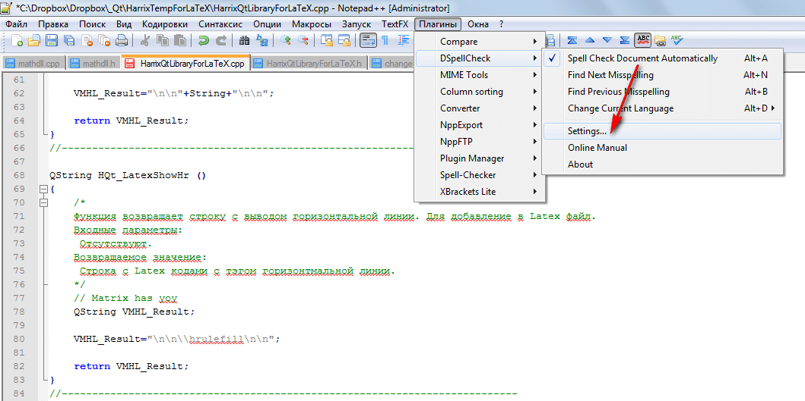
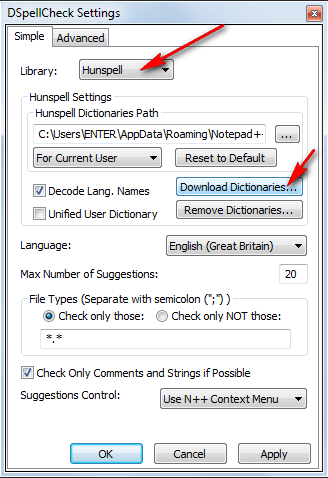
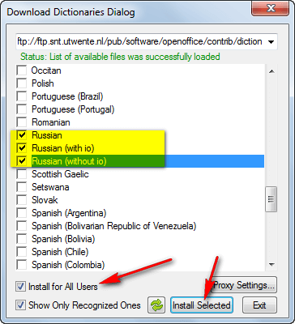
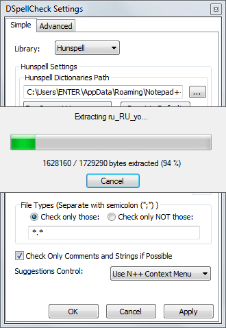
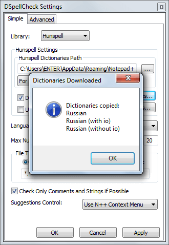
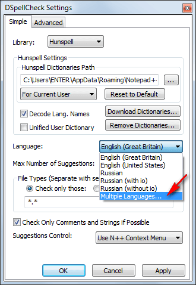
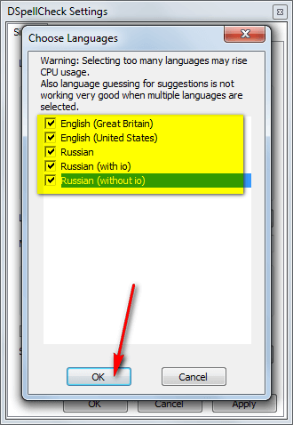
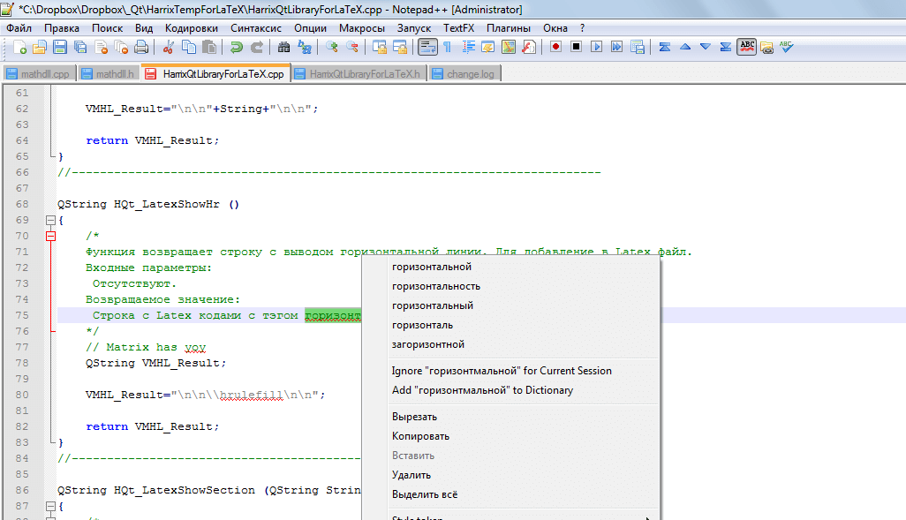

# Проверка орфографии в Notepad++

В статье описывается способ подключения проверки орфографии на русском и английском языках в Notepad++.

Перейдите в Notepad++ в настройки плагина `DSpellCheck` по проверке орфографии:

Смотрите, чтобы наверху был выбран пункт `Hunspell`. После перейдите в режим загрузки словарей (английский по умолчанию загружен):

Выделите русские словари и те, что вы хотите. Затем установите словари:

В процессе будут показаны вот такие картинки:

Теперь включим одновременную проверку нескольких языков:

Выберем языки, которые нас интересуют:

Теперь всё готово. Нажимайте на `OK`

Проверка орфографии заработала:

