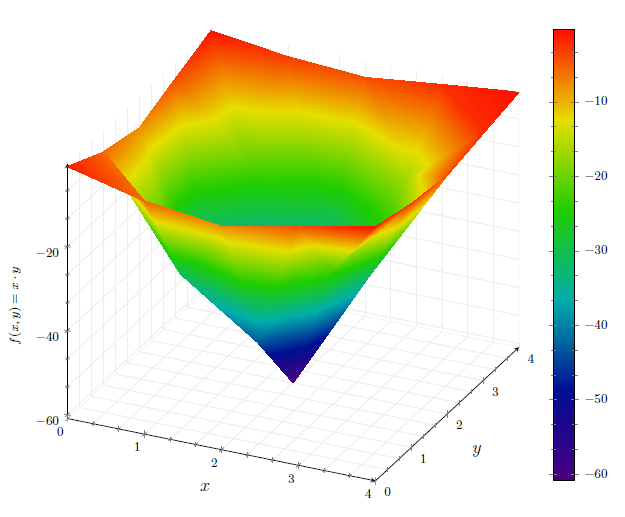
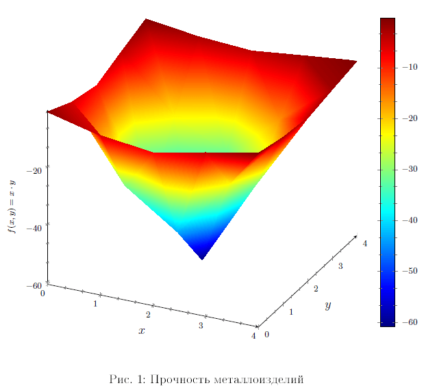
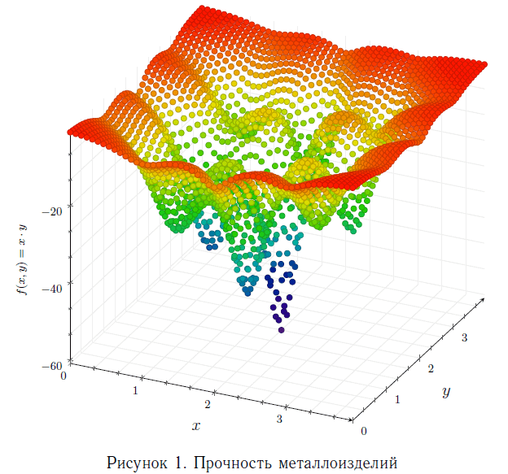
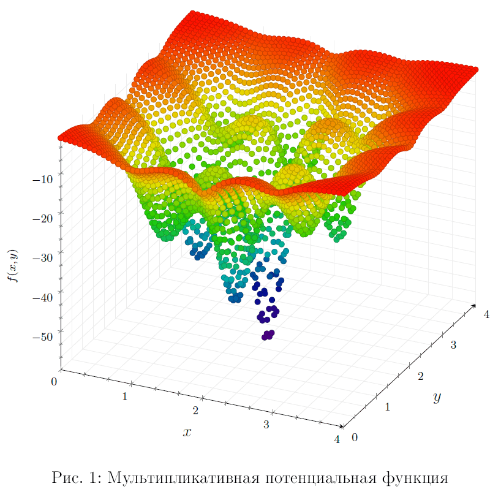

# 3D графики в LaTeX пакетом pgfplots в стиле MathCAD

Рассказано, как делать 3D графики в LaTeX файлах с помощью пакета pgfplots так, чтобы они были похожи на графики из MathCAD. Мне нравится такая цветовая схема как MathCAD, вот и решил попробовать.

## Решение

Итак, используйте следующую карту цвета:

```tex
\pgfplotsset{
/pgfplots/colormap={mathcad}{rgb255(0cm)=(76,0,128) rgb255(2cm)=(0,14,147) rgb255(4cm)=(0,173,171) rgb255(6cm)=(32,205,0) rgb255(8cm)=(229,222,0) rgb255(10cm)=(255,13,0)}
}
```

А это карта для графиков с стиле Matlab:

```tex
\pgfplotsset{
/pgfplots/colormap={matlab}{rgb255(0cm)=(0,0,128) rgb255(1cm)=(0,0,255) rgb255(3cm)=(0,255,255) rgb255(5cm)=(255,255,0) rgb255(7cm)=(255,0,0) rgb255(8cm)=(128,0,0)}
}
```

В статье [Установка и настройка программ для редактирования LaTeX файлов](/blog/2018/install-latex/) прочитайте, если надо, про установку всех нужных программ для работы с LaTeX.

## Примеры

Ниже приведены примеры полных исходников некоторых примеров:

```tex
\documentclass[a4paper,12pt]{report}

%%% Кодировки и шрифты %%%
\usepackage[T2A]{fontenc} % Поддержка русских букв
\usepackage[utf8]{inputenc} % Кодировка utf8
\usepackage[english, russian]{babel} % Языки: русский, английский

%%% Цвета %%%
\usepackage[usenames]{color}
\usepackage{color}

%%% Рисование графиков %%%
\usepackage{pgfplots}

\usepackage{float}

\definecolor{plotgrid}{HTML}{ECECEC} % цвет сетки

\pgfplotsset{
  every axis legend/.append style={at={(0.5,-0.13)},anchor=north,legend cell align=left},
  tick label style={font=\tiny\scriptsize},
  label style={font=\scriptsize},
  legend style={font=\scriptsize},
  grid=both,
  minor tick num=2,
  major grid style={plotgrid},
  minor grid style={plotgrid},
  axis lines=left,
  legend style={draw=none},
  /pgf/number format/.cd,
  1000 sep={}
}
% Карта цвета для трехмерных графиков в стиле графиков Mathcad

\pgfplotsset{
/pgfplots/colormap={mathcad}{rgb255(0cm)=(76,0,128) rgb255(2cm)=(0,14,147) rgb255(4cm)=(0,173,171) rgb255(6cm)=(32,205,0) rgb255(8cm)=(229,222,0) rgb255(10cm)=(255,13,0)}
}
% Карта цвета для трехмерных графиков в стиле графиков Matlab

\pgfplotsset{
/pgfplots/colormap={matlab}{rgb255(0cm)=(0,0,128) rgb255(1cm)=(0,0,255) rgb255(3cm)=(0,255,255) rgb255(5cm)=(255,255,0) rgb255(7cm)=(255,0,0) rgb255(8cm)=(128,0,0)}
}
\begin{document}

% Вывод графика

\begin{figure} [H]
\centering
{
\begin{tikzpicture}
\begin{axis}[
xlabel={$x$},
ylabel={$y$},
zlabel={$f(x,y) = x\cdot y$},
height=12cm,
width=12cm,
z buffer=sort,
colormap name=mathcad,
]
\addplot3[only marks,scatter] coordinates {
(0, 0, -0.985379) (0, 1, -5.50572) (0, 2, -7.74578) (0, 3, -4.00693) (0, 4, -0.530504) (1, 0, -5.50572) (1, 1, -30.7627) (1, 2, -43.2789) (1, 3, -22.3884) (1, 4, -2.96415) (2, 0, -7.74578) (2, 1, -43.2789) (2, 2, -60.8873) (2, 3, -31.4973) (2, 4, -4.17014) (3, 0, -4.00693) (3, 1, -22.3884) (3, 2, -31.4973) (3, 3, -16.2937) (3, 4, -2.15723) (4, 0, -0.530504) (4, 1, -2.96415) (4, 2, -4.17014) (4, 3, -2.15723) (4, 4, -0.28561)
};
\end{axis}
\end{tikzpicture}
}
\caption{Прочность металлоизделий}\label{ChartsAjFkQrR}
\end{figure}

\end{document}
```

Получим это:


Для кода:

```tex
\documentclass[a4paper,12pt]{report}

%%% Кодировки и шрифты %%%
\usepackage[T2A]{fontenc} % Поддержка русских букв
\usepackage[utf8]{inputenc} % Кодировка utf8
\usepackage[english, russian]{babel} % Языки: русский, английский

%%% Цвета %%%
\usepackage[usenames]{color}
\usepackage{color}

%%% Рисование графиков %%%
\usepackage{pgfplots}

\usepackage{float}

\definecolor{plotgrid}{HTML}{ECECEC} % цвет сетки

\pgfplotsset{
  every axis legend/.append style={at={(0.5,-0.13)},anchor=north,legend cell align=left},
  tick label style={font=\tiny\scriptsize},
  label style={font=\scriptsize},
  legend style={font=\scriptsize},
  grid=both,
  minor tick num=2,
  major grid style={plotgrid},
  minor grid style={plotgrid},
  axis lines=left,
  legend style={draw=none},
  /pgf/number format/.cd,
  1000 sep={}
}
% Карта цвета для трехмерных графиков в стиле графиков Mathcad

\pgfplotsset{
  /pgfplots/colormap={mathcad}{rgb255(0cm)=(76,0,128) rgb255(2cm)=(0,14,147) rgb255(4cm)=(0,173,171) rgb255(6cm)=(32,205,0) rgb255(8cm)=(229,222,0) rgb255(10cm)=(255,13,0)}
}
% Карта цвета для трехмерных графиков в стиле графиков Matlab

\pgfplotsset{
  /pgfplots/colormap={matlab}{rgb255(0cm)=(0,0,128) rgb255(1cm)=(0,0,255) rgb255(3cm)=(0,255,255) rgb255(5cm)=(255,255,0) rgb255(7cm)=(255,0,0) rgb255(8cm)=(128,0,0)}
}
\begin{document}

  % Вывод графика

  \begin{figure} [H]
    \centering
    {
      \begin{tikzpicture}
      \begin{axis}[
      xlabel={$x$},
      ylabel={$y$},
      zlabel={$f(x,y) = x\cdot y$},
      height=12cm,
      width=12cm,
      z buffer=sort,
      colorbar,
      colorbar style={axis lines=box},
      colormap name=mathcad,
      view/h=25, %25
      view/v=30, %30
      ]
      \addplot3[surf,shader=interp,mesh/cols=5, opacity=1.0] coordinates {
        (0, 0, -0.985379) (0, 1, -5.50572) (0, 2, -7.74578) (0, 3, -4.00693) (0, 4, -0.530504) (1, 0, -5.50572) (1, 1, -30.7627) (1, 2, -43.2789) (1, 3, -22.3884) (1, 4, -2.96415) (2, 0, -7.74578) (2, 1, -43.2789) (2, 2, -60.8873) (2, 3, -31.4973) (2, 4, -4.17014) (3, 0, -4.00693) (3, 1, -22.3884) (3, 2, -31.4973) (3, 3, -16.2937) (3, 4, -2.15723) (4, 0, -0.530504) (4, 1, -2.96415) (4, 2, -4.17014) (4, 3, -2.15723) (4, 4, -0.28561)
      };
      \end{axis}
      \end{tikzpicture}
    }
    \caption{Прочность металлоизделий}\label{ChartsAjFkQrR2}
  \end{figure}
  \
\end{document}
```

Получим вот это:



Для кода:

```tex
\documentclass[a4paper,12pt]{report}

%%% Кодировки и шрифты %%%
\usepackage[T2A]{fontenc} % Поддержка русских букв
\usepackage[utf8]{inputenc} % Кодировка utf8
\usepackage[english, russian]{babel} % Языки: русский, английский

%%% Цвета %%%
\usepackage[usenames]{color}
\usepackage{color}

%%% Рисование графиков %%%
\usepackage{pgfplots}

\usepackage{float}

\definecolor{plotgrid}{HTML}{ECECEC} % цвет сетки

\pgfplotsset{
  every axis legend/.append style={at={(0.5,-0.13)},anchor=north,legend cell align=left},
  tick label style={font=\tiny\scriptsize},
  label style={font=\scriptsize},
  legend style={font=\scriptsize},
  grid=both,
  minor tick num=2,
  major grid style={plotgrid},
  minor grid style={plotgrid},
  axis lines=left,
  legend style={draw=none},
  /pgf/number format/.cd,
  1000 sep={}
}
% Карта цвета для трехмерных графиков в стиле графиков Mathcad

\pgfplotsset{
  /pgfplots/colormap={mathcad}{rgb255(0cm)=(76,0,128) rgb255(2cm)=(0,14,147) rgb255(4cm)=(0,173,171) rgb255(6cm)=(32,205,0) rgb255(8cm)=(229,222,0) rgb255(10cm)=(255,13,0)}
}
% Карта цвета для трехмерных графиков в стиле графиков Matlab

\pgfplotsset{
  /pgfplots/colormap={matlab}{rgb255(0cm)=(0,0,128) rgb255(1cm)=(0,0,255) rgb255(3cm)=(0,255,255) rgb255(5cm)=(255,255,0) rgb255(7cm)=(255,0,0) rgb255(8cm)=(128,0,0)}
}
\begin{document}

  % Вывод графика

  \begin{figure} [H]
    \centering
    {
      \begin{tikzpicture}
      \begin{axis}[
      xlabel={$x$},
      ylabel={$y$},
      zlabel={$f(x,y) = x\cdot y$},
      height=12cm,
      width=12cm,
      z buffer=sort,
      colorbar,
      colorbar style={axis lines=box},
      colormap name=mathcad,
      view/h=25, %25
      view/v=30, %30
      ]
      \addplot3[surf,shader=faceted,mesh/cols=5, opacity=1.0] coordinates {
        (0, 0, -0.985379) (0, 1, -5.50572) (0, 2, -7.74578) (0, 3, -4.00693) (0, 4, -0.530504) (1, 0, -5.50572) (1, 1, -30.7627) (1, 2, -43.2789) (1, 3, -22.3884) (1, 4, -2.96415) (2, 0, -7.74578) (2, 1, -43.2789) (2, 2, -60.8873) (2, 3, -31.4973) (2, 4, -4.17014) (3, 0, -4.00693) (3, 1, -22.3884) (3, 2, -31.4973) (3, 3, -16.2937) (3, 4, -2.15723) (4, 0, -0.530504) (4, 1, -2.96415) (4, 2, -4.17014) (4, 3, -2.15723) (4, 4, -0.28561)
      };
      \end{axis}
      \end{tikzpicture}
    }
    \caption{Прочность металлоизделий}\label{ChartsAjFkQrR4}
  \end{figure}

\end{document}
```

Получим:


Для кода:

```tex
\documentclass[a4paper,12pt]{report}

%%% Кодировки и шрифты %%%
\usepackage[T2A]{fontenc} % Поддержка русских букв
\usepackage[utf8]{inputenc} % Кодировка utf8
\usepackage[english, russian]{babel} % Языки: русский, английский

%%% Цвета %%%
\usepackage[usenames]{color}
\usepackage{color}

%%% Рисование графиков %%%
\usepackage{pgfplots}

\usepackage{float}

\definecolor{plotgrid}{HTML}{ECECEC} % цвет сетки

\pgfplotsset{
  every axis legend/.append style={at={(0.5,-0.13)},anchor=north,legend cell align=left},
  tick label style={font=\tiny\scriptsize},
  label style={font=\scriptsize},
  legend style={font=\scriptsize},
  grid=both,
  minor tick num=2,
  major grid style={plotgrid},
  minor grid style={plotgrid},
  axis lines=left,
  legend style={draw=none},
  /pgf/number format/.cd,
  1000 sep={}
}
% Карта цвета для трехмерных графиков в стиле графиков Mathcad

\pgfplotsset{
  /pgfplots/colormap={mathcad}{rgb255(0cm)=(76,0,128) rgb255(2cm)=(0,14,147) rgb255(4cm)=(0,173,171) rgb255(6cm)=(32,205,0) rgb255(8cm)=(229,222,0) rgb255(10cm)=(255,13,0)}
}
% Карта цвета для трехмерных графиков в стиле графиков Matlab

\pgfplotsset{
  /pgfplots/colormap={matlab}{rgb255(0cm)=(0,0,128) rgb255(1cm)=(0,0,255) rgb255(3cm)=(0,255,255) rgb255(5cm)=(255,255,0) rgb255(7cm)=(255,0,0) rgb255(8cm)=(128,0,0)}
}
\begin{document}

  % Вывод графика

  \begin{figure} [H]
    \centering
    {
      \begin{tikzpicture}
      \begin{axis}[
      xlabel={$x$},
      ylabel={$y$},
      zlabel={$f(x,y) = x\cdot y$},
      height=12cm,
      width=12cm,
      view={0}{90},
      z buffer=sort,
      colorbar,
      colorbar style={axis lines=box},
      grid=none,
      colormap name=mathcad,
      ]
      \addplot3[surf,shader=interp,mesh/cols=5] coordinates {
        (0, 0, -0.985379) (0, 1, -5.50572) (0, 2, -7.74578) (0, 3, -4.00693) (0, 4, -0.530504) (1, 0, -5.50572) (1, 1, -30.7627) (1, 2, -43.2789) (1, 3, -22.3884) (1, 4, -2.96415) (2, 0, -7.74578) (2, 1, -43.2789) (2, 2, -60.8873) (2, 3, -31.4973) (2, 4, -4.17014) (3, 0, -4.00693) (3, 1, -22.3884) (3, 2, -31.4973) (3, 3, -16.2937) (3, 4, -2.15723) (4, 0, -0.530504) (4, 1, -2.96415) (4, 2, -4.17014) (4, 3, -2.15723) (4, 4, -0.28561)
      };
      \end{axis}
      \end{tikzpicture}
    }
    \caption{Прочность металлоизделий}\label{ChartsAjFkQrR3}
  \end{figure}

\end{document}
```

Получим вот это:


На код:

```tex
\documentclass[a4paper,12pt]{report}

%%% Кодировки и шрифты %%%
\usepackage[T2A]{fontenc} % Поддержка русских букв
\usepackage[utf8]{inputenc} % Кодировка utf8
\usepackage[english, russian]{babel} % Языки: русский, английский

%%% Цвета %%%
\usepackage[usenames]{color}
\usepackage{color}

%%% Рисование графиков %%%
\usepackage{pgfplots}

\usepackage{float}

\definecolor{plotgrid}{HTML}{ECECEC} % цвет сетки

\pgfplotsset{
  every axis legend/.append style={at={(0.5,-0.13)},anchor=north,legend cell align=left},
  tick label style={font=\tiny\scriptsize},
  label style={font=\scriptsize},
  legend style={font=\scriptsize},
  grid=both,
  minor tick num=2,
  major grid style={plotgrid},
  minor grid style={plotgrid},
  axis lines=left,
  legend style={draw=none},
  /pgf/number format/.cd,
  1000 sep={}
}
% Карта цвета для трехмерных графиков в стиле графиков Mathcad

\pgfplotsset{
  /pgfplots/colormap={mathcad}{rgb255(0cm)=(76,0,128) rgb255(2cm)=(0,14,147) rgb255(4cm)=(0,173,171) rgb255(6cm)=(32,205,0) rgb255(8cm)=(229,222,0) rgb255(10cm)=(255,13,0)}
}
% Карта цвета для трехмерных графиков в стиле графиков Matlab

\pgfplotsset{
  /pgfplots/colormap={matlab}{rgb255(0cm)=(0,0,128) rgb255(1cm)=(0,0,255) rgb255(3cm)=(0,255,255) rgb255(5cm)=(255,255,0) rgb255(7cm)=(255,0,0) rgb255(8cm)=(128,0,0)}
}
\begin{document}

  % Вывод графика

  \begin{figure} [H]
    \centering
    {
      \begin{tikzpicture}
      \begin{axis}[
      xlabel={$x$},
      ylabel={$y$},
      zlabel={$f(x,y) = x\cdot y$},
      height=12cm,
      width=12cm,
      z buffer=sort,
      colorbar,
      colorbar style={axis lines=box},
      grid=none,
      colormap name=matlab,
      ]
      \addplot3[surf,shader=interp,mesh/cols=5] coordinates {
        (0, 0, -0.985379) (0, 1, -5.50572) (0, 2, -7.74578) (0, 3, -4.00693) (0, 4, -0.530504) (1, 0, -5.50572) (1, 1, -30.7627) (1, 2, -43.2789) (1, 3, -22.3884) (1, 4, -2.96415) (2, 0, -7.74578) (2, 1, -43.2789) (2, 2, -60.8873) (2, 3, -31.4973) (2, 4, -4.17014) (3, 0, -4.00693) (3, 1, -22.3884) (3, 2, -31.4973) (3, 3, -16.2937) (3, 4, -2.15723) (4, 0, -0.530504) (4, 1, -2.96415) (4, 2, -4.17014) (4, 3, -2.15723) (4, 4, -0.28561)
      };
      \end{axis}
      \end{tikzpicture}
    }
    \caption{Прочность металлоизделий}\label{ChartsAjFkQrR3}
  \end{figure}

\end{document}
```

Получим:



## Скриншоты более сложных примеров

Примеры от предыдущих отливаются большим количеством точек:




## Сравнение с MathCAD

Вот что мы получим в MathCAD на ту же функцию:


А это в LaTeX получили:


Похоже же?

## Пример мультипликативной потенциальной функции

Решил привести LaTeX код функции, которая приведена выше:

```tex
\documentclass[a4paper,12pt]{report}

%%% Кодировки и шрифты %%%
\usepackage[T2A]{fontenc} % Поддержка русских букв
\usepackage[utf8]{inputenc} % Кодировка utf8
\usepackage[english, russian]{babel} % Языки: русский, английский

%%% Цвета %%%
\usepackage[usenames]{color}
\usepackage{color}

%%% Рисование графиков %%%
\usepackage{pgfplots}

\usepackage{float}

\definecolor{plotgrid}{HTML}{ECECEC} % цвет сетки

\pgfplotsset{
  every axis legend/.append style={at={(0.5,-0.13)},anchor=north,legend cell align=left},
  tick label style={font=\tiny\scriptsize},
  label style={font=\scriptsize},
  legend style={font=\scriptsize},
  grid=both,
  minor tick num=2,
  major grid style={plotgrid},
  minor grid style={plotgrid},
  axis lines=left,
  legend style={draw=none},
  /pgf/number format/.cd,
  1000 sep={}
}
% Карта цвета для трехмерных графиков в стиле графиков Mathcad

\pgfplotsset{
  /pgfplots/colormap={mathcad}{rgb255(0cm)=(76,0,128) rgb255(2cm)=(0,14,147) rgb255(4cm)=(0,173,171) rgb255(6cm)=(32,205,0) rgb255(8cm)=(229,222,0) rgb255(10cm)=(255,13,0)}
}
% Карта цвета для трехмерных графиков в стиле графиков Matlab

\pgfplotsset{
  /pgfplots/colormap={matlab}{rgb255(0cm)=(0,0,128) rgb255(1cm)=(0,0,255) rgb255(3cm)=(0,255,255) rgb255(5cm)=(255,255,0) rgb255(7cm)=(255,0,0) rgb255(8cm)=(128,0,0)}
}
\begin{document}

  % Вывод графика

  \begin{figure} [H]
  \centering
  {
    \begin{tikzpicture}
    \begin{axis}[
    xlabel={$x$},
    ylabel={$y$},
    zlabel={$f(x,y)$},
    height=12cm,
    width=12cm,
    z buffer=sort,
    colormap name=mathcad,
    ]
    \addplot3[
      only marks,scatter,
      shader=flat,
      samples=60,
      domain=0:4,y domain=0:4]
      {-(-(1/((x-1)*(x-1)+0.2))-(1/(2*(x-2)*(x-2)+0.15))-(1/(3*(x-3)*(x-3)+0.3)))*(-(1/((y-1)*(y-1)+0.2))-(1/(2*(y-2)*(y-2)+0.15))-(1/(3*(y-3)*(y-3)+0.3)))};
    \end{axis}
    \end{tikzpicture}
  }
  \caption{Мультипликативная потенциальная функция}\label{ChartsMultiplicativePotential}
  \end{figure}

\end{document}
```


