# Как скачать файлы с GitHub

Небольшая инструкция по скачиванию файлов с <https://github.com>. Для работы над проектами это замечательная система, но с точки зрения стороннего пользователя процесс скачивания файлов не совсем очевидный.

Ниже приведены разные способы скачивания. Выбирайте, какой вам по душе.

## Скачивание релиза проекта

Если вам нужен не сам исходный код проекта, а уже готовый вариант приложения, то лучше посмотреть релизы данного проекта.

Перейдите по ссылке к релизам проекта. Рассмотрим на примере <https://github.com/jquery/jquery>:

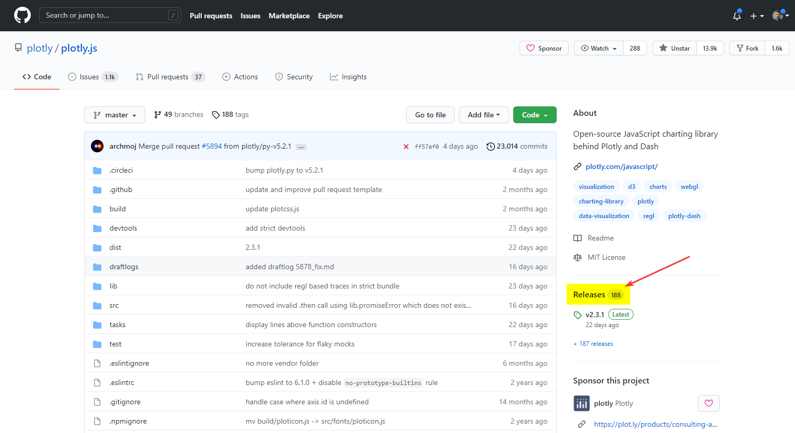

А там скачивайте ту версию релиза, которая вам нужна:

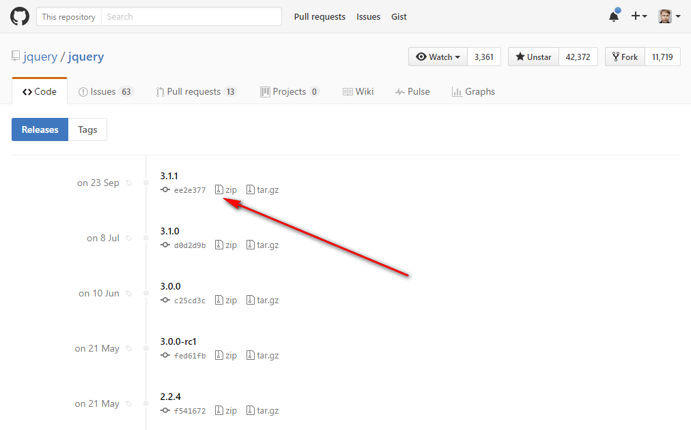

Прошу обратить внимание, что не всякий проект на GitHub обладает релизами. Некоторые разработчики или не знают об этой функции, или же не занимаются релизами, а всё сохраняют в главном репозитории.

## Скачивание целого проекта

Например вы заходите на проект <https://github.com/jquery/jquery>. И вам нужно скачать его весь (а там уже уже на компе выбрать для себя нужные файлы).

Справа наверху есть кнопка `Download ZIP`:

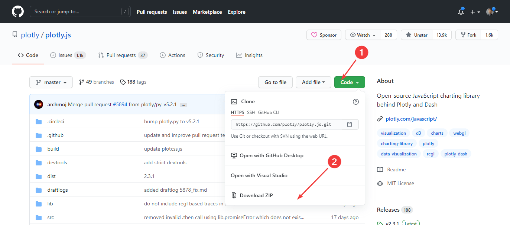

Щелкайте по ней и zip архив с проектом будет скачен к вам на компьютер.

## Скачивание отдельного файла (текстовой)

Допустим, на том же сайте jQuery вам нужен только один текстовой файл. Например, `package.json`. Находим его и щелкаем по нему:

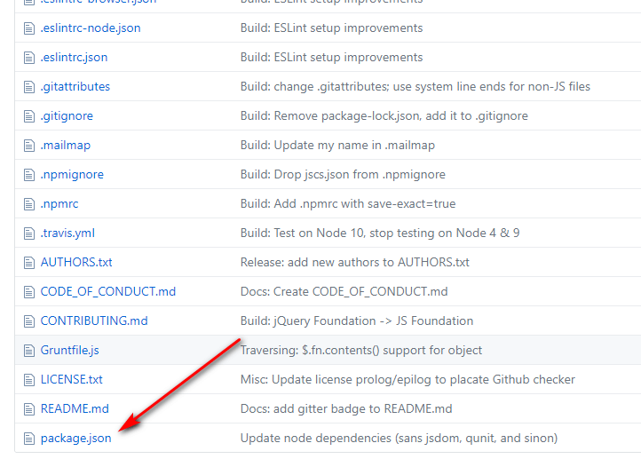

Щелкните по данному файлу (или перейдите по ссылке, если у вас есть прямая ссылка, как приведена выше):

Кликнете по кнопке `Raw`:

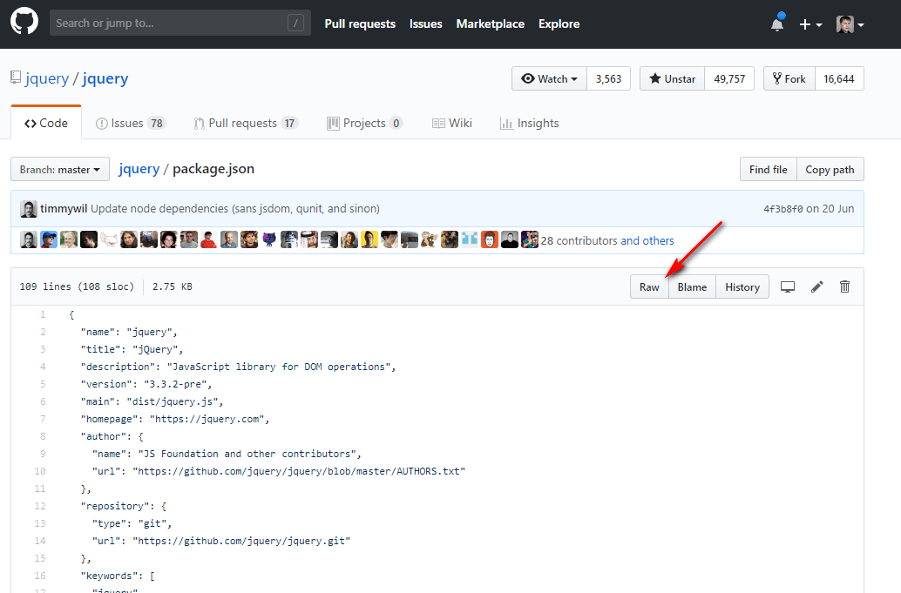

Откроется чистый код файла. Нажимаем правую кнопку мыши, и выбираем пункт меню `Сохранить как…`:

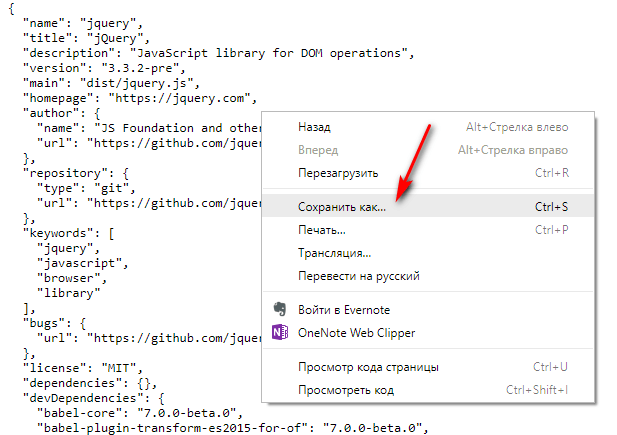

И сохраняем наш файл:

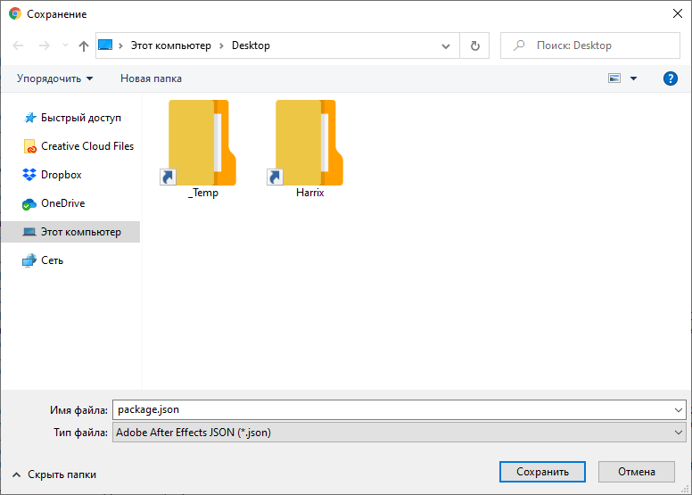

В некоторых файлах нужно будет убрать лишнее расширение:

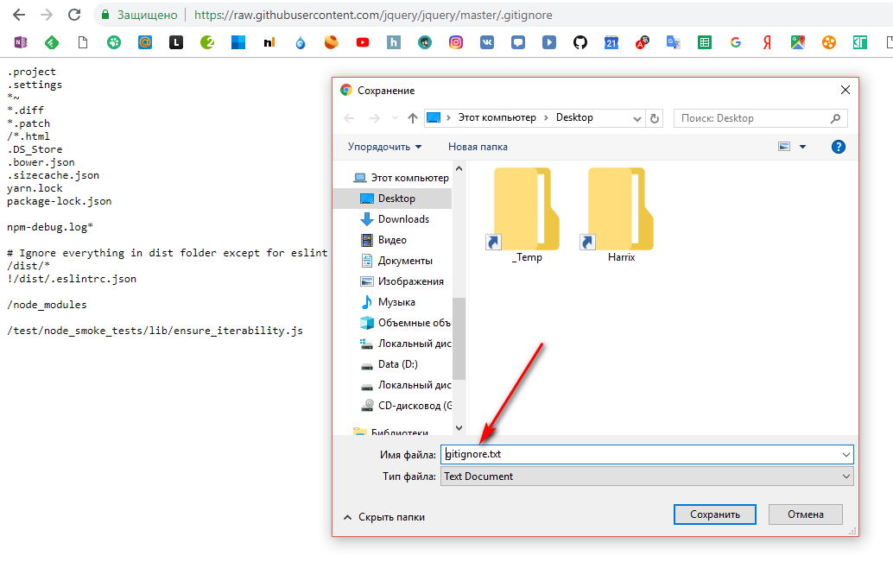

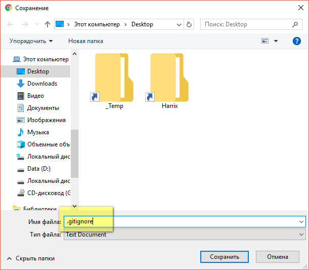

Также отдельные файлы открываются через клиент GitHub через кнопку `Open`:

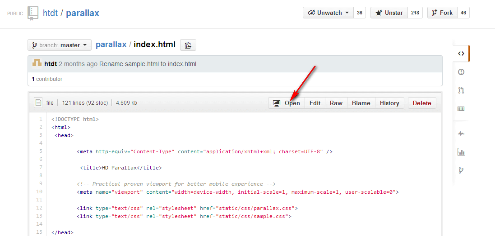

## Скачивание отдельного файла (PDF)

Конечно, лучше весь проект скачать, как показано выше, но если не хотите, то читайте дальше.

Щелкните по нужному файлу.

Откроется просмотр содержимого файла. Щелкайте по `View Raw`, и файл или откроется (а там через правую кнопку мыши сохраняйте), или же через начнет скачиваться:

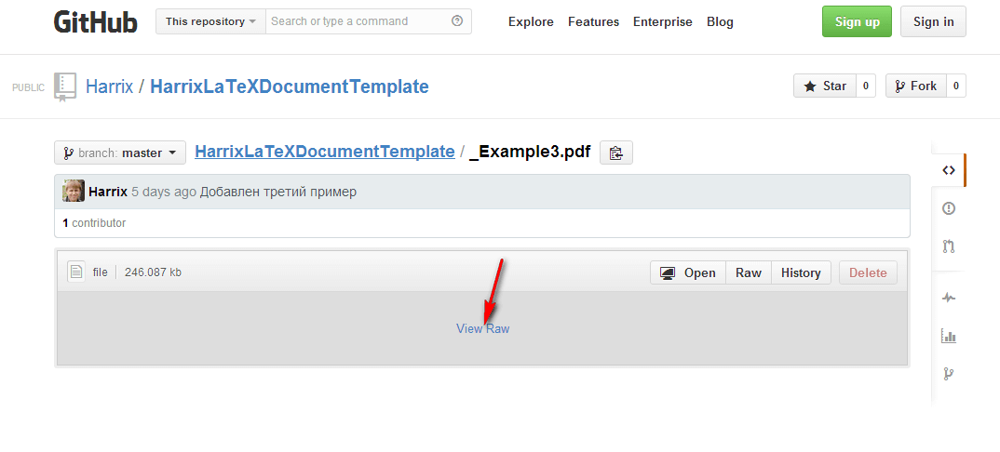

Теперь у вас есть сохраненный файл.

С остальными форматами файлов всё аналогично.

## Простой метод для разработчиков

Если вы активный пользователь GitHub, и у вас есть уже свой репозиторий, то вы и так все знаете. Но для полноты способов я здесь его приведу.

Заходите на сайт под своей учетной записью.

Переходите на нужный вам репозиторий (проект).

Если не хотите создавать отдельную ветку для развития проекта, то нажимайте `Open in Desktop`. А там уже через клиент GitHub обновляете его и копия проекта появляется у вас на компьютере:

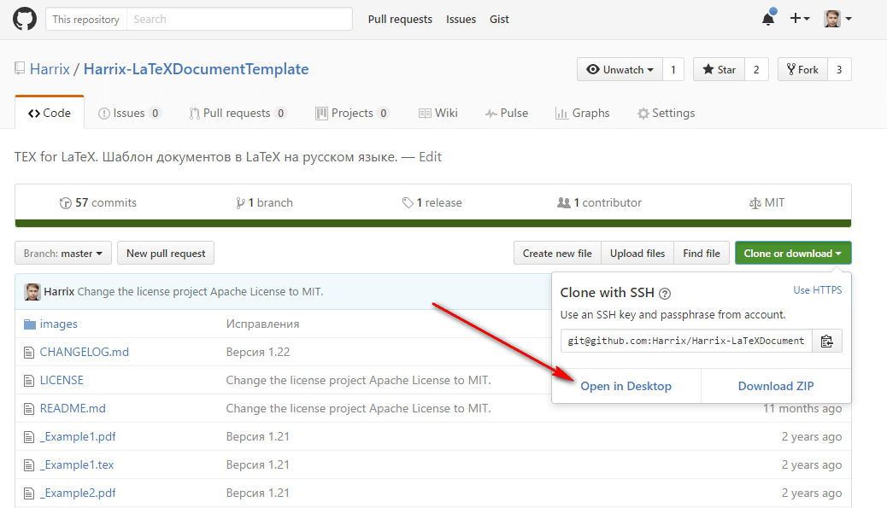

Если хотите создать свою ветку продукта, то делаете **fork** проекта. И проект в виде копии появляется у вас в коллекции репозиториев. А там уже через клиент GitHub обновляете его и копия проекта появляется у вас на компьютере:

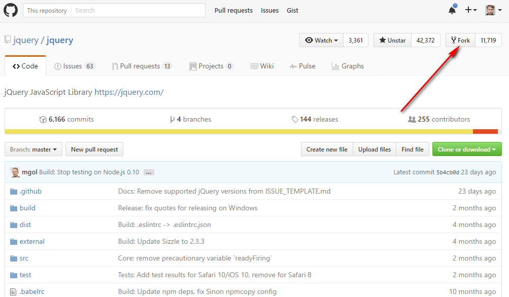

## Консольный способ для разработчиков

А вообще лучше клонировать проекты себе на компьютер через консоль. Например, так:

```console
git clone https://github.com/jquery/jquery.git
```
