# Базовое приложение в Qt Widgets

В статье показан пример создания простейшего приложения в режиме Qt Widgets.

В качестве среды для разработки используется Qt 5.2.0 for Windows 32-bit (MinGW 4.8). Скачать можно тут <https://www.qt.io/download>.

## Создание Qt Widgets приложения

Создаем приложение: `File` → `New File or Project…`. Там слева выбираем Applications, а справа `Qt Widgets` (в старых версиях `Qt GuiApplication`). Потом жмем внизу кнопку `Choose…`:

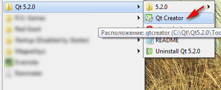

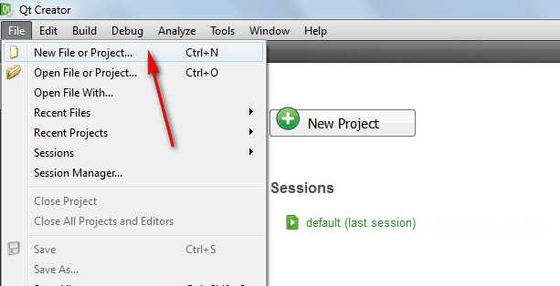

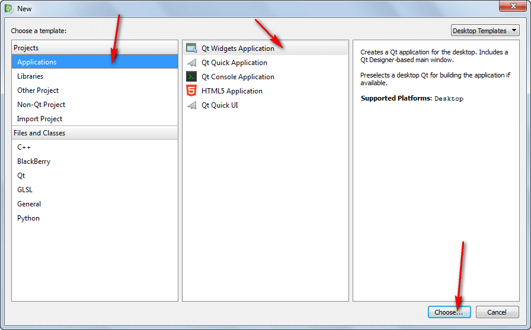

В следующем окне выбираем название нашего проекта (без пробелов и русских букв). Например, в нашем случае это `Example`:

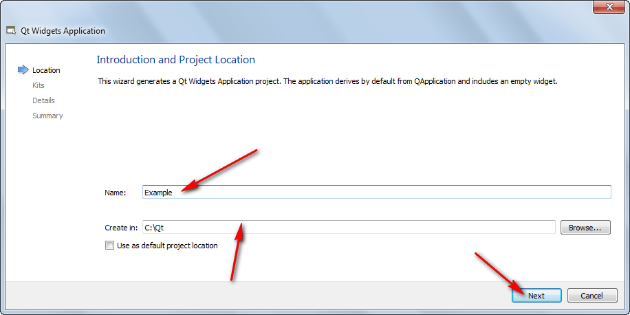

В следующем окне у вас должна стоять галочка у `MinGW` (либо того kit, который вам нужен):

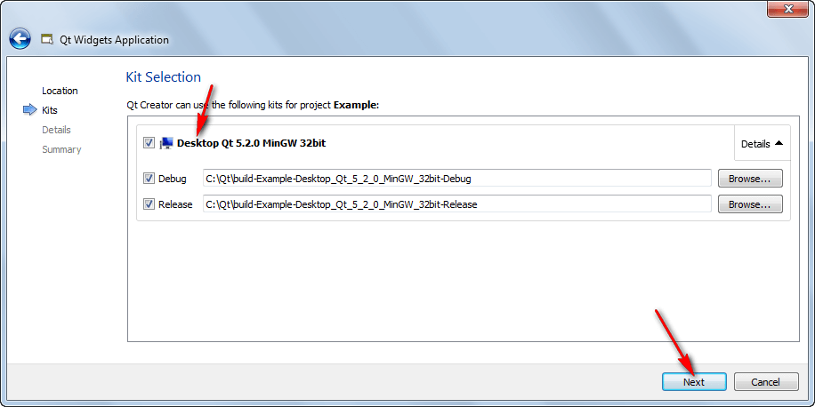

В следующем окне можно ничего не менять:

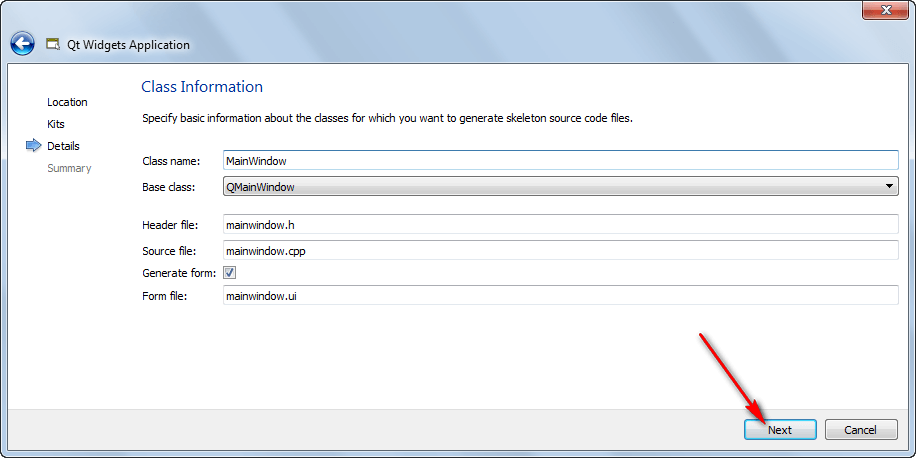

В следующем окне можно ничего не менять. И жмем кнопку `Finish`:

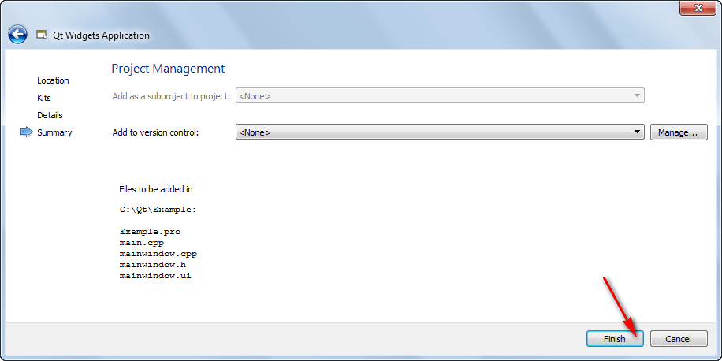

Вы должны увидеть что-то подобное:

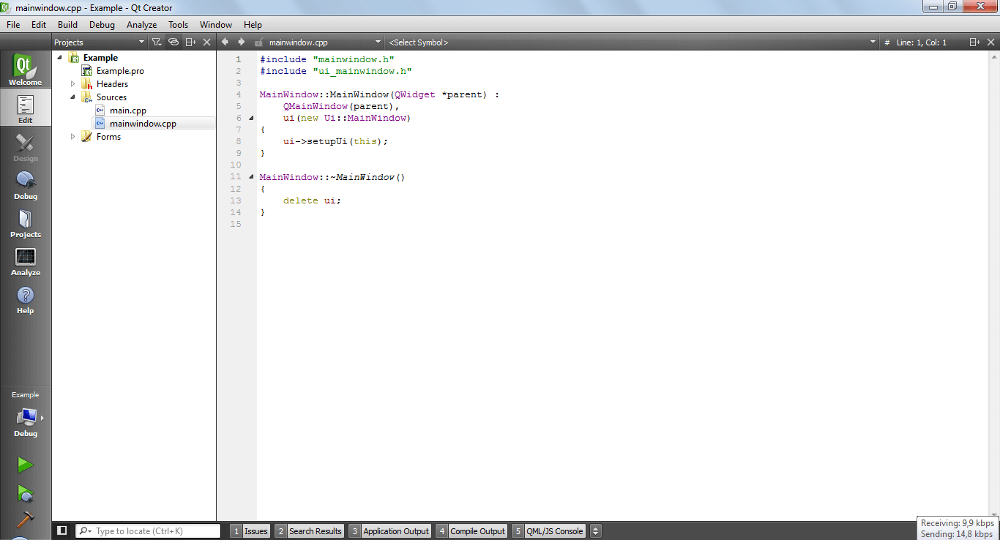

## Наполнение приложения компонентами

Щелкнете двойным щелчком по `Forms`:

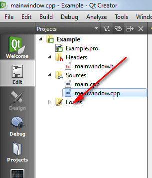

Двойным щелчком перейдите на форму:

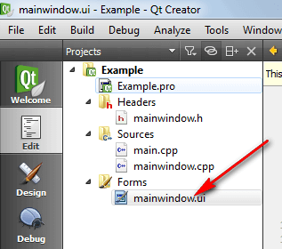

Перетащите на форму кнопку:

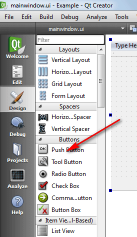

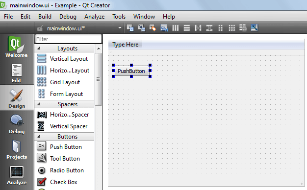

Перетащите на форму элемент `QTextEdit`:

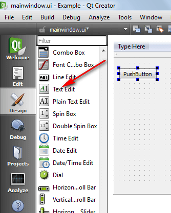

Растяните текстовое поле и форму для удобства:

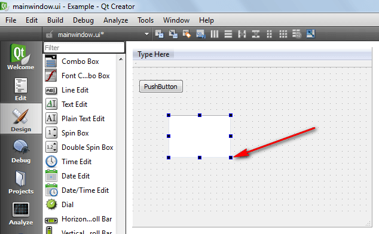

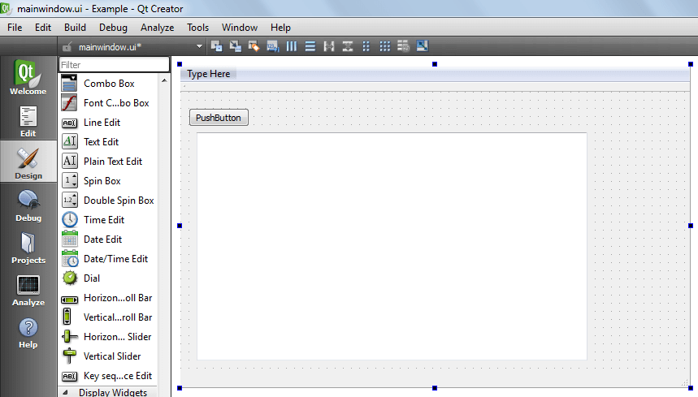

## Программирование кнопки

Теперь перейдем в режим кодирования поведения кнопки при нажатии.

Правый клик по кнопке. И выбираем пункт `Go to slot…`:

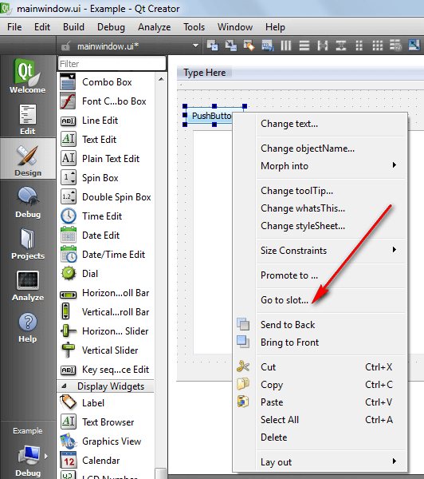

По умолчанию выбрано событие именно при нажатии, так что просто жмем `OK`:

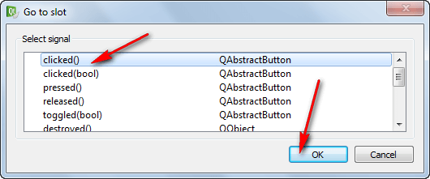

В исходном коде появляется метод, который будет действовать, когда нажмем на кнопку:

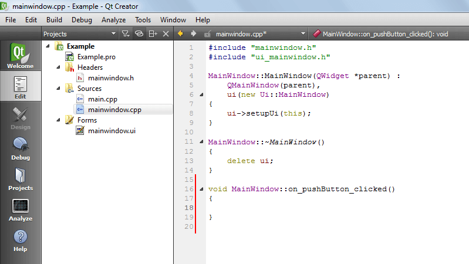

Можем теперь данное место как хотим редактировать. Ниже вставлен только комментарий, чтобы вы видели, где надо вставлять код C++:

```cpp
//тут будем писать код, который будет выполняться при нажатии кнопки
```

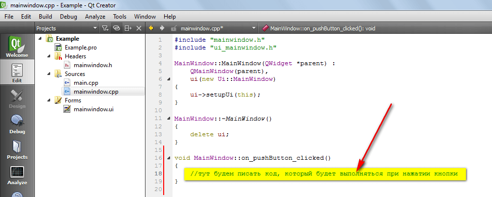

Запустите приложение, нажав на зеленый треугольник:

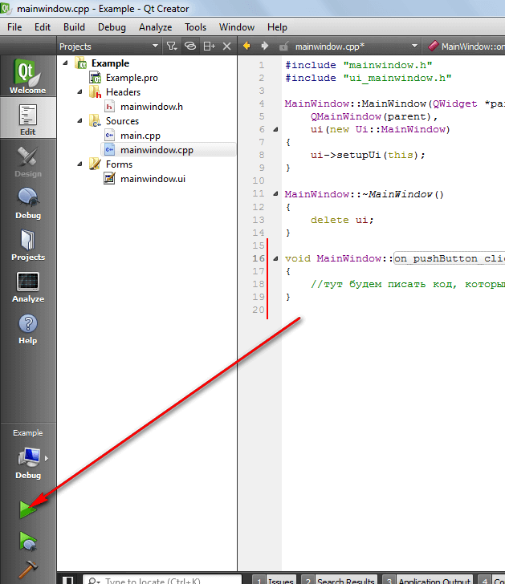

И поменяйте режим компилирования на `Release`:

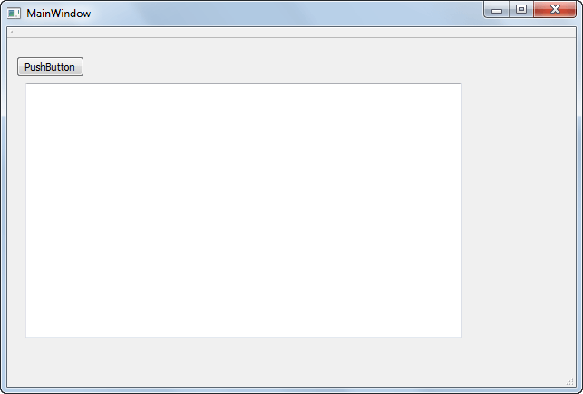

Должно запустить окно:


В статье [Запуск Qt приложений .exe вне Qt Creator](https://github.com/Harrix/harrix.dev-blog-2014/blob/main/2014-01-28-run-qt-app-exe-outside-qt/2014-01-28-run-qt-app-exe-outside-qt.md) рассказывается о том, как запустить приложение и его распространять в Qt. Это не очевидно, как кажется на первый взгляд.
