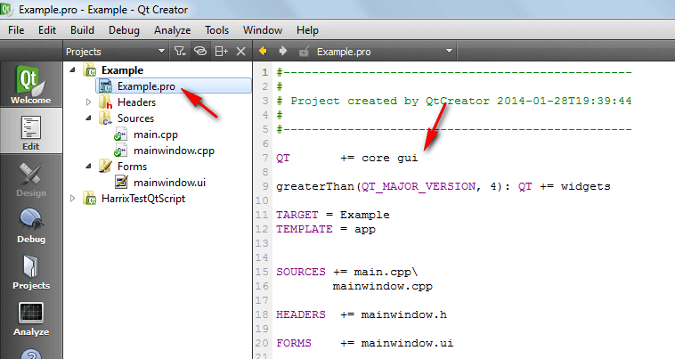
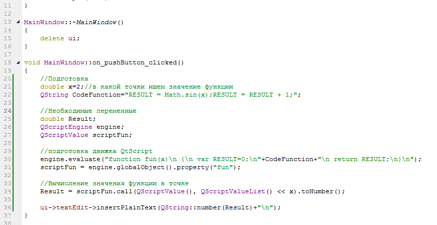
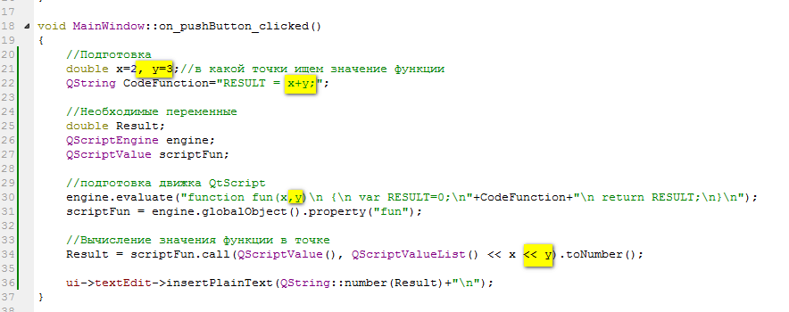
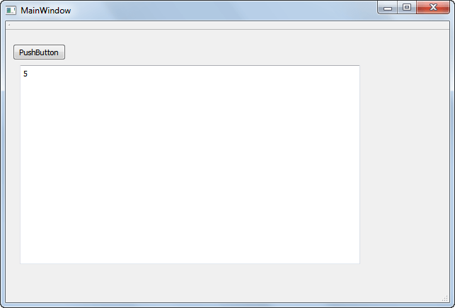

# Интерпретатор функции в Qt — QtScript

Возникла потребность в интерпретаторе простых функций в среде Qt. Например, у вас программа, где пользователь может сам ввести свою функцию, которая что-то считает (например, sin(x)). Как быть? В Qt есть хороший встроенный язык QtScript как раз для этих нужд. Единственно, что синтаксис у него под JavaScript, хотя мне больше по душе был бы C++, но ладно.

**Внимание!** QtScript — **устарел**! Вместо него надо использовать **QJSEngine**. В статье [Интерпретатор функций в Qt — QJSEngine](https://github.com/Harrix/harrix.dev-blog-2016/blob/main/2016-03-23-qjsengine/2016-03-23-qjsengine.md) про него рассказываются вещи, аналогичные в данной статье для QtScript.

При написании статьи и изучении материала использовалась статья <https://pro-prof.com/archives/1316>.

Мы будем рассматривать простые математические пользовательские функции с одной и двумя переменными. По аналогии с ними вы сможете модифицировать код под себя.

**Постановка задачи:** У нас в переменной типа QString записан код пользовательской функции: $y(x)=sin(x)+1$. Надо посчитать значение функции в этой точке.

Для объяснения буду использовать простое приложение в Qt на Qt Widgets.

## Процесс

Вначале нужно прописать в файле проекта `.pro` факт подключения QtScript через добавления слова `script`. Без этого не будут подключаться заголовочные файлы:

```cpp
QT       += core gui script
```




В файле `mainwindow.cpp` или в том, что вам нужно пропишите подключение библиотеки:

```cpp
#include <QtScript/QScriptEngine>
```


А в кнопке пропишите такой код:

```cpp
//Подготовка
double x=2;//в какой точки ищем значение функции
QString CodeFunction="RESULT = Math.sin(x);RESULT = RESULT + 1;";

//Необходимые переменные
double Result;
QScriptEngine engine;
QScriptValue scriptFun;

//подготовка движка QtScript
engine.evaluate("function fun(x)\n {\n var RESULT=0;\n"+CodeFunction+"\n return RESULT;\n}\n");
scriptFun = engine.globalObject().property("fun");

//Вычисление значения функции в точке
Result = scriptFun.call(QScriptValue(), QScriptValueList() << x).toNumber();

ui->textEdit->insertPlainText(QString::number(Result)+"\n");
```



При запуске приложения и нажатии на кнопку получите вот это:


Для функции с двумя аргументами (например, $z(x,y)=x+y$) код будет немного отличаться:

```cpp
//Подготовка
double x=2, y=3;//в какой точки ищем значение функции
QString CodeFunction="RESULT = x+y;";

//Необходимые переменные
double Result;
QScriptEngine engine;
QScriptValue scriptFun;

//подготовка движка QtScript
engine.evaluate("function fun(x,y)\n {\n var RESULT=0;\n"+CodeFunction+"\n return RESULT;\n}\n");
scriptFun = engine.globalObject().property("fun");

//Вычисление значения функции в точке
Result = scriptFun.call(QScriptValue(), QScriptValueList() << x << y).toNumber();

ui->textEdit->insertPlainText(QString::number(Result)+"\n");
```



При запуске получим вот это:



## Вычисление простого выражения

Если же вам нужно вычислить значение простого выражения без всяких переменных, то всё гораздо проще. Например, вы хотите вычислить пример $2+2\cdot2$. Тогда код будет выглядеть так:

```cpp
QString CodeFunction="2+2*2";

QScriptEngine engine;

double Result = engine.evaluate(CodeFunction).toNumber();

ui->textEdit->insertPlainText(QString::number(Result)+"\n");
```

Вы можете спокойно вводить тексты функций на языке QtScript (для простых вычислений как JavaScript) через файлы, поля ввода и использовать как функции в своих вычислениях. Конечно, работа таких функций будет поменьше, чем у обычных, прописанных на C++ внутри программы, но это и естественно.
