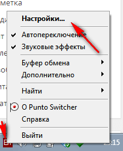
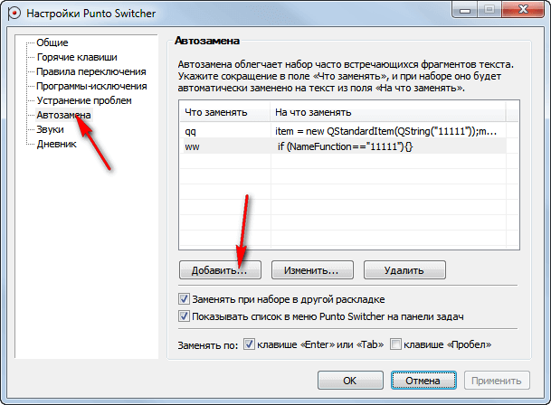
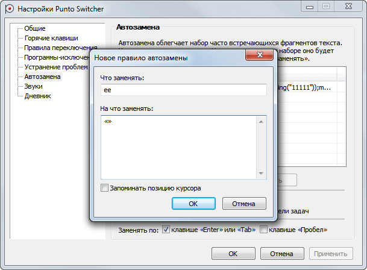

# Как быстро добавлять знаки «» при печати

Небольшой совет для того, чтобы при печатании текста быстро набивать «». Конечно, способов может быть много, но расскажу о своем.

В русском языке для кавычек используются в типографии вот такие символы: `«»`. Но так как на клавиатуре нет быстрого сочетания для таких кавычек, все используют стандартные кавычки `""`. Можно, конечно, копировать символы из Word, но это долго.

Итак, я делаю через `Punto Switcher`. Люди или ненавидят эту программу (тогда дальше можно не читать), а есть те, которые жить без нее не могут (как я).

Идем в настройки программы через правый клик по иконке программы в трее:

Там перейдите в `Автозамену` и нажмите `Добавить…`:

И добавьте замену, например, на две буквы `ee`:

Теперь, если вы где-нибудь напишите `ee`, а потом нажмете сразу `Enter`, то у вас эти две буквы заменяться на нужные. Как по мне, это удобно.
