# Подборка сервисов по издаванию звуков

В данной коллекции всевозможные сервисы для обработки или генерации звуков. Все сервисы тут для веселья.

- <https://www.crazygames.com/game/matrix> — это уже классика. Щелкаем по квадратикам и получаем свою мелодию:

  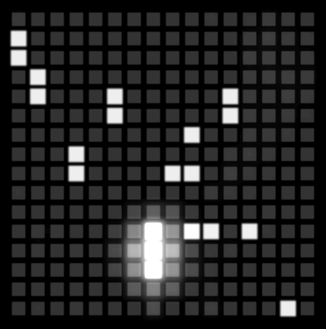

- <http://pictoplasma.sound-creatures.com> — в коллекции сайта несколько десятков звуков. Художники пытались представить животных, которые могут такие звуки издавать:

  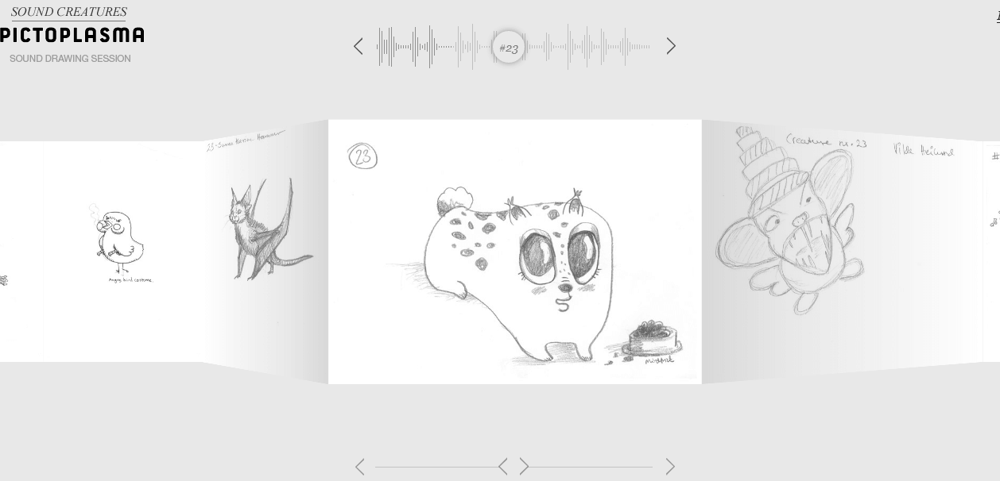

- <http://fritzo.org/keys/#style=piano> — висячее пианино:

  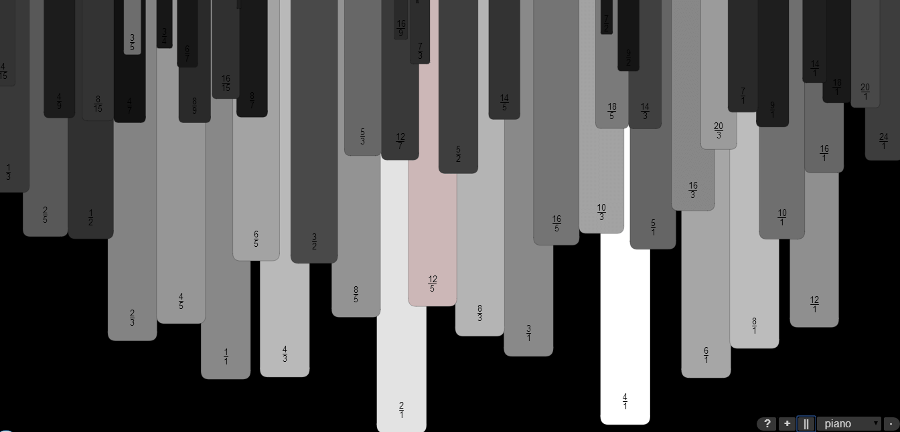

- <https://lab.hakim.se/radar/> — музыкальный радар. Принцип тот же — выделяем те кружочки, которые нам нужны, и появляются звуки:

  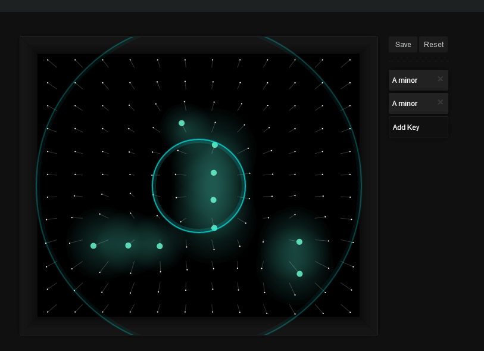

- <http://www.binaura.net/stc/wrx/soundbow/web/> — рисуем линию и по пересечениям будут издаваться звуки:

  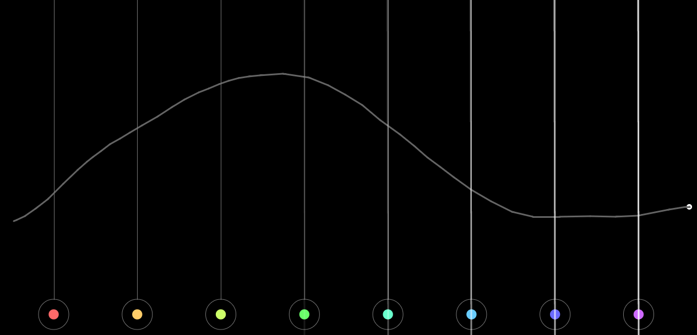

- <http://isleoftune.com/> — а тут надо построить остров, где машинки, катаясь издают звуки, проезжая около построек:

  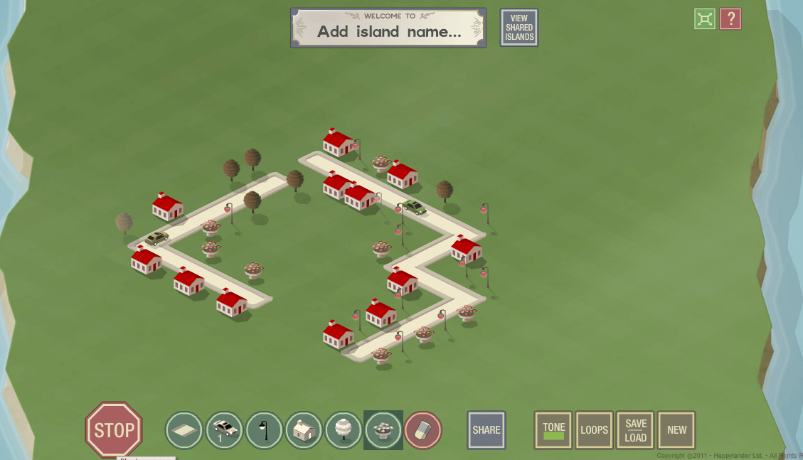

- <http://plink.in/> — у вас не может получиться плохой музыки:

  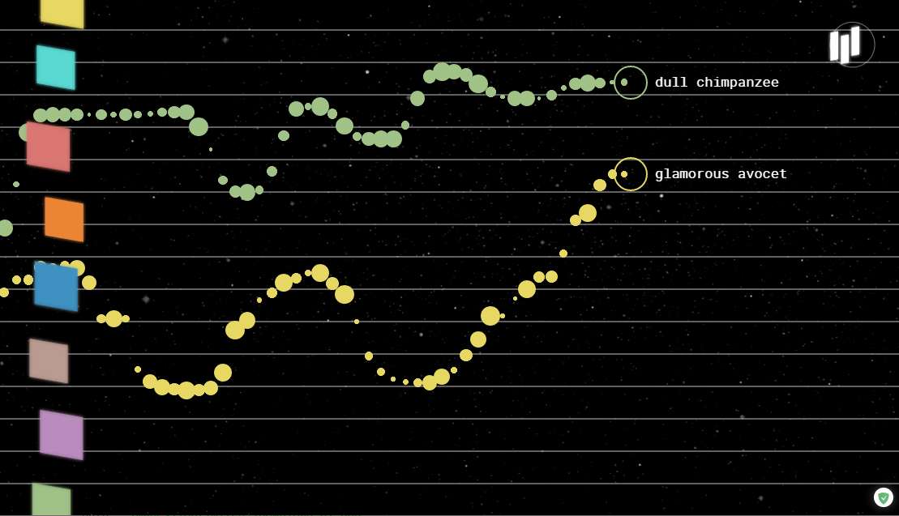

- <http://vstb.ru/pric/pric2.htm> — а поющие лошади:

  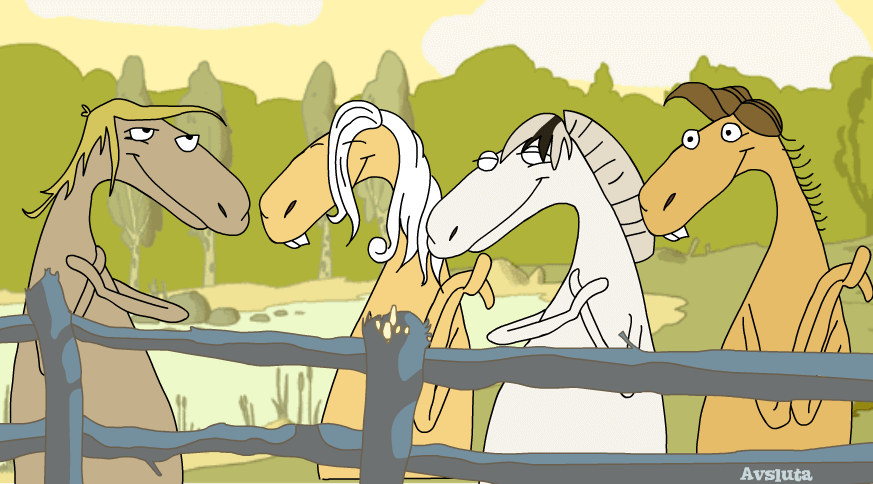

- <http://www.desktopblues.lichtlabor.ch> — разные симуляции музыкантов:

  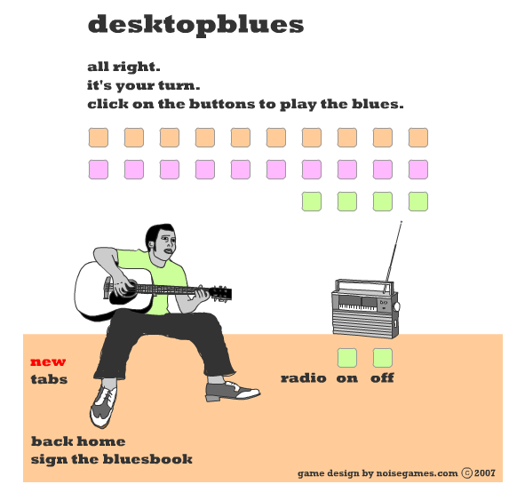

- <http://gamelion.net/music-box> — музыкальная штуковина:

  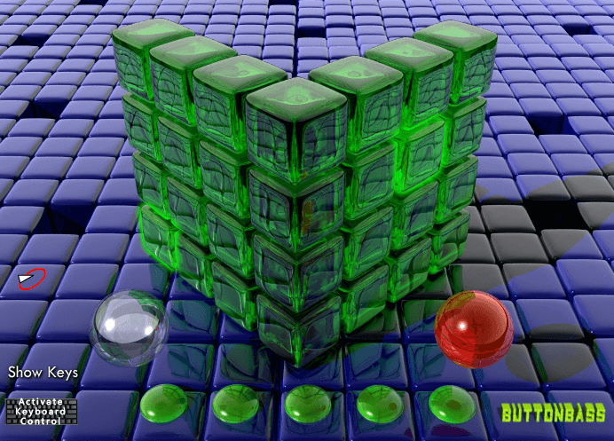

- <http://labs.dinahmoe.com/theme/> — генератор музыки, где вы можете выбирать даже настроение музыки:

  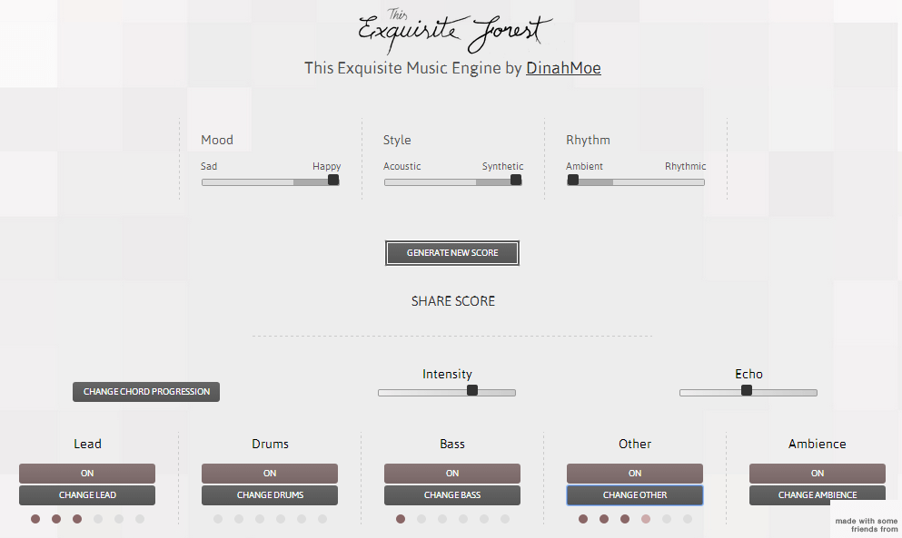

- <http://www.fallingfalling.com/> — а здесь ничего не генерируется. Просто депрессия:

  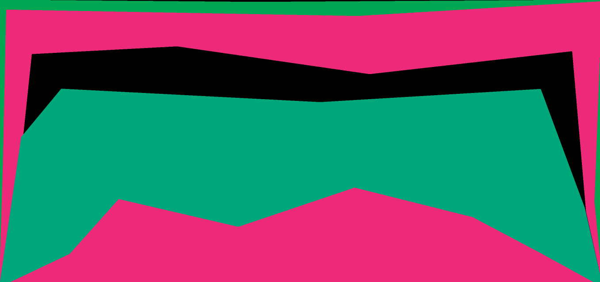

- <https://femurdesign.com/theremin/> — очень странные звуки при генерации получаются:

  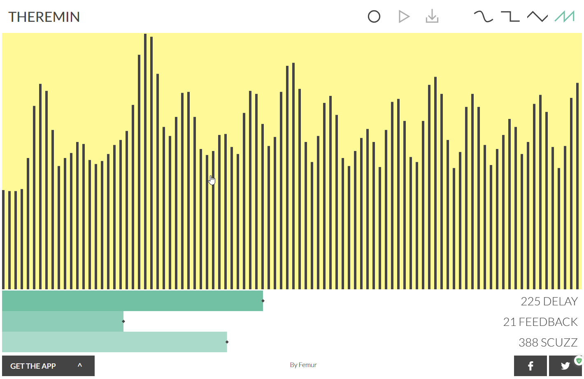

- <https://virtualpiano.net/> — виртуальное пианино:

  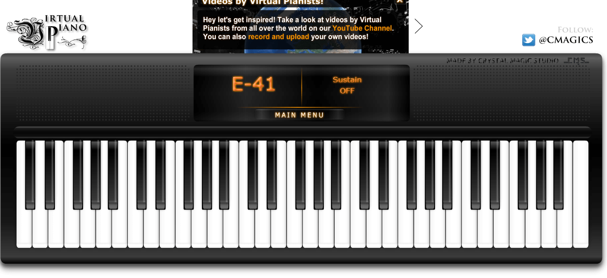

- <http://www.multiplayerpiano.com/> — еще одно виртуальное пианино, но многопользовательское и с чатом:

  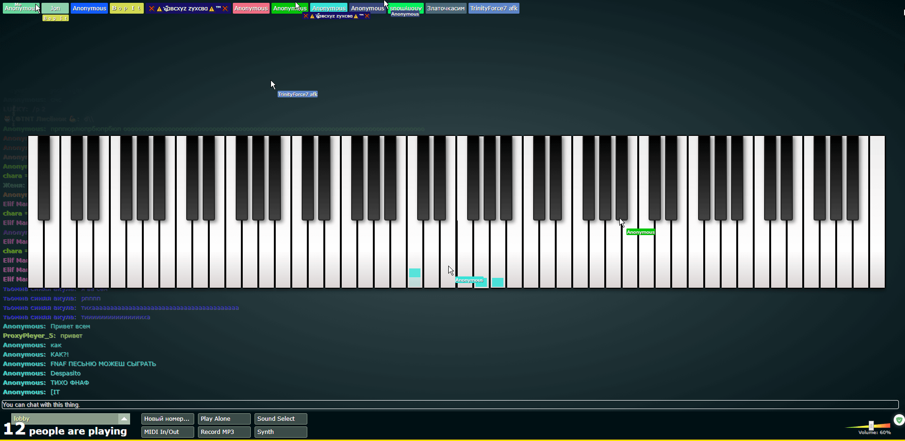

- <http://mikengreg.com/solipskier/> — флеш-игра, но с прикольной музыкой:

  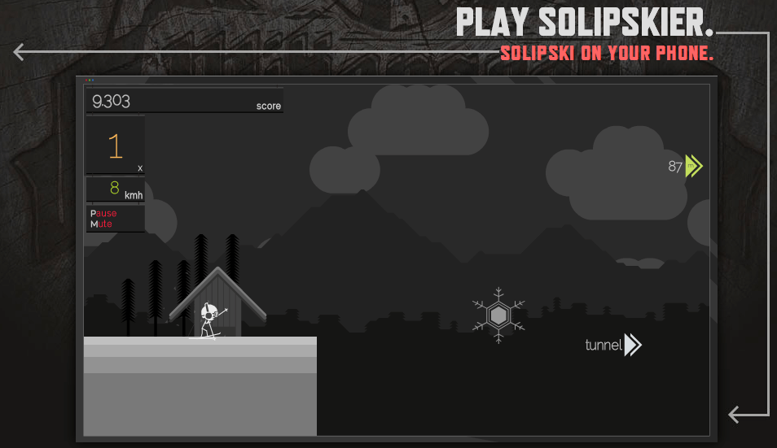

- <https://www.virtualdrumming.com/drums/online-virtual-games/online-virtual-games-drums.html> — симулятор барабанов:

  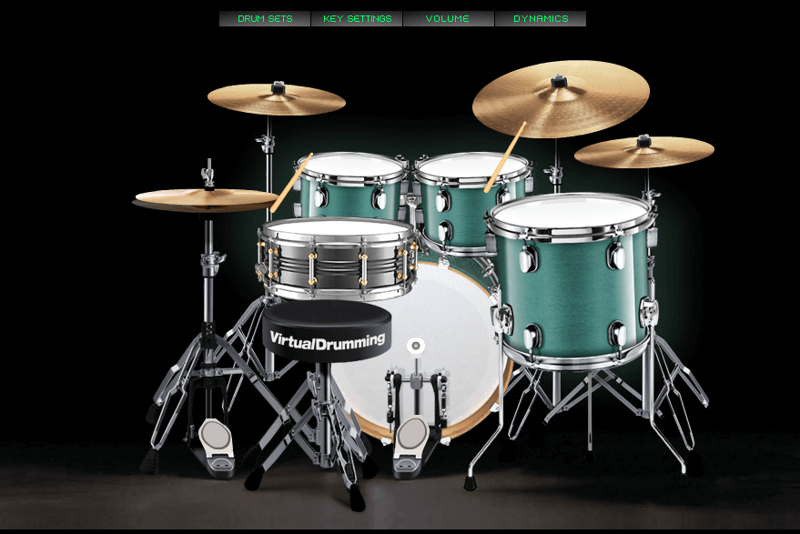

- <http://808cube.com/> — музыкальный кубик-рубик:

  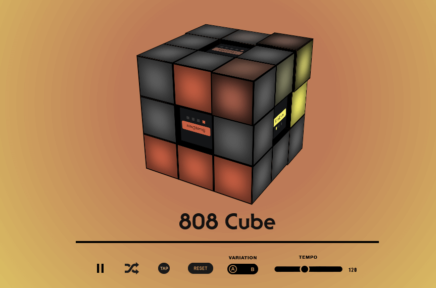
