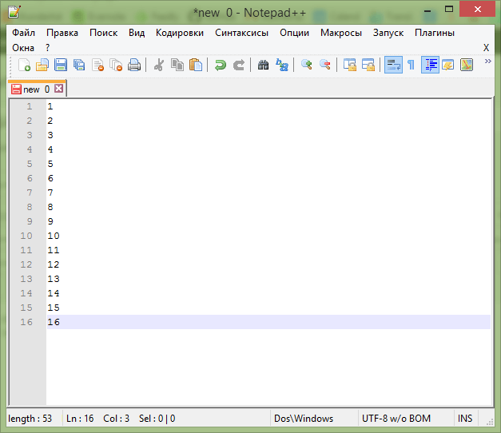
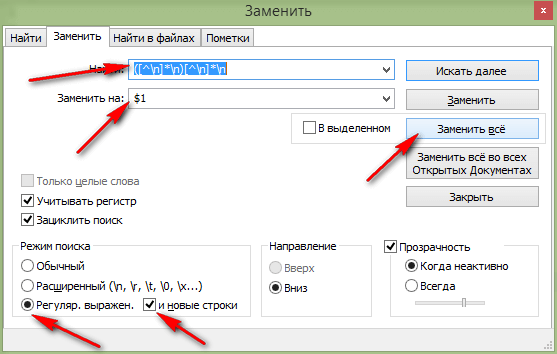
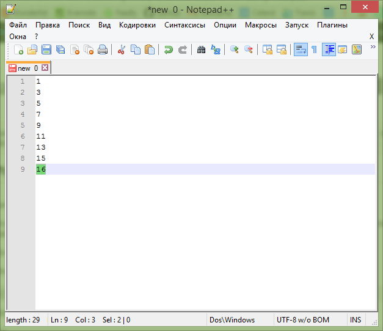

# Как удалить каждую вторую строку в Notepad++

В статье рассказывается как удалить в документе каждую вторую строку в Notepad++.

Допустим у нас такой документ в Notepad++:



Нажимаем `Ctrl` + `F` и переходим в закладку `Заменить`.

Вводим в поле поиска такой текст:

```text
([^\n]*\n)[^\n]*\n
```

В поле заменить вводим:

```text
$1
```

Выставим вот такие параметры замены:



В итоге получим, что удалены каждая вторая строка:



Если не сработает код, то в поле текста добавляем вот такой код:

```text
([^\r\n]*[\r\n]+)[^\r\n]*[\r\n]*
```

И повторяем.
