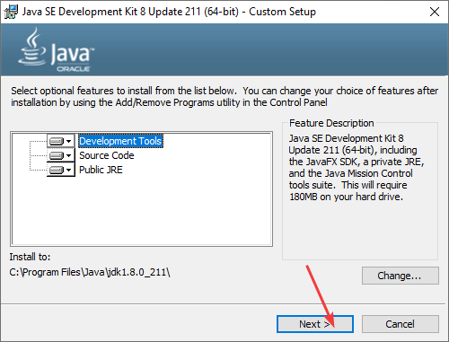

# Установка JDK 8 в Windows

Для программирования под Java и, в частности, при создании приложений под Android на компе требуется установка JDK (Java Development Kit). В статье рассказывается как это сделать.

В статье рассматривается способ установки под Widows 10, но никакой разницы для других версий Windows не должно быть. Если вам нужна последняя версия JDK, то посмотрите эту [статью](/blog/2019/install-jdk-on-windows/).

Скачиваем и устанавливаем с официального сайта:

<https://www.oracle.com/java/technologies/javase-downloads.html>

Если у вас 32-битная операционная система, то скачивайте пакет под Windows x86. Для тех, кто не знает: версии программ для 64-битных операционных систем обозначаются **x64**, а для 32-битных обозначаются **x86**. Версии программ x86 можно устанавливать на 64-битные операционные системы, но лучше (за рядом некоторых исключений) устанавливать x64 версии. А версии программ x64 не получится установить на 32-битные операционные системы. В общем, выбираем:

Еще в 2019 году для скачивания не самых свежих версий JDK нужно будет зарегистрироваться на сайте Oracle, и только после ввода логина с паролем начнется скачивание файла:

Но в 2020 вроде этого больше не нужно делать.

Процесс установки обычный и не представляет никаких трудностей:

