# Базовое приложение в Qt Widgets


В статье показан пример создания простейшего приложения в режиме Qt Widgets.

<details>
<summary>📖 Содержание</summary>

- [Создание Qt Widgets приложения](#создание-qt-widgets-приложения)
- [Наполнение приложения компонентами](#наполнение-приложения-компонентами)
- [Программирование кнопки](#программирование-кнопки)

В качестве среды для разработки используется Qt 5.2.0 for Windows 32-bit (MinGW 4.8). Скачать можно тут <https://www.qt.io/download>.

</details>

## Создание Qt Widgets приложения

Создаем приложение: `File` → `New File or Project…`. Там слева выбираем Applications, а справа `Qt Widgets` (в старых версиях `Qt GuiApplication`). Потом жмем внизу кнопку `Choose…`:

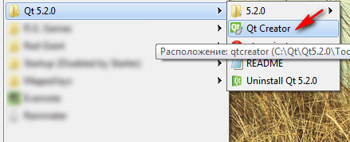

_Рисунок 1 — Открытие Qt Creator_

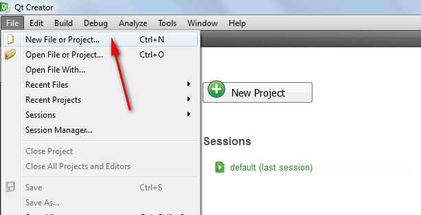

_Рисунок 2 — Создание нового проекта_

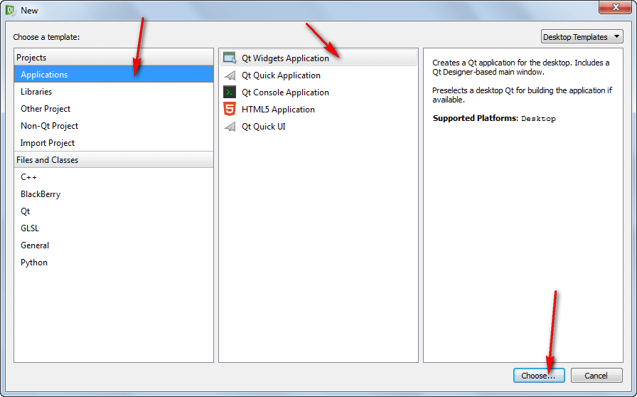

_Рисунок 3 — Выбор Qt Widgets_

В следующем окне выбираем название нашего проекта (без пробелов и русских букв). Например, в нашем случае это `Example`:

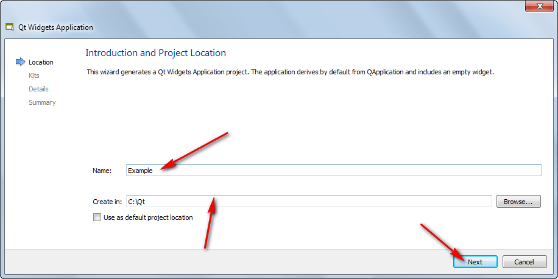

_Рисунок 4 — Выбор названия проекта_

В следующем окне у вас должна стоять галочка у `MinGW` (либо того kit, который вам нужен):

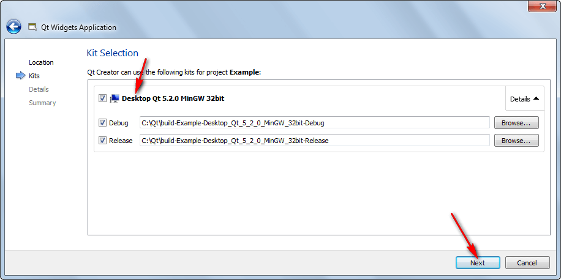

_Рисунок 5 — Выбор компилятора для приложения_

В следующем окне можно ничего не менять:

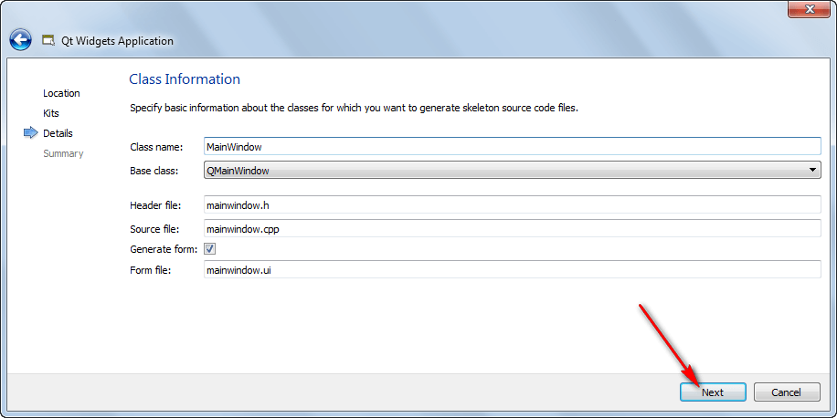

_Рисунок 6 — Выбор названия класса файлов_

В следующем окне можно ничего не менять. И жмем кнопку `Finish`:

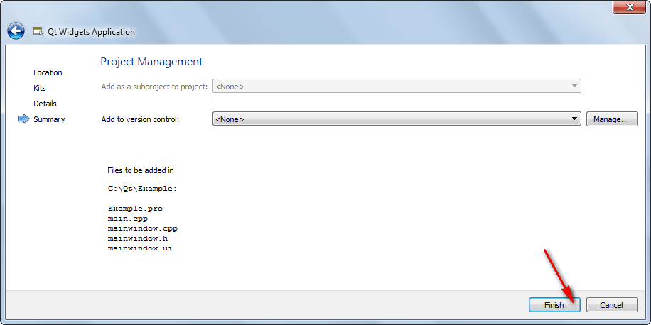

_Рисунок 7 — Окончание создания проекта_

Вы должны увидеть что-то подобное:

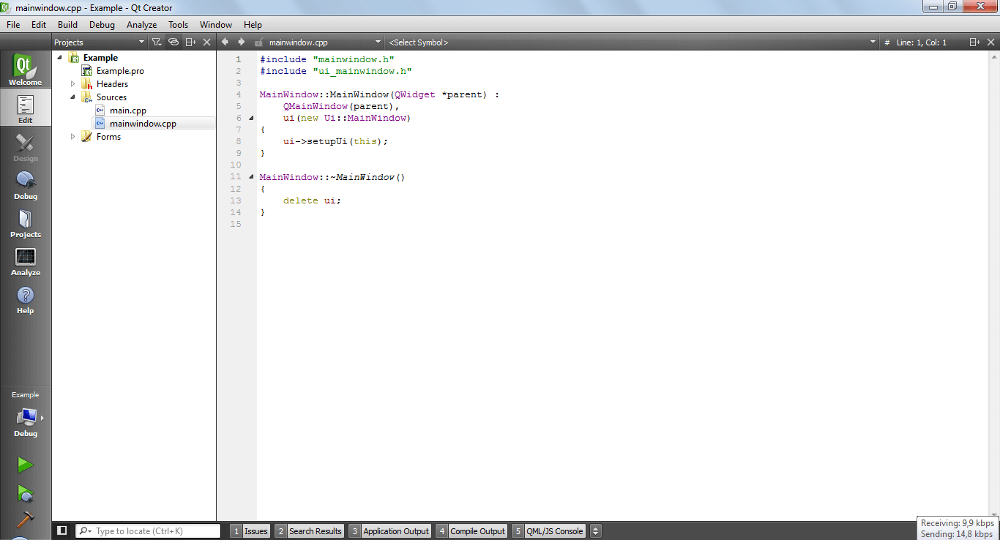

_Рисунок 8 — Открытый проект в Qt Creator_

## Наполнение приложения компонентами

Щелкнете двойным щелчком по `Forms`:

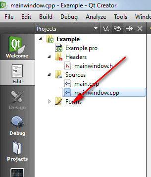

_Рисунок 9 — Клик по Forms_

Двойным щелчком перейдите на форму:

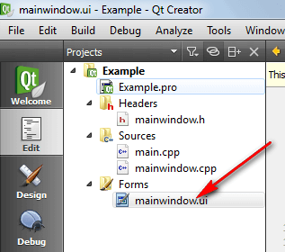

_Рисунок 10 — Клик по форме_

Перетащите на форму кнопку:

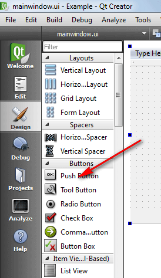

_Рисунок 11 — Выбор кнопки на панели элементов_

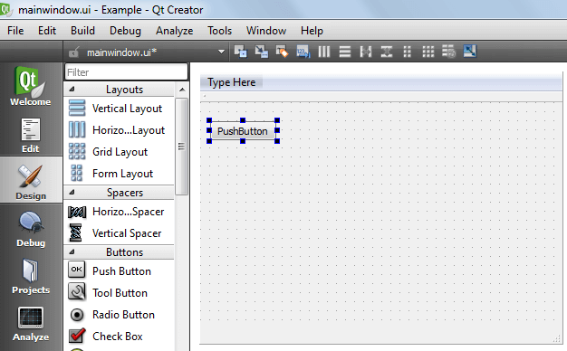

_Рисунок 12 — Кнопка на форме_

Перетащите на форму элемент `QTextEdit`:

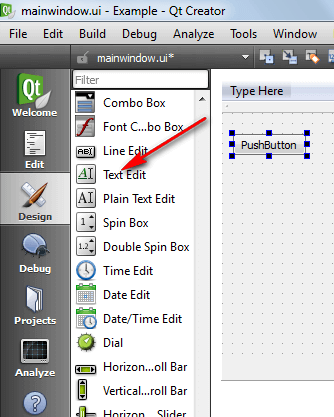

_Рисунок 13 — Выбор текстового поля на панели элементов_

Растяните текстовое поле и форму для удобства:

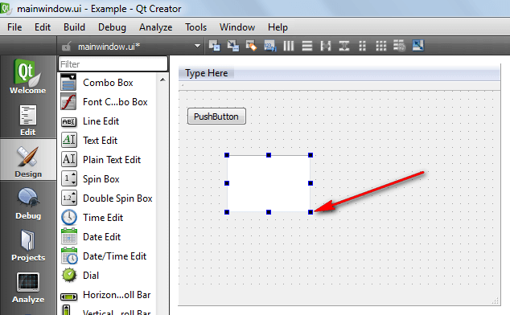

_Рисунок 14 — Растягивание текстового поля_

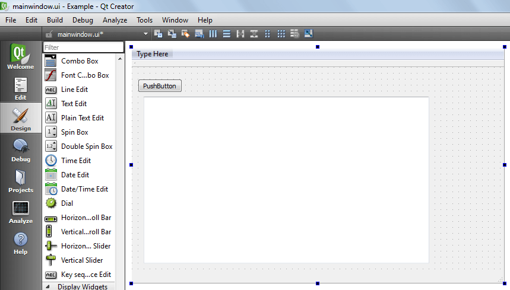

_Рисунок 15 — Растягивание формы приложения_

## Программирование кнопки

Теперь перейдем в режим кодирования поведения кнопки при нажатии.

Правый клик по кнопке. И выбираем пункт `Go to slot…`:

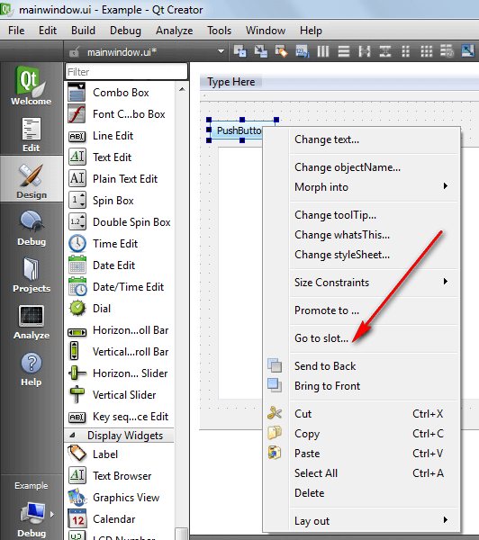

_Рисунок 16 — Выбор Go to slot…_

По умолчанию выбрано событие именно при нажатии, так что просто жмем `OK`:

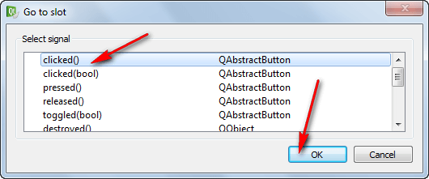

_Рисунок 17 — Выбор слота для кнопки_

В исходном коде появляется метод, который будет действовать, когда нажмем на кнопку:

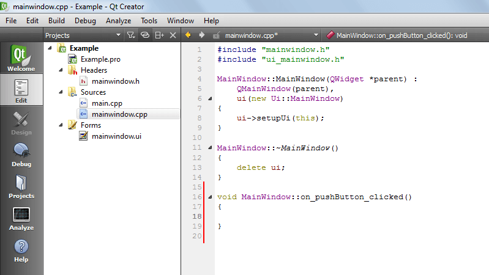

_Рисунок 18 — Новый метод к коде приложения_

Можем теперь данное место как хотим редактировать. Ниже вставлен только комментарий, чтобы вы видели, где надо вставлять код C++:

```cpp
//тут будем писать код, который будет выполняться при нажатии кнопки
```

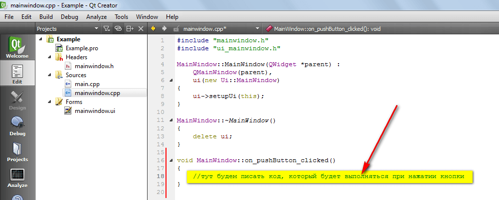

_Рисунок 19 — Комментарий для указания места написания кода_

Запустите приложение, нажав на зеленый треугольник:

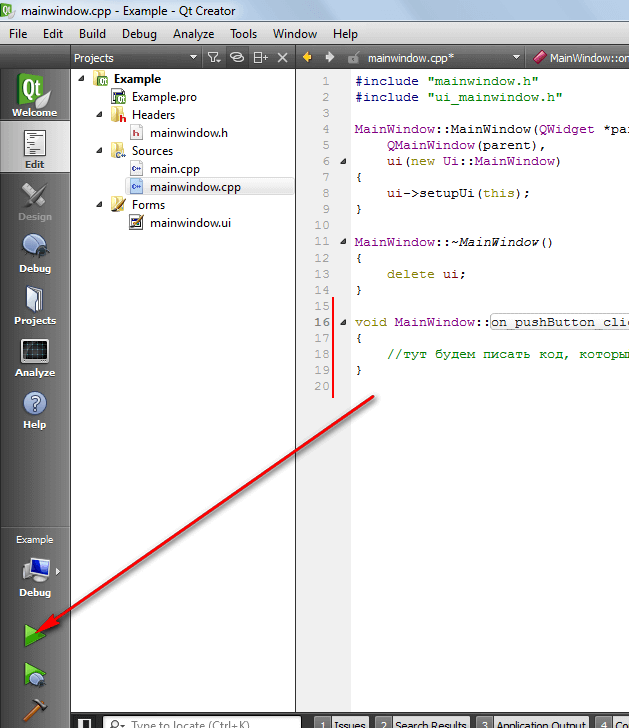

_Рисунок 20 — Запуск приложения_

И поменяйте режим компилирования на `Release`:

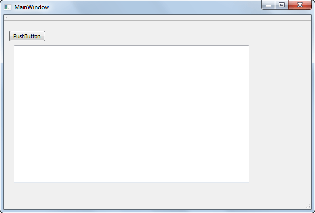

_Рисунок 21 — Изменение режима компилирования на Release_

Должно запустить окно:


_Рисунок 22 — Запущенное приложение_

В статье [Запуск Qt приложений .exe вне Qt Creator](https://github.com/Harrix/harrix.dev-articles-2014/blob/main/run-qt-app-exe-outside-qt/run-qt-app-exe-outside-qt.md) | [🡥](https://harrix.dev/ru/articles/2014/run-qt-app-exe-outside-qt/) рассказывается о том, как запустить приложение и его распространять в Qt. Это не очевидно, как кажется на первый взгляд.
