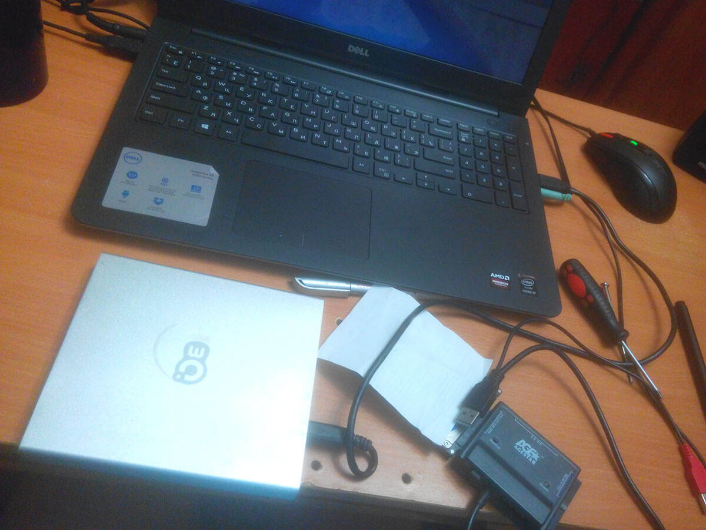
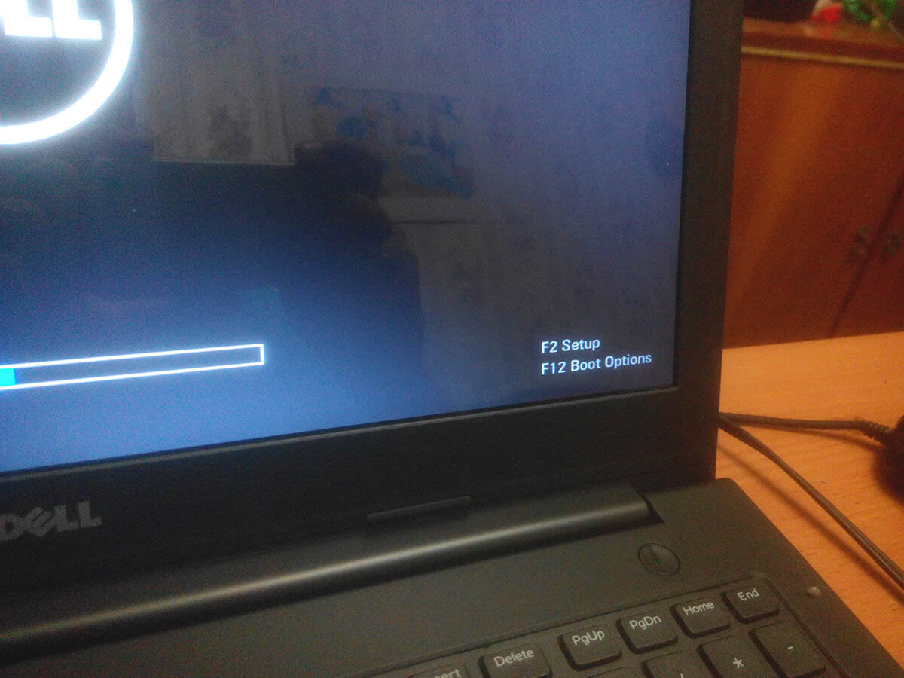
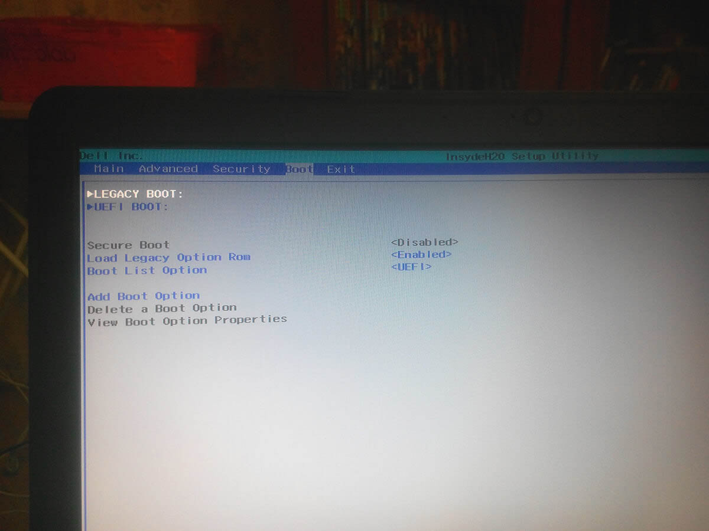
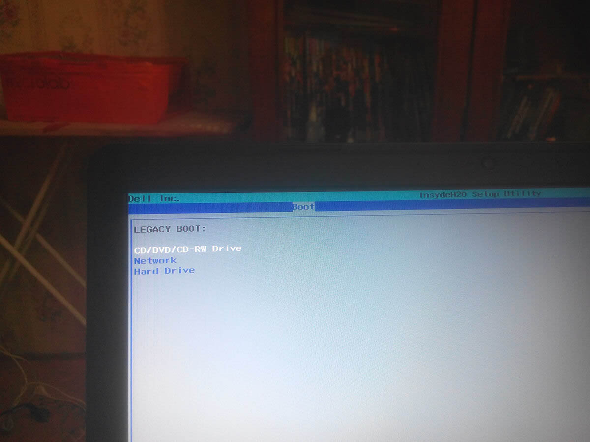

# Boot menu в Dell Inspiron 5547

В статье рассказано, как загрузить в Dell Inspiron 5547 boot menu для загрузки загрузочного диска.

Купил ноут недавно Dell Inspiron 5547, и сразу поменял на нем винт на гибридный. Соответственно, возникла задача установить операционку. Делал через обычный загрузочный диск через внешний дисковод:

При голом винте, BIOS автоматом находит диск. Но я с разными операционками побаловался (Windows 10 не пошла, так как драйвера на Wi-Fi не поставились). В общем, если на винте есть операционка, то нужно вызывать boot menu.

Для этого при запуске ноута, нажимаем на `F2`:

Потом идем в раздел `Boot` стрелочками:

И там выбираем `Legacy Boot` и нажимаем `Enter`:

А там выбираем то устройство, с которого хотим произвести запуск, и нажимаем `Enter`.
