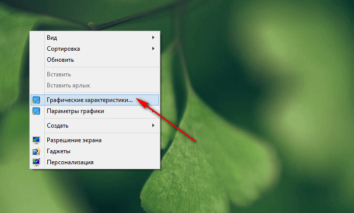
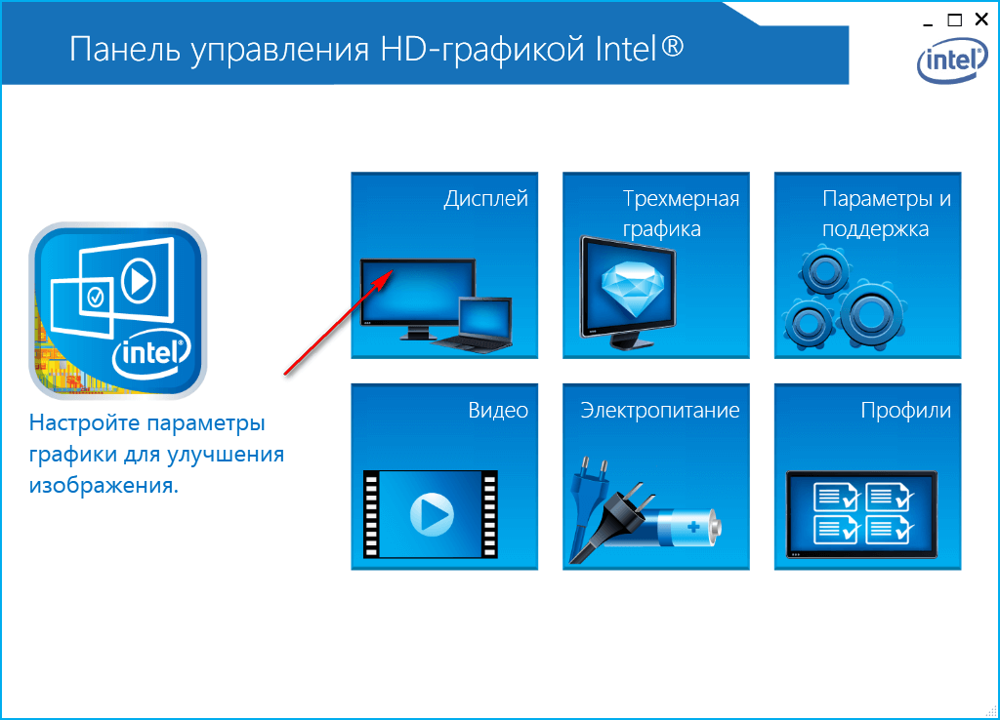
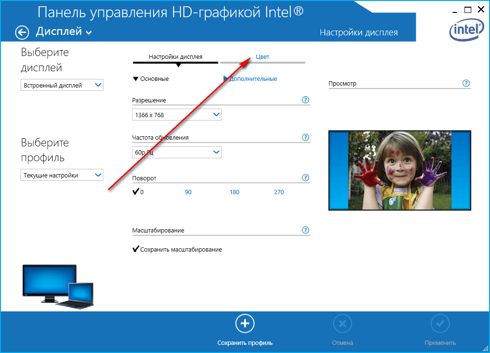
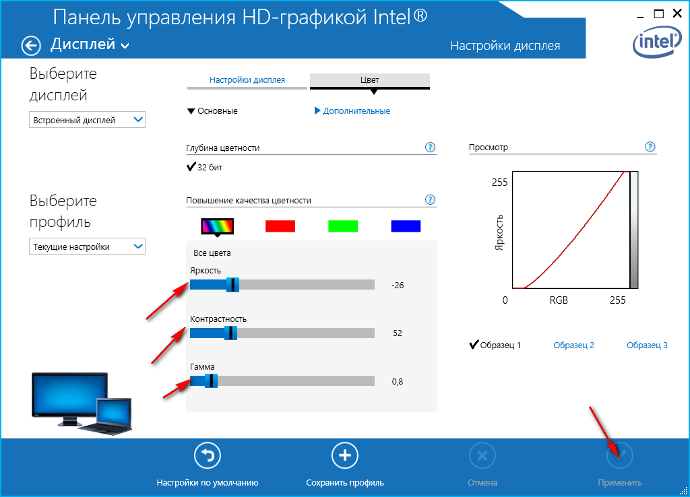
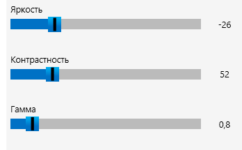
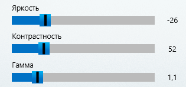

# Настройка цвета в Dell Inspiron 5547

Купил себе ноутбук Dell Inspiron 5547. Противоречивые чувства от него. Многим доволен, а вот экраном не очень. Не доглядел во время покупки. В краткой статье о том, какие я выставил настройки для цветов на экране.

Итак, во-первых, отключайте `True Color`. C ним все цвета выглядят ужасно. Причем, по словам других пользователей на других ноутбуках этой серии ситуация такая же.

А теперь настроим цвета. Правая кнопка по рабочему столу:

Вот такие настройки использовал. Они спорные. Но это максимум, что мне понравилось, и что я смог вытянуть на данной матрице:

Или вот такой вариант:

