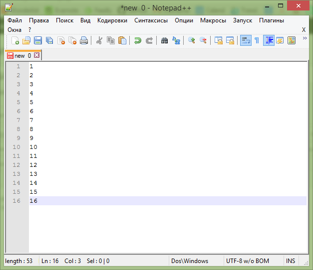
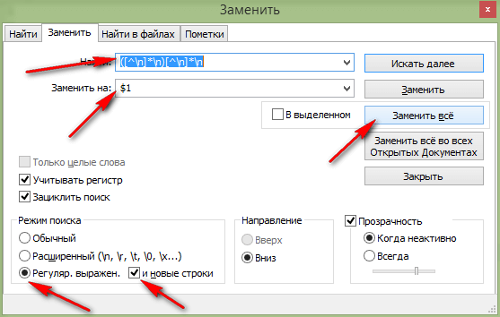
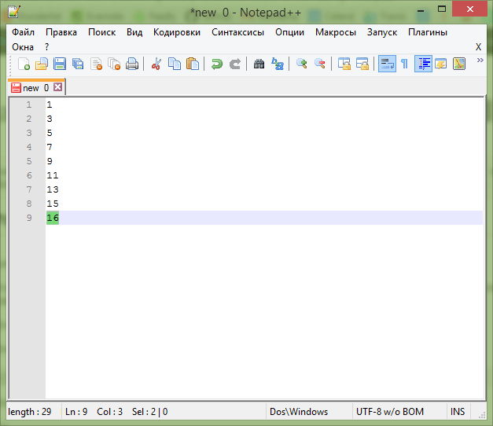

# Как удалить каждую вторую строку в Notepad++


В статье рассказывается как удалить в документе каждую вторую строку в Notepad++.

Допустим у нас такой документ в Notepad++:



_Рисунок 1 — Текст для тестирования_

Нажимаем `Ctrl` + `F` и переходим в закладку `Заменить`.

Вводим в поле поиска такой текст:

```text
([^\n]*\n)[^\n]*\n
```

В поле заменить вводим:

```text
$1
```

Выставим вот такие параметры замены:



_Рисунок 2 — Параметры замены_

В итоге получим, что удалены каждая вторая строка:



_Рисунок 3 — Текст с удаленными строками_

Если не сработает код, то в поле текста добавляем вот такой код:

```text
([^\r\n]*[\r\n]+)[^\r\n]*[\r\n]*
```

И повторяем.
