# Как сделать эффект Дросте

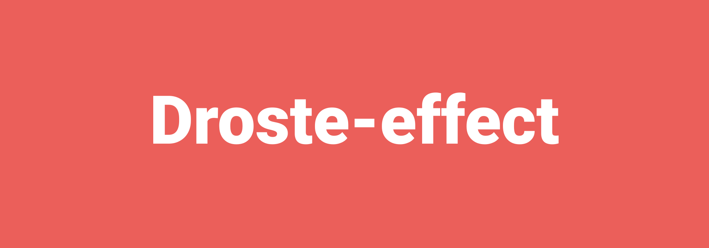

Эффект Дросте (нидерл. Droste-effect) — рекурсивное изображение как частный случай техники mise en abîme. То есть это рисунок в рисунке и так далее. В уроке показано как такое можно сделать самому.

Вы видели вот такие картинки в интернете:

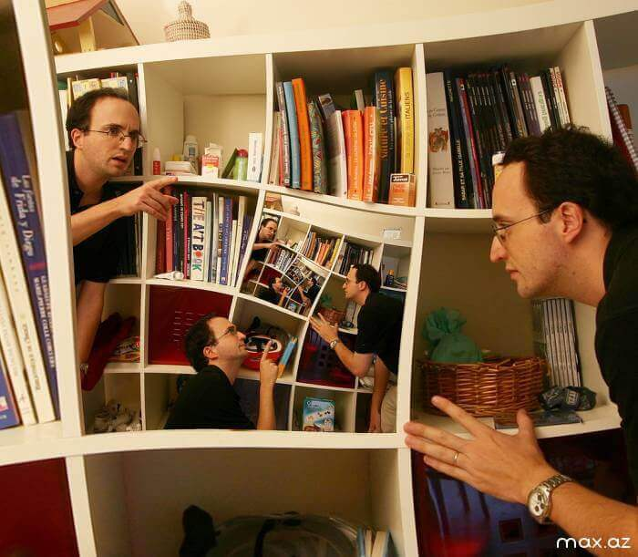

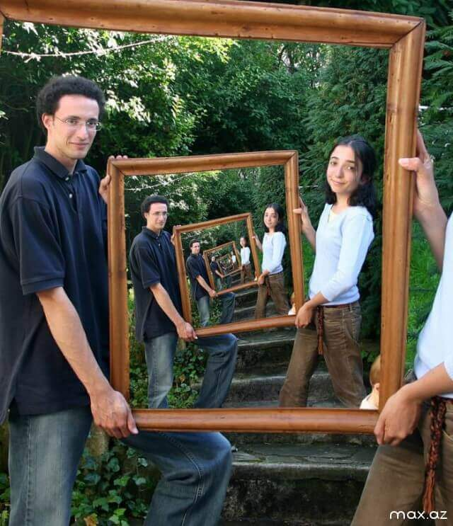

Будем сегодня учиться создавать подобные картинки.

Для начала нам потребуется установить **Adobe Pixel Bender Toolkit 2**. Скачать можно по ссылке <http://www.adobe.com/devnet/pixelbender.html>:

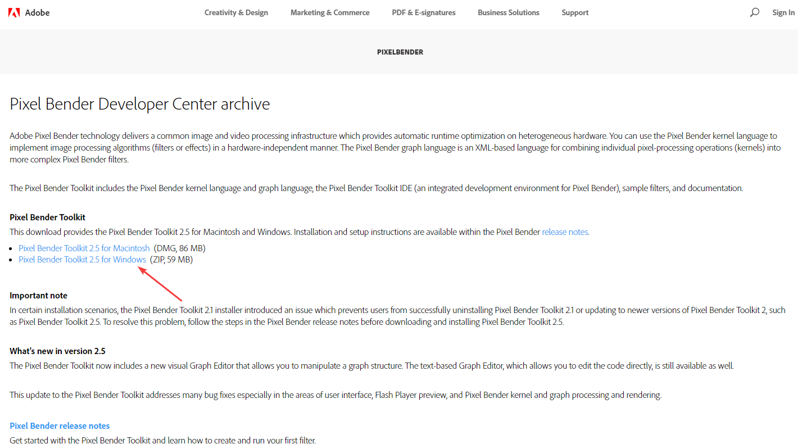

Установка простая и не требует каких-нибудь особых знаний. Теперь нам нужно найти и скачать плагин для этой программы (скорее это скрипт), который и будет трансформировать наши изображения. Идем по ссылке <http://2008.sub.blue/projects/droste.html> и скачиваем. В архиве нам потребуется файл `Droste.pbk`:

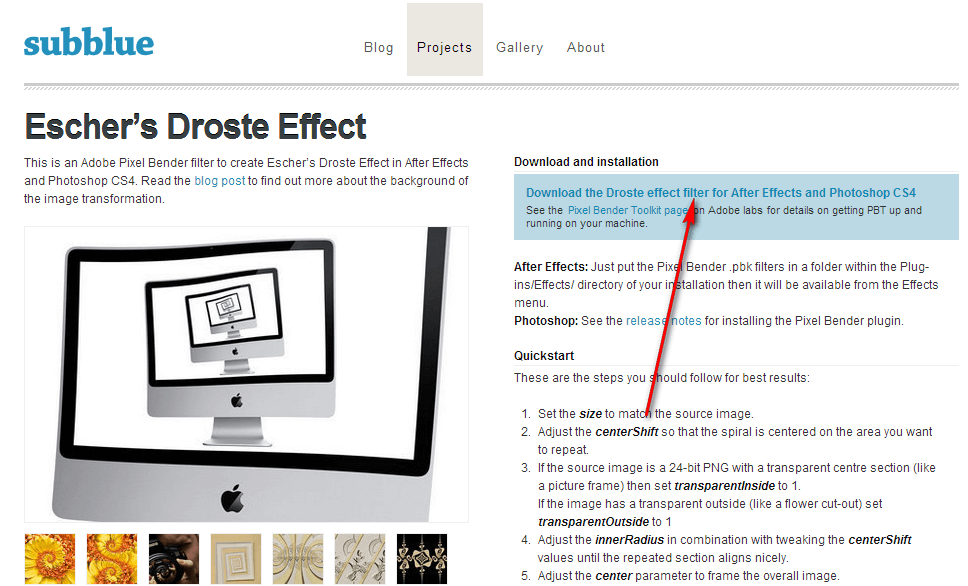

Или можете скачать с этого сайта: [droste.zip](files/droste.zip).

Открываем `Adobe Pixel Bender Toolkit 2`:

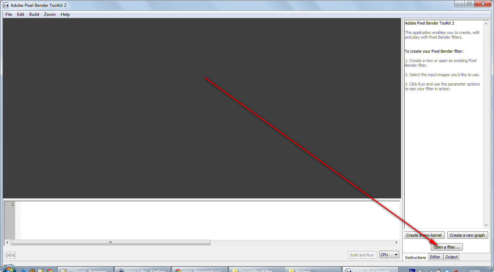

Справа внизу у нас есть кнопка «Open a filter…». Нажимаем ее и открываем файл `Droste.pbk`. У нас внизу откроется код данного скрипта:

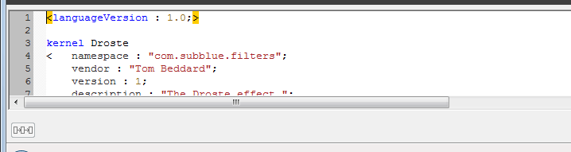

В главном меню загружаем тот рисунок, который вы хотите трансформировать:

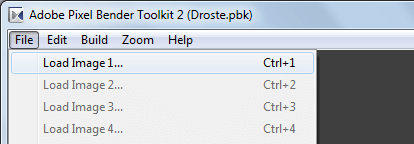

Я решил взять вот такую фотографию:

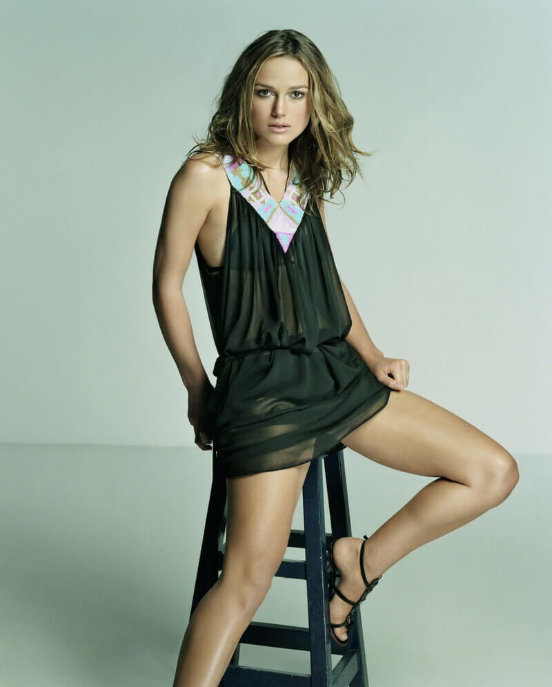

Нажимаем внизу кнопку «Build and Run…». У нас появится первый набросок фотографии, а справа появится панель управления, где вы можете изменять параметры построения картинки:

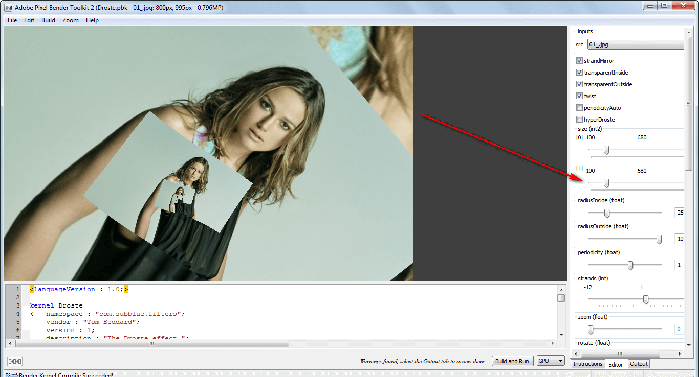

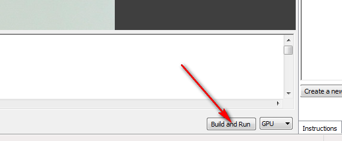

Сохранить полученный результат можете обычным способом:

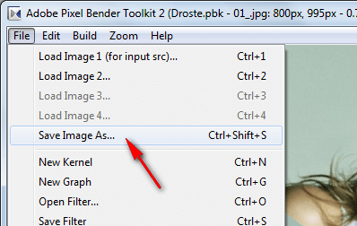

Далее всё будет решать ваша фантазия и подкрутка параметров на картинках. Приведу несколько примеров, которые я замутил на скорую руку:

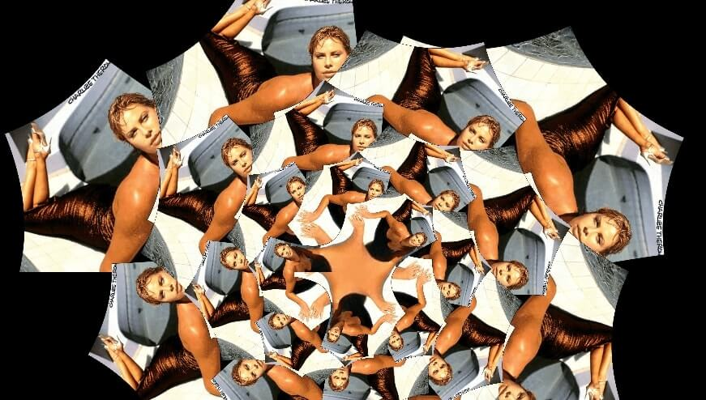

