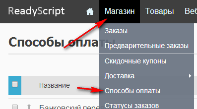
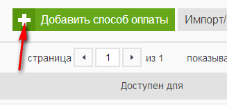
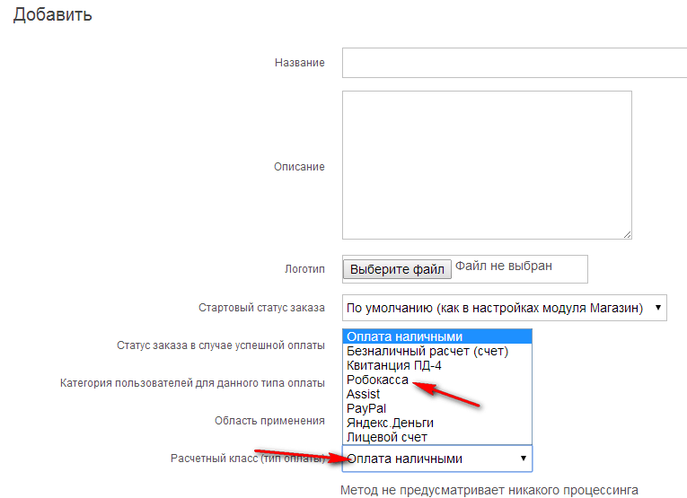
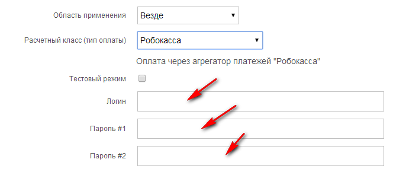
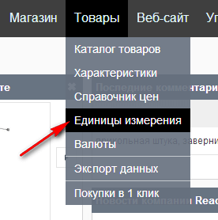
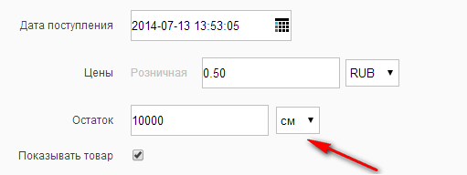

# Небольшой FAQ по ReadyScript 2


Для одного интернет-магазина использовал платную CMS, а именно [http://readyscript.ru](http://readyscript.ru). Понравилась мне в плане возможностей и реализации. Документация у них хорошо прописана, но как всегда ясно не всё. Тут я собрал несколько моментов, которые или с техподдержкой решал или самостоятельно.

<details>
<summary>📖 Содержание</summary>

## Содержание

- [При переносе сайта с одного поддомена на другой поддомен при открытии по новому адресу возникает ошибка 404](#при-переносе-сайта-с-одного-поддомена-на-другой-поддомен-при-открытии-по-новому-адресу-возникает-ошибка-404)
- [А есть ли заглушка, чтобы до открытия магазина сайт не был виден пользователям](#а-есть-ли-заглушка-чтобы-до-открытия-магазина-сайт-не-был-виден-пользователям)
- [Как подключить Робокассу](#как-подключить-робокассу)
- [Как подключить Яндекс-деньги](#как-подключить-яндекс-деньги)
- [Тема «Молодежная» не адаптивная](#тема-молодежная-не-адаптивная)
- [Можно сделать так, чтобы в главном меню выводились только категории товаров, а спецкатегории не выводились](#можно-сделать-так-чтобы-в-главном-меню-выводились-только-категории-товаров-а-спецкатегории-не-выводились)
- [Можно сделать так, чтобы баннеры были не в том виде как у вас: картинка из товара и некоторый текст, а полностью был своим рисунком](#можно-сделать-так-чтобы-баннеры-были-не-в-том-виде-как-у-вас-картинка-из-товара-и-некоторый-текст-а-полностью-был-своим-рисунком)
- [Доставка через Почту России](#доставка-через-почту-россии)
- [Товары не поштучно](#товары-не-поштучно)

</details>

## При переносе сайта с одного поддомена на другой поддомен при открытии по новому адресу возникает ошибка 404

У меня действия происходили внутри одного аккаунта хостинга, так что база одна, и доступ к ней не меняется.

Нужно удалить папку с кэшем `/cache` (так как в ней могут остаться старые пути к файлам относительно корня диска).

Но если у вас есть при этом уже лицензия, но надо отписаться перенести лицензию на новых поддомен. Самому это не сделать, а вот ругаться и не запускать систему он будет.

## А есть ли заглушка, чтобы до открытия магазина сайт не был виден пользователям

Техподдержка ответила так: «Так как нужно, чтобы сайт у вас открывался, а у других пользователей — нет. То самый простой способ — это установить редирект на заглушку (`stub.htm`) для других IP в `htaccess`.

Добавьте следующие строки в `.htaccess`:

```text
RewriteCond %{REMOTE_ADDR} !(222.222.22.222)
RewriteCond %{SCRIPT_FILENAME} !stub.htm
RewriteRule .* /stub.htm [R=302,L]
```

Вам нужно просто указать свой IP вместо `222.222.22.222`, узнать его можно здесь: <http://2ip.ru/>. И создать файл заглушки `stub.htm` в корне.

## Как подключить Робокассу



_Рисунок 1 — Выбор способов оплаты_



_Рисунок 2 — Добавление способа оплаты_



_Рисунок 3 — Выбор Робокассы_

Чуть ниже появятся еще поля:



_Рисунок 4 — Ввод данных Робокассы_

Их значения надо брать из кабинета Робокассы. Учтите, что там регистрация долгая: договора оформлять и так далее.

## Как подключить Яндекс-деньги

Аналогично, как Робокассу. Дополнительно техподдержка написала следующее:

«Подключения сервиса яндекс.деньги производится через службу поддержки Яндекс. То есть вам необходимо составить письмо, что вы хотите принимать платежи из интернет-магазина на свой кошелек и просите предоставить все параметры. Они в ручном режиме подключают каждого пользователя.

Для приема платежей от Яндекс, ваш сайт должен поддерживать протокол SSL (открываться по https) с сертификатом (подойдет самоподписанный), так как это требование Яндекс.»

## Тема «Молодежная» не адаптивная

Нет. А жаль.

## Можно сделать так, чтобы в главном меню выводились только категории товаров, а спецкатегории не выводились

Чтобы спецкатегории не выводились в списке обычных категорий, нужно снять флажок «публичный» в настройках спецкатегории.

## Можно сделать так, чтобы баннеры были не в том виде как у вас: картинка из товара и некоторый текст, а полностью был своим рисунком

Для вывода произвольных изображений в качестве баннера, вместо товарных позиций, вам необходимо использовать блок `Баннеры` → `Слайдер`, вместо `Каталог` → `Товары в виде баннера`.

Необходимо:

- Завести баннерную зону и загрузить в неё баннеры в разделе `Разное` → `Баннеры`.
- Зайти в раздел `Веб-сайт` → `Конструктор сайта`.
- Выбрать страницу `Главная страница`.
- Удалить блок `Товары в виде баннера`.
- Вместо него добавить блок `Баннеры` → `Слайдер`. При добавлении укажите созданную на шаге 0 зону.
- Очистите кэш (две стрелки в шапке сайта).

После этого вместо блока `Товары в виде баннера`, будет отображаться блок `Слайдер`, который будет показывать все баннеры, прикрепленные к зоне с ротацией.

## Доставка через Почту России

Спросил я следующее: «Для реализации способа доставки Почта России есть заданные магистральные пояса. Они будут верными для всех городов, или же только для Москвы? А если только для Москвы, то где взять для других городов? И если для других городов другие будут списки, то формулы не поменяются расчёта?»

Мне ответили так:

«К сожалению, у почты России все очень сложно. Магистральные пояса актуальны только Москвы. Для других регионов магистральные пояса нужно запрашивать вашего местного почтамта или искать в интернете. Формулы расчета также актуальны только для Москвы.

У нашей почты, к сожалению, нет официального API, к которому можно обращаться для расчета стоимости доставки из любого региона в другой, как это должно быть в теории. Многие наши клиенты грубо заводят свои стоимости доставки для различных регионов, таким образом решая данную проблему.»

## Товары не поштучно

Есть некоторые товары, которые продаются не поштучно, а килограммами, метрами и так далее. Как быть с ними?

Вначале нужно создать нужную единицу измерений:



_Рисунок 5 — Выбор единиц измерения_

Потом в разделе редактирования товара около остатка (он должен быть в нужных единицах) выберите единицу измерения:



_Рисунок 6 — Выбор единицы измерений_

А чтобы количество товара (в штуках, сантиметрах) пользователь мог вводить не в корзине, а сразу, то идем можете подправить шаблон карточки товара `product.tpl`, добавив туда форму количества.

Достаточно просто добавить в HTML:

```html
<input type="text" name="amount" value="1" />
```

Чтобы вывести единицу изменения возле формы вы можете воспользоваться конструкцией:

```php
{$product->getUnit()->stitle}
```
