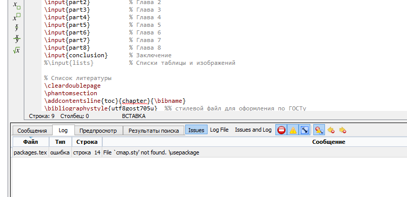
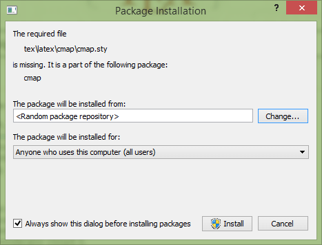
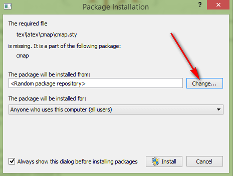
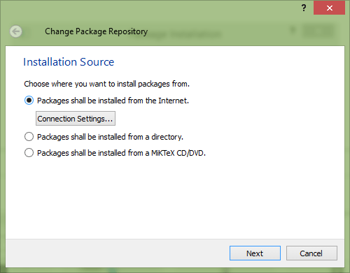
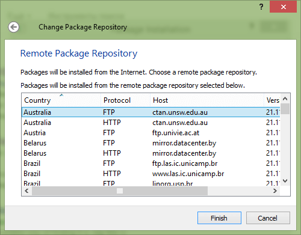
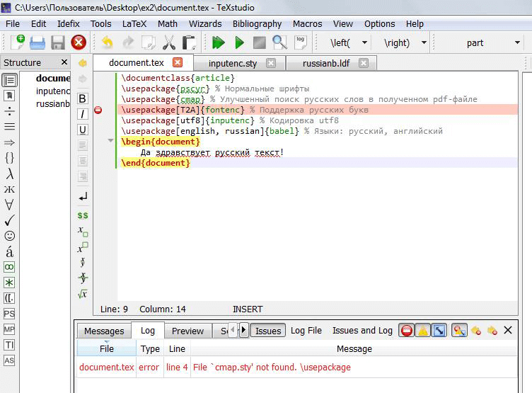
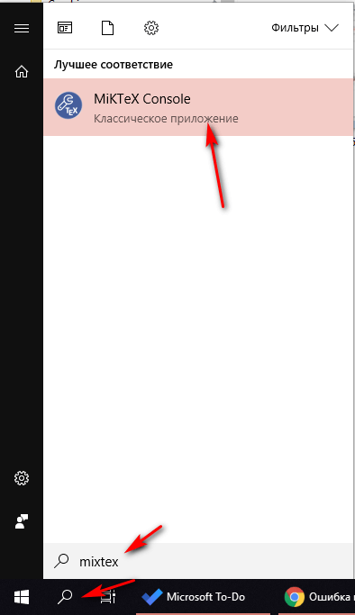
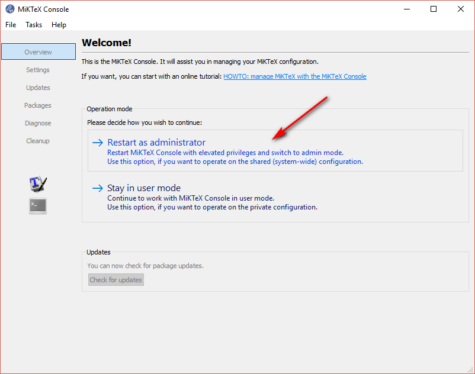
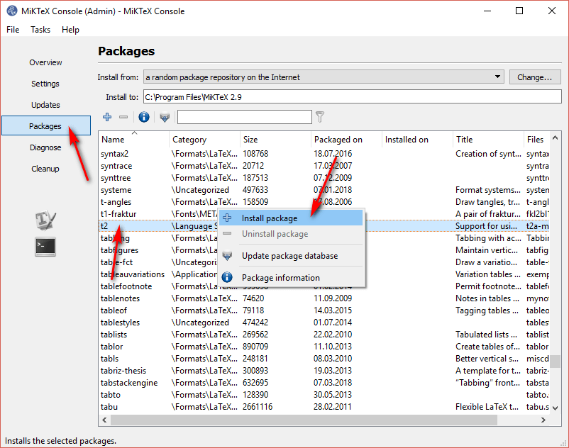

# Ошибка при загрузке пакетов в TeXstudio

В статье рассказывается, как в TeXstudio (точнее проблема вызывается в MiKTeX) решить проблему с отсутствием загрузки пакетов типа: `` File `cmap.sty' not found ``. Вместо пакета `cmap.sty` у вас может быть ошибка с другим пакетом.

Столкнулся с проблемой, когда недавно купил новый ноут с Windows 8.1, и там надо было восстановить всю инфраструктуру, что была на предыдущем ноуте. В том числе надо было [восстановить](https://github.com/Harrix/harrix.dev-blog-2018/blob/main/2018-08-03-install-latex/2018-08-03-install-latex.md) связку MiKTeX + TeXstudio. Но при попытке первой компиляции файлов с использованием различных пакетов, столкнулся с тем, что MiKTeX не подгружает пакеты, хотя и должен:

Когда пытаемся скомпилировать файл в TeXstudio, то выдается такое окошко, что пакетов не хватает:

## Вариант 1

Нажимаем на `Change`:

Выбираем подключение по интернету:

И выбираем сервер с стандартными пакетами. Я выбрал первый. Если он вдруг не будет работать, то выберете потом другой:

При таких настройках загрузка пакетов происходит успешно. Напоминаю, что загрузка пакетов может занимать какое-то время.

## Вариант 2

Например, в этом варианте отсутствует пакет `T2` (прислал один из пользователей):

Установим пакет принудительно.

Через пуск находим `MikTex Console`:

И перезапускаем его под администратором:

В разделе `Packages` находим нужный пакет, щелкаем по нему правой кнопкой и устанавливаем его:

Пытаетесь перекомпилировать ваш документ. Если еще какие-то пакеты попросит, то тоже их установите аналогичным способом.
