# Как скачать файлы с GitHub


Небольшая инструкция по скачиванию файлов с <https://github.com>. Для работы над проектами это замечательная система, но с точки зрения стороннего пользователя процесс скачивания файлов не совсем очевидный.

## Содержание

- [Скачивание релиза проекта](#скачивание-релиза-проекта)
- [Скачивание целого проекта](#скачивание-целого-проекта)
- [Скачивание отдельного файла (текстовой)](#скачивание-отдельного-файла-текстовой)
- [Скачивание отдельного файла (PDF)](#скачивание-отдельного-файла-pdf)
- [Простой метод для разработчиков](#простой-метод-для-разработчиков)
- [Консольный способ для разработчиков](#консольный-способ-для-разработчиков)

Ниже приведены разные способы скачивания. Выбирайте, какой вам по душе.

## Скачивание релиза проекта

Если вам нужен не сам исходный код проекта, а уже готовый вариант приложения, то лучше посмотреть релизы данного проекта.

Перейдите по ссылке к релизам проекта. Рассмотрим на примере <https://github.com/plotly/plotly.js>:

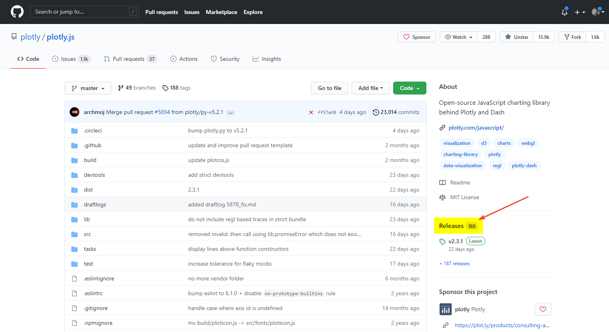

_Рисунок 1 — Релизы проекта_

А там скачивайте ту версию релиза, которая вам нужна:

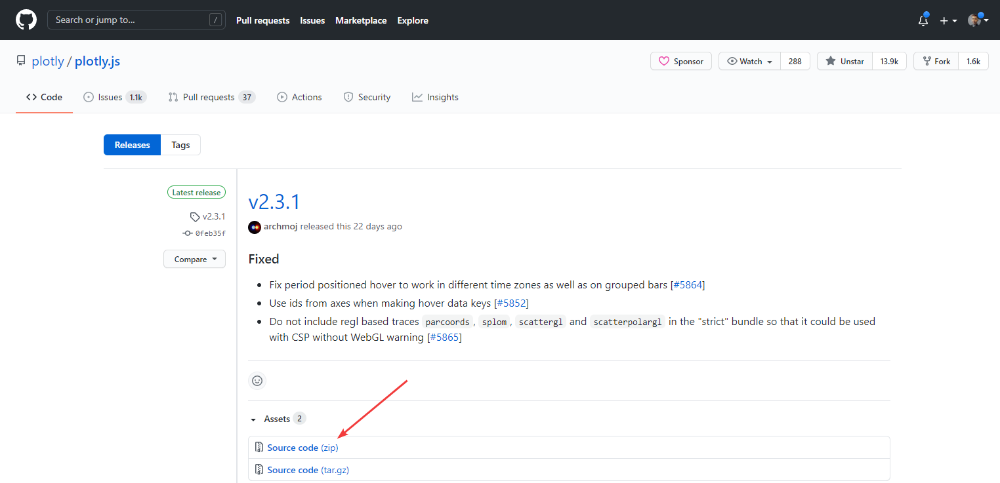

_Рисунок 2 — Выбор релиза проекта_

Прошу обратить внимание, что не всякий проект на GitHub обладает релизами. Некоторые разработчики или не знают об этой функции, или же не занимаются релизами, а всё сохраняют в главном репозитории.

## Скачивание целого проекта

Например вы заходите на проект <https://github.com/plotly/plotly.js>. И вам нужно скачать его весь (а там уже уже на компе выбрать для себя нужные файлы).

Справа наверху есть кнопка `Download ZIP`:

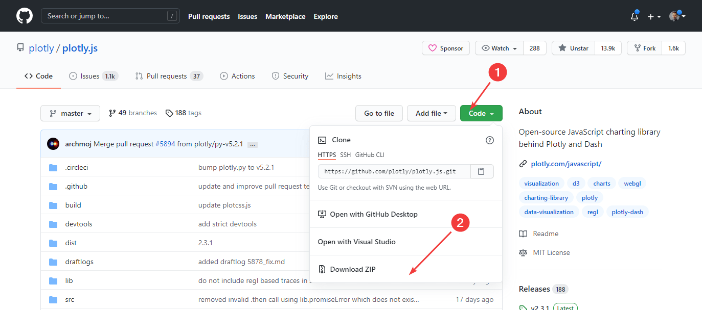

_Рисунок 3 — Кнопка скачивания проекта_

Щелкайте по ней и zip архив с проектом будет скачен к вам на компьютер.

## Скачивание отдельного файла (текстовой)

Допустим, на том же репозитории plotly.js вам нужен только один текстовой файл. Например, `package.json`. Находим его и щелкаем по нему:

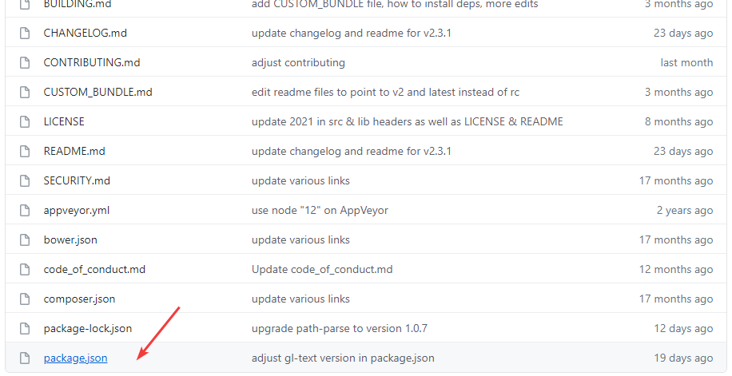

_Рисунок 4 — Выбор нужного файла_

Щелкните по данному файлу (или перейдите по ссылке, если у вас есть прямая ссылка, как приведена выше):

Кликнете по кнопке `Raw`:

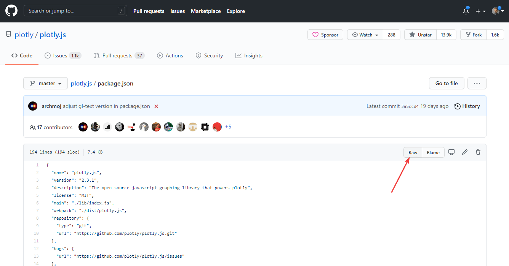

_Рисунок 5 — Клик по кнопке Raw_

Откроется чистый код файла. Нажимаем правую кнопку мыши, и выбираем пункт меню `Сохранить как…`:

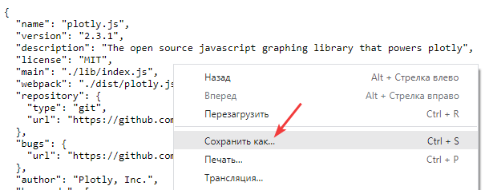

_Рисунок 6 — Клик по кнопке Raw_

И сохраняем наш файл:

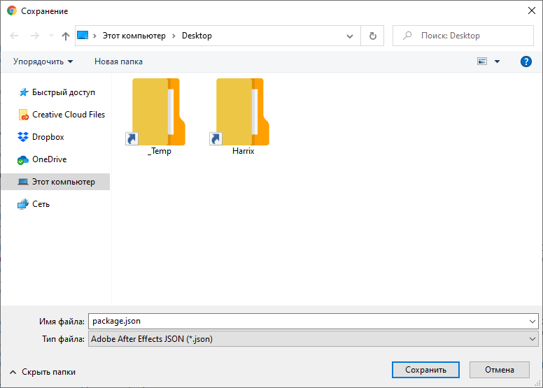

_Рисунок 7 — Сохранение файла_

В некоторых файлах нужно будет убрать лишнее расширение:

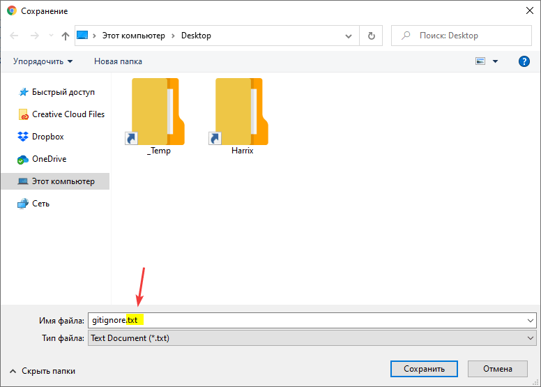

_Рисунок 8 — Наличие у файла лишнего расширения_

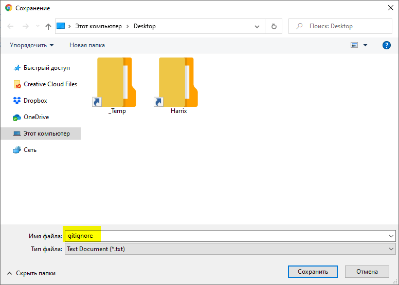

_Рисунок 9 — Файл без лишнего расширения_

Также отдельные файлы открываются через клиент GitHub через кнопку `Open`:

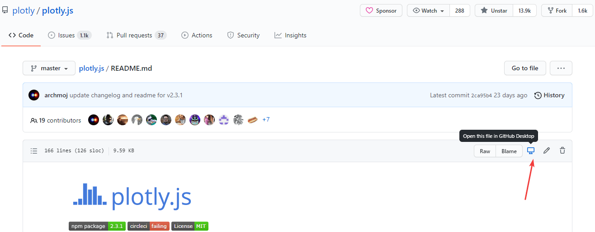

_Рисунок 10 — Открытие файла через кнопку Open_

## Скачивание отдельного файла (PDF)

Конечно, лучше весь проект скачать, как показано выше, но если не хотите, то читайте дальше.

Щелкните по нужному файлу.

Откроется просмотр содержимого файла. И там в 2021 году появляется кнопка download, а также есть предварительный просмотр, чего раньше не было:

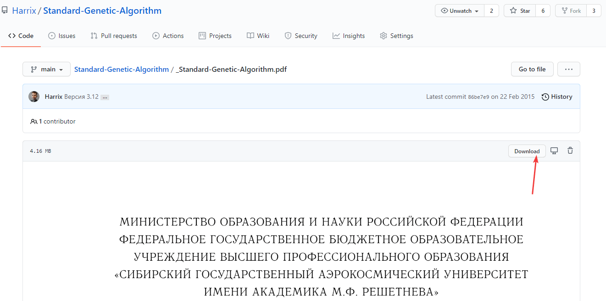

_Рисунок 11 — Просмотр нетекстового файла_

Теперь у вас есть сохраненный файл.

С остальными форматами файлов всё аналогично.

## Простой метод для разработчиков

Если вы активный пользователь GitHub, и у вас есть уже свой репозиторий, то вы и так все знаете. Но для полноты способов я здесь его приведу.

Заходите на сайт под своей учетной записью.

Переходите на нужный вам репозиторий (проект).

Если не хотите создавать отдельную ветку для развития проекта, то нажимайте `Open in Desktop`. А там уже через клиент GitHub обновляете его и копия проекта появляется у вас на компьютере:

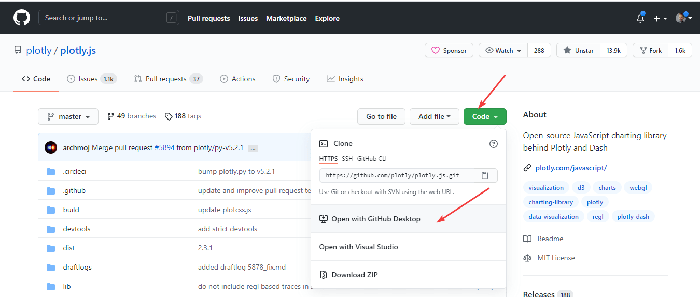

_Рисунок 12 — Открытие проекта через Git_

Если хотите создать свою ветку продукта, то делаете **fork** проекта. И проект в виде копии появляется у вас в коллекции репозиториев. А там уже через клиент GitHub обновляете его и копия проекта появляется у вас на компьютере:

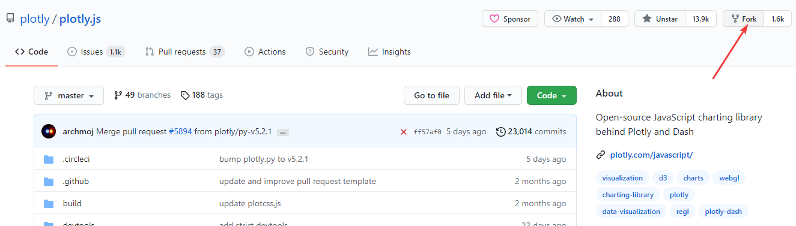

_Рисунок 13 — Создание форка проекта_

## Консольный способ для разработчиков

А вообще лучше клонировать проекты себе на компьютер через консоль. Например, так:

```shell
git clone https://github.com/plotly/plotly.js.git
```
