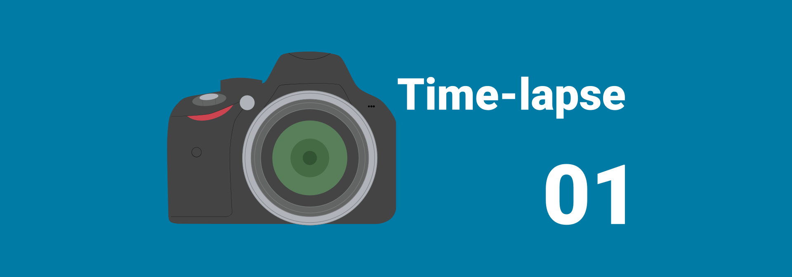
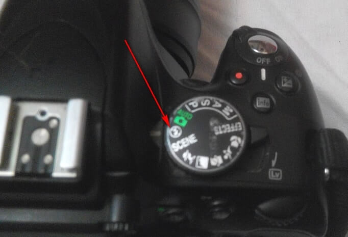
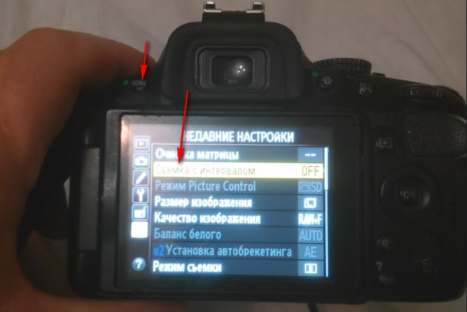
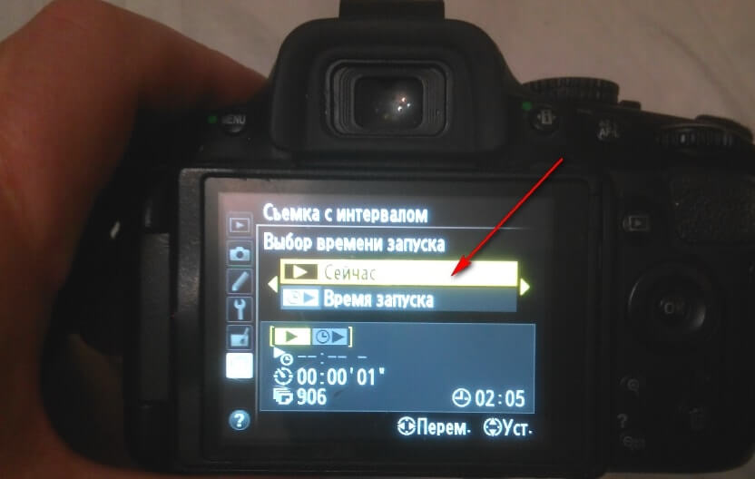
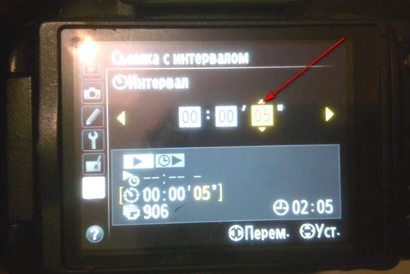
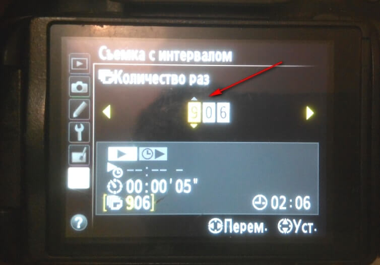
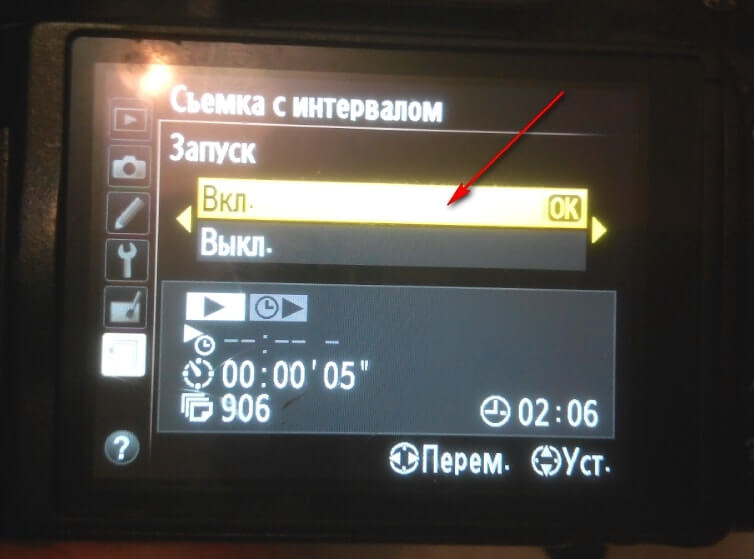

# Как сделать Time-lapse видео. Часть 1 — Сбор материала

Решил написать серию статей о том, как собрать нормальное Time-lapse видео для новичков. В интернете мало материала, которые бы показывали, как собрать видео с непрофессиональной техникой, как исправлять проблемные моменты… Я сам непрофессионал в данной области, так что можно считать, что эти статьи написаны для памятки себе.

**Что потребуется**: штатив и фотоаппарат.

У меня Nikon D5100. Поэтому в данной части буду рассказывать конкретно про съемку с помощью данного фотоаппарата.

Не на всех фотоаппаратах есть функция автоматического фотографирования с постоянным интервалом съемки. Для таких устройств надо приобретать соответствующие гаджеты.

Устанавливаем режим, например, в автоматический без вспышки. Конечно, правильно установить в ручной режим `M`, и там выставить все параметры. Но попробуем через этот режим:

_Рисунок 1 — Режим без вспышки_

Найдите в `Меню` режим `Съемка с интервалом`:

_Рисунок 2 — Режим «Съемка с интервалом»_

Выбираем режим `Сейчас`, если хотите начать съемку прямо сейчас. В режиме `Время съемки` можете выбрать время старта съемок:

_Рисунок 3 — Режим «Сейчас для съемки с интервалом»_

Выберете интервал съемок. На фотографии выбрано 5 сек. Какое время выбрать вам? Всё зависит от скорости протекания процессов. Для быстрых облаков 5 секунд хватит. Для более медленных облаков и 20 секунд будет достаточно:

_Рисунок 4 — Выставление интервала между кадрами_

Выберете количество кадров, которое необходимо снять. Лучше поставьте побольше. Всё равно вы сможете просто отключить фотоаппарат, когда посчитаете, что достаточно наснимали:

_Рисунок 5 — Выставление количества кадров_

И включайте съемку, когда установите фотоаппарат на штатив:

_Рисунок 6 — Запуск съемки_

Вот и всё! После этой нехитрой процедуры у вас наберется определенный набор фотографий.

В [Как сделать Time-lapse видео. Часть 2 — Обработка файлов](https://github.com/Harrix/harrix.dev-articles-2014/blob/main/how-to-make-time-lapse-2/how-to-make-time-lapse-2.md) <!-- https://harrix.dev/ru/articles/2014/how-to-make-time-lapse-2/ --> части будем обрабатывать фотографии в Lightroom.
