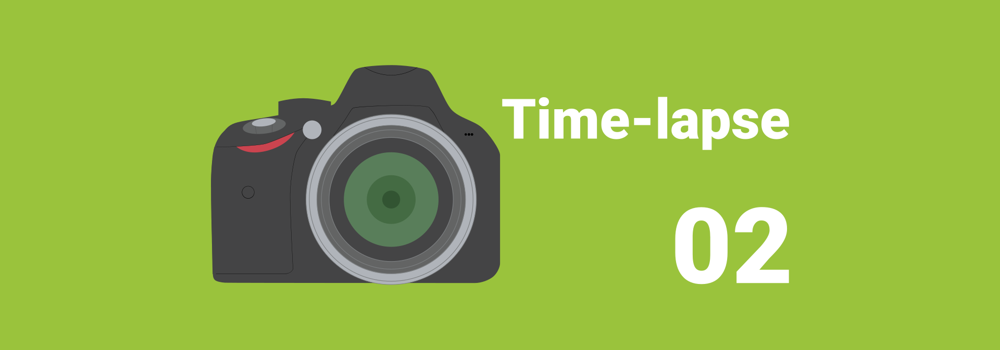

# Как сделать Time-lapse видео. Часть 2 — Обработка файлов

Во второй части обсудим как обрабатывать фотографии для Time-lapse через Lightroom.

Решил написать серию статей о том, как собрать нормальное Time-lapse видео для новичков. В интернете мало материала, которые бы показывали, как собрать видео не с профессиональной техникой, как исправлять проблемные моменты… Я сам непрофессионал в данной области, так что можно считать, что эти статьи написаны для памятки себе.

**Что потребуется**: снимки, Lightroom.

В [Как сделать Time-lapse видео. Часть 1 — Сбор материала](https://github.com/Harrix/harrix.dev-articles-2014/blob/main/how-to-make-time-lapse-1/how-to-make-time-lapse-1.md) | [🡥](https://harrix.dev/ru/articles/2014/how-to-make-time-lapse-1/) мы получили наши снимки. Теперь надо их обработать, перед тем, как будем их соединять в видео.

Итак, у нас есть множество фотографий (у меня получилось 250):

_Рисунок 1 — Отснятые фотографии_

Этих кадров хватит на `250 / 24 = 10,41` секунд видео.

Съемки проводились летом и на холме в автоматическом режиме съемки. При этом яркость кадров меняется от кадра к кадру (будет мигание в видео). Из-за наличия ветра штатив шатается и картинка тоже будет колыхаться. Так как было лето, то в кадр иногда попадают насекомые — их тоже надо будет убрать, а то в видео будут помехи.

Итак, приступаем к работе.

## Обработка в Lightroom

Открываем `Lightroom` (у меня Adobe Photoshop Lightroom 5 64-bit). Убеждаемся в том, что находимся в режиме `Library`:

_Рисунок 2 — Открытый Lightroom в режиме Library_

Перетаскиваем файлы из папки:

_Рисунок 3 — Перетаскивание файлов в Lightroom_

Нажимаем `Import`:

_Рисунок 4 — Импорт фотографий_

_Рисунок 5 — Фотографии в Lightroom после импорта_

Выбираем первый рисунок и идем его редактировать в режиме `Develop`:

_Рисунок 6 — Переход в режим Develop из Library_

_Рисунок 7 — Фотография в режиме Develop_

Как-нибудь обработайте фотографию. Например, я использовал следующие настройки:

_Рисунок 8 — Общие настройки обработки_

_Рисунок 9 — Настройки цвета_

_Рисунок 10 — Настройки цветов по отдельности_

_Рисунок 11 — Настройки цветов по отдельности_

_Рисунок 12 — Настройки четкости и подавления шума_

Сверху наложил еще градиент, чтобы сохранить небо:

_Рисунок 13 — Наложение градиента на небо_

Вот что получили. Возможно, что я переборщил, но для урока сойдет:

_Рисунок 14 — Сравнение фотографии в режиме «до и после»_

Теперь сохраним данные настройки:

_Рисунок 15 — Создание нового пресета_

_Рисунок 16 — Выбор имени и папки нового пресета_

Как видим, наши настройки сохранились в общем наборе `Presets`:

_Рисунок 17 — Пресет в папке пресетов_

Переходим в режим `Library`:

_Рисунок 18 — Переход в режим Library_

Выделяем все файлы, которые хотим также обработать. У меня это все файлы: `Ctrl` + `A`:

_Рисунок 19 — Выделение всех файлов_

Примените сохраненные настройки ко всем файлам:

_Рисунок 20 — Выбор пресета из сохраненных_

_Рисунок 21 — Выбор нашего пресета_

Увидим, что все наши фотографии постепенно также поменяют свой вид:

_Рисунок 22 — Процесс применения пресета_

Осталось только их экспортировать. Переходим в `File` → `Export…`:

_Рисунок 23 — Вызов экспорта фотографий_

Выбираете папку для сохранения файлов:

_Рисунок 24 — Выбор папки для сохранения_

Убеждаетесь, что качество экспортируемых файлов высшее. И экспортируете:

_Рисунок 25 — Выбор качества jpg_

Процесс будет не быстрым, и комп будет весьма нагружен работой, так что сходите за бутербродом. В результате получите множество обработанных файлов:

_Рисунок 26 — Экспортируемые фотографии_

В Lightroom мы закончили работу! В [Как сделать Time-lapse видео. Часть 3 — Простая сборка видео](https://github.com/Harrix/harrix.dev-articles-2014/blob/main/how-to-make-time-lapse-3/how-to-make-time-lapse-3.md) | [🡥](https://harrix.dev/ru/articles/2014/how-to-make-time-lapse-3/) будем уже собирать видео.
