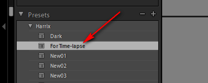

# Как сделать Time-lapse видео. Часть 2 — Обработка файлов

Во второй части обсудим как обрабатывать фотографии для Time-lapse через Lightroom.

Решил написать серию статей о том, как собрать нормальное Time-lapse видео для новичков. В интернете мало материала, которые бы показывали, как собрать видео не с профессиональной техникой, как исправлять проблемные моменты… Я сам непрофессионал в данной области, так что можно считать, что эти статьи написаны для памятки себе.

**Что потребуется**: снимки, Lightroom.

В [Как сделать Time-lapse видео. Часть 1 — Сбор материала](https://github.com/Harrix/harrix.dev-blog-2014/blob/main/how-to-make-time-lapse-1/how-to-make-time-lapse-1.md) мы получили наши снимки. Теперь надо их обработать, перед тем, как будем их соединять в видео.

Итак, у нас есть множество фотографий (у меня получилось 250):

Этих кадров хватит на `250 / 24 = 10,41` секунд видео.

Съемки проводились летом и на холме в автоматическом режиме съемки. При этом яркость кадров меняется от кадра к кадру (будет мигание в видео). Из-за наличия ветра штатив шатается и картинка тоже будет колыхаться. Так как было лето, то в кадр иногда попадают насекомые — их тоже надо будет убрать, а то в видео будут помехи.

Итак, приступаем к работе.

## Обработка в Lightroom

Открываем `Lightroom` (у меня Adobe Photoshop Lightroom 5 64-bit). Убеждаемся в том, что находимся в режиме `Library`:

Перетаскиваем файлы из папки:

Нажимаем `Import`:

Выбираем первый рисунок и идем его редактировать в режиме `Develop`:

Как-нибудь обработайте фотографию. Например, я использовал следующие настройки:

Сверху наложил еще градиент, чтобы сохранить небо:

Вот что получили. Возможно, что я переборщил, но для урока сойдет:

Теперь сохраним данные настройки:

Как видим, наши настройки сохранились в общем наборе `Presets`:

Переходим в режим `Library`:

Выделяем все файлы, которые хотим также обработать. У меня это все файлы: `Ctrl` + `A`:

Примените сохраненные настройки ко всем файлам:

Увидим, что все наши фотографии постепенно также поменяют свой вид:

Осталось только их экспортировать. Переходим в `File` → `Export…`:

Выбираете папку для сохранения файлов:

Убеждаетесь, что качество экспортируемых файлов высшее. И экспортируете:

Процесс будет не быстрым, и комп будет весьма нагружен работой, так что сходите за бутербродом. В результате получите множество обработанных файлов:

В Lightroom мы закончили работу! В [Как сделать Time-lapse видео. Часть 3 — Простая сборка видео](https://github.com/Harrix/harrix.dev-blog-2014/blob/main/how-to-make-time-lapse-3/how-to-make-time-lapse-3.md) будем уже собирать видео.
