# Как сделать Time-lapse видео. Часть 3 — Простая сборка видео

В третей части обсудим как собрать видео из фотографий в Adobe Premiere.

Решил написать серию статей о том, как собрать нормальное Time-lapse видео для новичков. В интернете мало материала, которые бы показывали, как собрать видео не с профессиональной техникой, как исправлять проблемные моменты… Я сам непрофессионал в данной области, так что можно считать, что эти статьи написаны для памятки себе.

**Что потребуется**: снимки, Adobe Premiere.

В статье [Как сделать Time-lapse видео. Часть 2 — Обработка файлов](https://github.com/Harrix/harrix.dev-blog-2014/blob/main/how-to-make-time-lapse-2/how-to-make-time-lapse-2.md) мы получили обработанные снимки в Lightroom, из которых можно уже собирать видео. Чем мы сейчас и займемся. В данной части мы соберем простейшее вариант видео. Он подойдет в случаях, если кадры без всяких артефактов, снимались не в автоматическом режиме, без дрожания камеры — в идеальных условиях.

## Сбор видео в Adobe Premiere CS6

Открываем Adobe Premiere и создаем новый проект:

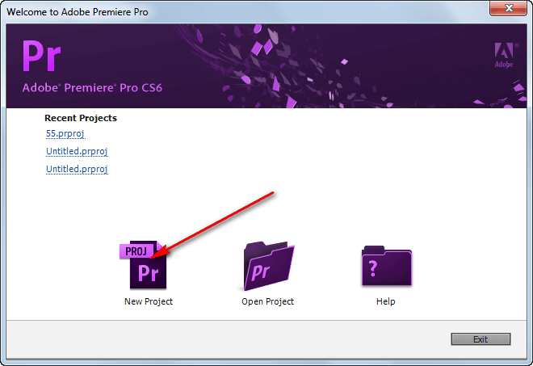

Задаем папку проекта и его имя:

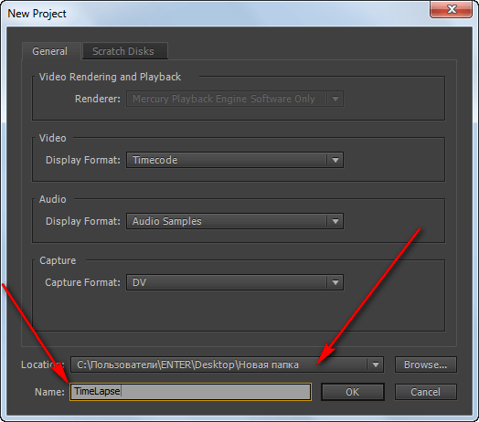

Выбираем видео в стиле Full-HD:

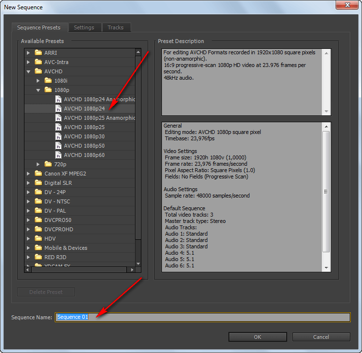

Видим теперь вот такое окно:

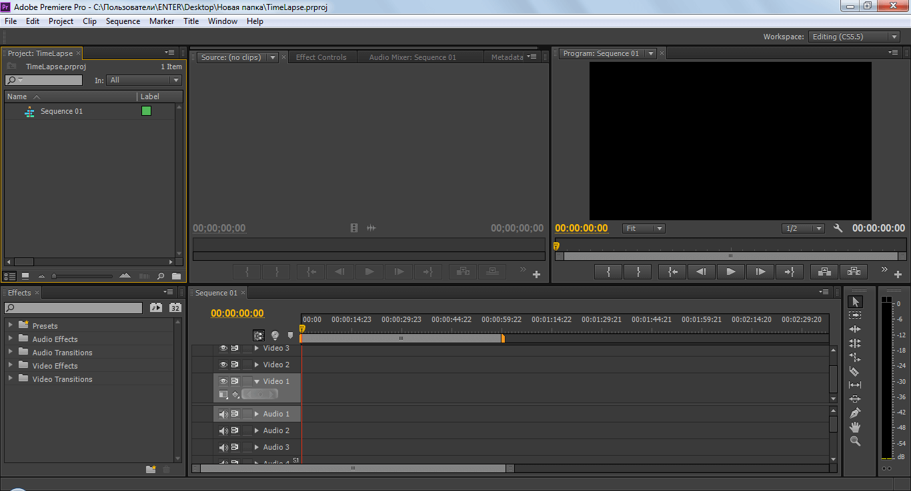

Настроим количество фреймов для одной фотографии. Для этого переходим в настройки Premiere:

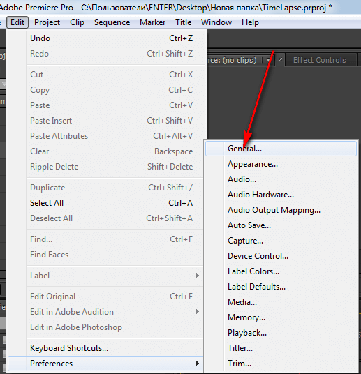

И считаем, что каждый рисунок будет длиться только один фрейм. Что нам и надо:

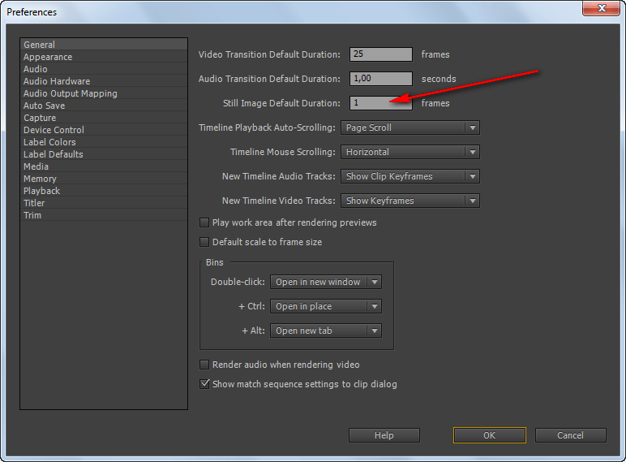

Создаем новую папку в разделе загруженных файлов. Назовем ее `Images`:

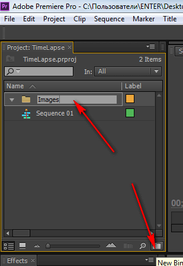

Теперь займемся импортом наших рисунков. Не рекомендую делать это через перетаскивание файлов — комп тормозит будет сильно. Идем `File` → `Import…`:

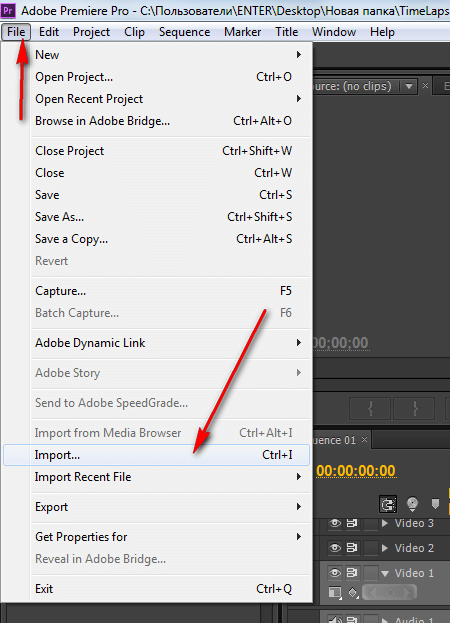

Выберите все нужные фотографии и начните импорт:

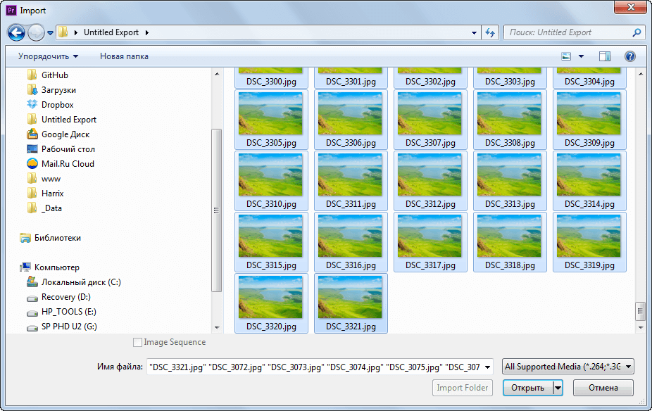

Импорт файлов будет долгим, и он будет сильно загружать компьютер:

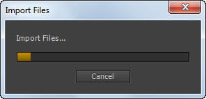

В результате получим в папке `Images` список наших файлов, причем на данный момент все они будут выделены:

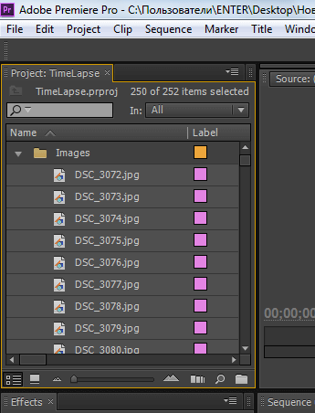

Правая кнопка по выделенным фотографиям, и выбираем пункт `New Sequence From Clip…`:

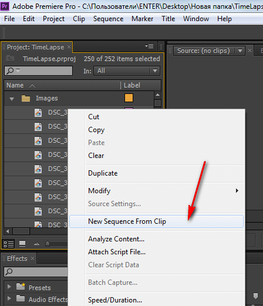

Тем самым мы создали новую Sequence под размер наших фотографий, что можете видеть на монтажном столе:

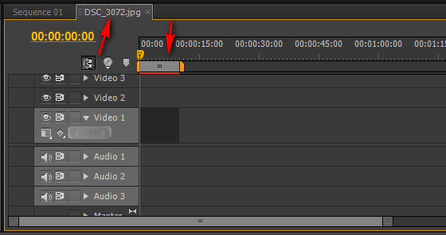

Нажмите клавишу Enter, чтобы отрендерить данную Sequence:

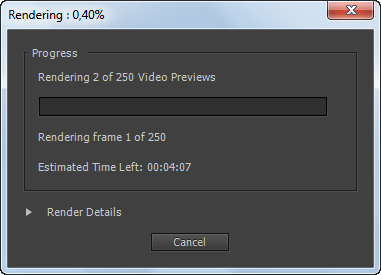

При этом полоска над нашим фрагментом изменится с красного на зеленый:

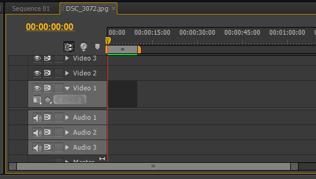

Перейдем в основной монтажный стол:

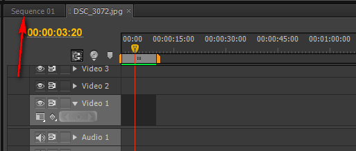

В списке добавляемых файлов кроме рисунков появился также наш второй Sequence. Перетащите его на монтажный стол:

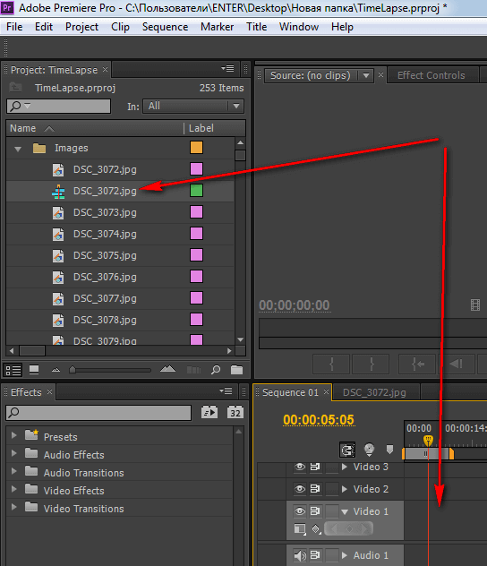

Наш фрагмент добавился. Но размер видео в основном монтажном столе 1920 по ширине (Full-HD), а на втором в моем примере 4928 × 3264 (по размеру фотографий). Поэтому добавился с лихвой:

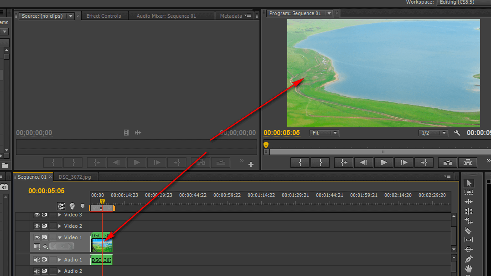

Надо уменьшить размер добавленного Sequence, чтобы вписать его по нормальному. Для этого уменьшите масштаб в окне миниатюры:

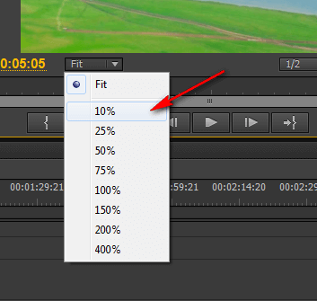

И сделайте двойной щелчок по изображению в этом окне. Появится рамка для изменения размера:

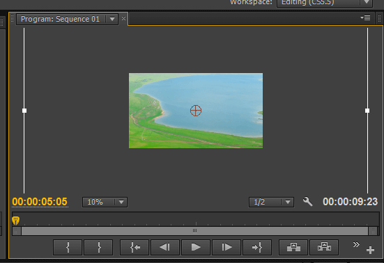

Уменьшите так, как хотите, и нажмите потом клавишу `Enter`:

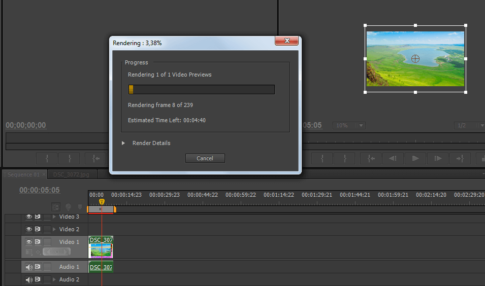

Затем экспортируем наш видеофайл:

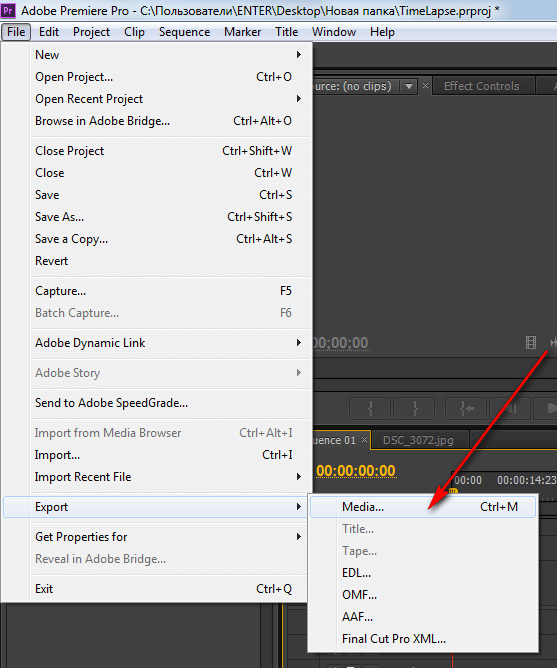

Обратите внимание, что мы поставили галочку у `Match Sequence Settings`, чтобы экспорт производился с теми настройками, которые мы указали при создании файла Adobe Premiere:

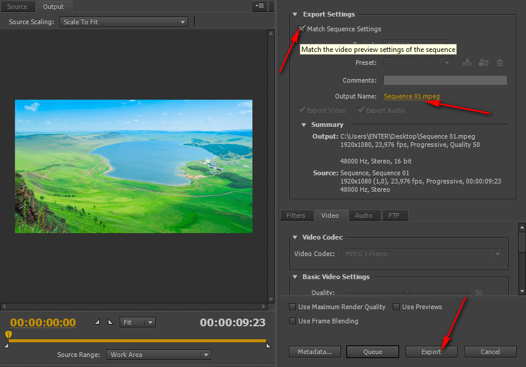

В результате мы получим вот такое видео:

<https://www.youtube.com/watch?v=aiDWsAG8cUY>

Видео получилось уж очень не ахти: как будто это старое кино с кинопленки: куча помех: насекомые, камера дрожит, яркость мигает.

В [Как сделать Time-lapse видео. Часть 4 — Сложная, но качественная сборка видео](https://github.com/Harrix/harrix.dev-blog-2014/blob/main/how-to-make-time-lapse-4/how-to-make-time-lapse-4.md) будем избавляться от этих недостатков.
