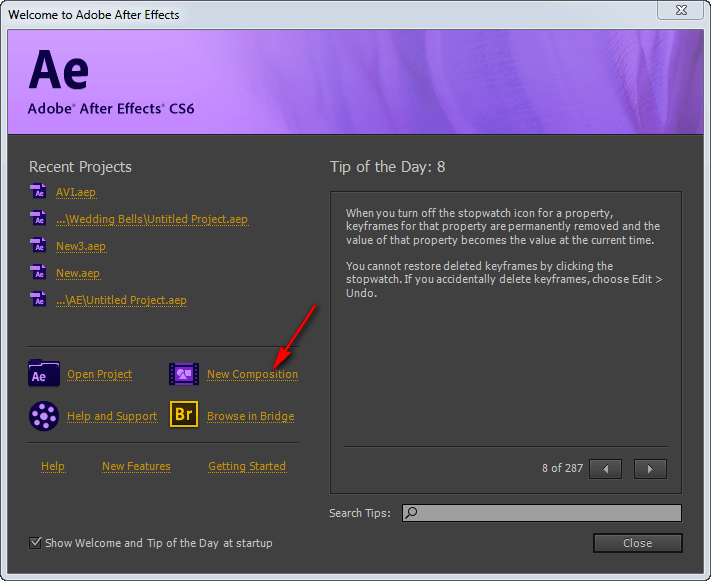

# Как сделать Time-lapse видео. Часть 4 — Сложная, но качественная сборка видео

Во третей части обсудим как собрать видео из фотографий в Adobe After Effects CS6.

Решил написать серию статей о том, как собрать нормальное Time-lapse видео для новичков. В интернете мало материала, которые бы показывали, как собрать видео не с профессиональной техникой, как исправлять проблемные моменты… Я сам непрофессионал в данной области, так что можно считать, что эти статьи написаны для памятки себе.

Вот, что мы получим в итоге:

<https://www.youtube.com/watch?v=9Ta4LNR_6AI>

**Что потребуется**: снимки, After Effects, VirtualDub, Xilisoft Video Converter Ultimate.

## Создание проекта

Откроем наш After Effects. Я показываю на примере After Effects CS6:

Создадим проект в режиме FULL-HD с 24 кадрами в секунду:

Получим вот такой монтажный стол:

Добавим наши изображения к проекту через `File` → `Import` → `Multiple Files…`:

При этом выбираем только первую фотографию! Остальные выделять не надо. Программа сама добавит все рисунки из этой папки. Поэтому будьте осторожны и следите, чтобы в папке были только нужные вам файлы:

После нажатия на `OK` вам предложат добавить еще файлы, но вы откажитесь:

И в списке файлов и объектов проекта появится сборник всех фотографий, где фотографии уже расположены в правильном порядке и с правильной длительностью:

Теперь смотрите. Основной монтажный стол у нас для видео 1920 × 1080 px. А фотографии у нас куда большего размера. Если мы перетащим фотографии сразу в основное видео и там обработаем, то потом не сможем приближать и удалять кадры и так далее. Поэтому обработаем фотографии на монтажном столе такого же размера, что и размер фотографий. Для этого щелкаем правой кнопкой по объекту фотографий и идем в `New Comp from Selection`:

Получили новый Sequence:

Двойной щелчок и мы перешли на монтажный стол этого Sequence:

Проект мы создали. Теперь займемся стабилизацией видео, так как камера в данном случае сильно дрожала на ветру, и итоговое видео колбасит.

## Стабилизация видео

Откройте вкладку `Window` → `Tracker`:

И в этой панели вызываем команду `Warp Stabilizer`. Данный метод мне помог, но если вам не помогает, то попробуйте другие из данного набора:

После нажатия на кнопку начнется долгий процесс:

В итоге наше видео стабилизируется.

## Удаление шумов (птиц и насекомых)

В процессе съемок в кадр могут попадать шумы: случайно залетевшие насекомые, птицы, которые попадают на один кадр, а потом улетают. В итоге получается видео с шумами, как в старом кино. Что делать? Предлагается такая идея (не моя): вставить на видео такое же видео над ним, но смещенное на один кадр, и режим смешивания будет поставлено на Lighten. Что это даст? Два соседних кадра не сильно отличаются друг от друга, и при наложении если и создаться небольшое «мыло», то повышением резкости можно убрать это мыло. А вот насекомые и птицы обычно в виде черных пятен выступают. Так как они от кадра к кадру перемещаются, то режимом смешивания они и уберутся. Но есть недостаток в случае, если у нас в кадре есть близко лежащие объекты, которые динамически двигаются. У меня, например, это трава на переднем плане. И при использовании метода получается раздвоение этой травы. Поэтому наложим маску или разукрасим верхнее видео в тех областях, в которых наложение нам не нужно. Надеюсь, понятно объяснил. Эффект раздвоения травы:

Для этого создадим еще один Sequence на основе существующего:

И переименуем его в `Without Noise`:

Перейдем в `Without Noise`. И перетащим еще один Sequence с фотографиями:

Верхний слой перетащим на один фрейм вправо:

Добавим маску для верхнего слоя:

Откроем нашу маску у слоя:

Щелкнем по маске двойным щелчком. И увидим следующее:

Берем кисточку и выбираем черный цвет:

И закрашиваем ту область, которую мы не хотим потом обрабатывать в дальнейшем:

Переходим в обычное окно просмотра видео:

Переходим к выбору типа смешивания слоя:

У меняем на `Lighten`:

Посмотрите на пример. Вот тут видим размытое пятно какого-то насекомого:

А с нашим способом оно исчезло:

## Эффект движения камеры и финальное редактирование в After Effects

На данный момент имеем такую картину:

Кстати, масштаб просмотра видео можно менять на тот, что вам нужен:

На основе предыдущего Sequence создадим еще одну и переименуем в `Finish Source`:

Это мы сделали для удобства, чтобы не таскаться с двумя сдвинутыми слоями и маской. Теперь перейдем в наш самый первоначальный монтажный стол (у меня `Comp 1`) и перетащим туда наш последний Sequence:

Уменьшите размер слоя в окне просмотра видео. Так как я хочу сделать еще эффект движения, то не полностью вписываю слой под размер экрана:

Теперь перейдем к настройкам нашего слоя на монтажном слое:

Убедитесь, что каретка помещена в начало ролика. После этого щелкните по изображениям часиков около `Position` и `Scale`. Тем самым мы создадим ключевой кадр, где эти параметры будут фиксированы:

Переместите каретку на последний кадр:

Сдвиньте и измените масштаб слоя в окне просмотра видео. При этом будет создан второй ключевой кадр:

Всё! Обработку в After Effects мы закончили. Теперь запустим генерацию видео. Перейдем в меню экспорта:

Устанавливаем настройки по максимуму и запускаем `Render`:

И начнется процесс рендеринга:

В итоге получим наш видеофайл:

## Убирание мерцания

Видео мы получили. Дрожание камеры убрали. Насекомых убрали. Красивое плавное движение камеры добавили. Но осталось мерцание видео, так как снимки снимались в автоматическом режиме. Надо убрать. В After Effects я не нашел штатных средств для решения задачи. Вроде есть плагины, но они платные и так их не нашел по-быстрому. Для решения будем использовать бесплатную программу <http://www.virtualdub.org/download.html>.

В папку плагинов `plugins32` надо закинуть плагин `MSU Deflicker v1.3`.

Этот плагин можно тут взять: [msu_deflick.zip](files/msu_deflick.zip).

А можно всю сборку сразу скачать: [VirtualDub-1.10.4.zip](files/VirtualDub-1.10.4.zip).

Запускаем главный EXE файл:

Не открывая видео, заходим в фильтры:

Жмем кнопку добавления фильтра:

Добавляем наш фильтр `MSU Deflicker v1.3`:

Параметры по умолчанию оставляем:

Жмем `OK`:

Теперь открываем видеофайл:

Открыли:

И сразу сохраняем в AVI формате:

В результате начнется преобразование, чтобы убрать мерцание картинки:

Получим в итоге новый видео файл. Фактически это итоговый конечный файл, который можно уже использовать где надо: загружать на сайты, редактировать и так далее:

## Сжатие файла

Эта часть не обязательная. И его можно сделать многими способами. У нас есть большой видеофайл в 10 секунд размером больше 1 Гб. Многовато. Надо сжать. Будем сжимать программой Xilisoft Video Converter Ultimate:

Зададим такие настройки:

И запускаем преобразование:

В итоге получили видео, как в начале статьи.

Вроде получилось неплохо. Конечно, можно был поработать над резкостью и так далее, но это вы уже сможете сделать сами.

**Update 2018.** Сейчас я бы вместо Xilisoft Video Converter Ultimate воспользовался Adobe Premiere.

У меня в итоге получилось вот такое видео:

<https://www.youtube.com/watch?v=g0XnvLhvHN4>
