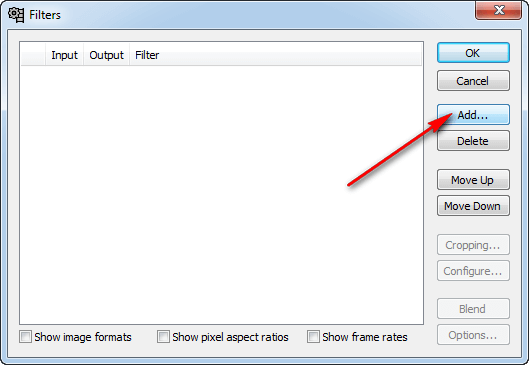

# Как сделать Time-lapse видео. Часть 4 — Сложная, но качественная сборка видео

Во третей части обсудим как собрать видео из фотографий в Adobe After Effects CS6.

## Содержание

- [Создание проекта](#создание-проекта)
- [Стабилизация видео](#стабилизация-видео)
- [Удаление шумов (птиц и насекомых)](#удаление-шумов-птиц-и-насекомых)
- [Эффект движения камеры и финальное редактирование в After Effects](#эффект-движения-камеры-и-финальное-редактирование-в-after-effects)
- [Убирание мерцания](#убирание-мерцания)
- [Сжатие файла](#сжатие-файла)

Решил написать серию статей о том, как собрать нормальное Time-lapse видео для новичков. В интернете мало материала, которые бы показывали, как собрать видео не с профессиональной техникой, как исправлять проблемные моменты… Я сам непрофессионал в данной области, так что можно считать, что эти статьи написаны для памятки себе.

Вот, что мы получим в итоге:

<https://www.youtube.com/watch?v=9Ta4LNR_6AI>

**Что потребуется**: снимки, After Effects, VirtualDub, Xilisoft Video Converter Ultimate.

## Создание проекта

Откроем наш After Effects. Я показываю на примере After Effects CS6:

_Рисунок 1 — Создание проекта в After Effects_

Создадим проект в режиме FULL-HD с 24 кадрами в секунду:

_Рисунок 2 — Выбор шаблона видео_

Получим вот такой монтажный стол:

_Рисунок 3 — Основное окно After Effects_

Добавим наши изображения к проекту через `File` → `Import` → `Multiple Files…`:

_Рисунок 4 — Вызов команды импорта изображений_

При этом выбираем только первую фотографию! Остальные выделять не надо. Программа сама добавит все рисунки из этой папки. Поэтому будьте осторожны и следите, чтобы в папке были только нужные вам файлы:

_Рисунок 5 — Выбор одной фотографии из папки_

После нажатия на `OK` вам предложат добавить еще файлы, но вы откажитесь:

_Рисунок 6 — Отказа от добавления других файлов_

И в списке файлов и объектов проекта появится сборник всех фотографий, где фотографии уже расположены в правильном порядке и с правильной длительностью:

_Рисунок 7 — Объект со всеми фотографиями из папки_

Теперь смотрите. Основной монтажный стол у нас для видео 1920 × 1080 px. А фотографии у нас куда большего размера. Если мы перетащим фотографии сразу в основное видео и там обработаем, то потом не сможем приближать и удалять кадры и так далее. Поэтому обработаем фотографии на монтажном столе такого же размера, что и размер фотографий. Для этого щелкаем правой кнопкой по объекту фотографий и идем в `New Comp from Selection`:

_Рисунок 8 — Создание новой Sequence_

Получили новый Sequence:

_Рисунок 9 — Новая Sequence в списке ресурсов_

Двойной щелчок и мы перешли на монтажный стол этого Sequence:

_Рисунок 10 — Второй монтажный стол_

Проект мы создали. Теперь займемся стабилизацией видео, так как камера в данном случае сильно дрожала на ветру, и итоговое видео колбасит.

## Стабилизация видео

Откройте вкладку `Window` → `Tracker`:

_Рисунок 11 — Открытие окна Tracker_

И в этой панели вызываем команду `Warp Stabilizer`. Данный метод мне помог, но если вам не помогает, то попробуйте другие из данного набора:

_Рисунок 12 — Выбор Warp Stabilizer_

После нажатия на кнопку начнется долгий процесс:

_Рисунок 13 — Процесс стабилизации_

В итоге наше видео стабилизируется.

## Удаление шумов (птиц и насекомых)

В процессе съемок в кадр могут попадать шумы: случайно залетевшие насекомые, птицы, которые попадают на один кадр, а потом улетают. В итоге получается видео с шумами, как в старом кино. Что делать? Предлагается такая идея (не моя): вставить на видео такое же видео над ним, но смещенное на один кадр, и режим смешивания будет поставлено на Lighten. Что это даст? Два соседних кадра не сильно отличаются друг от друга, и при наложении если и создаться небольшое «мыло», то повышением резкости можно убрать это мыло. А вот насекомые и птицы обычно в виде черных пятен выступают. Так как они от кадра к кадру перемещаются, то режимом смешивания они и уберутся. Но есть недостаток в случае, если у нас в кадре есть близко лежащие объекты, которые динамически двигаются. У меня, например, это трава на переднем плане. И при использовании метода получается раздвоение этой травы. Поэтому наложим маску или разукрасим верхнее видео в тех областях, в которых наложение нам не нужно. Надеюсь, понятно объяснил. Эффект раздвоения травы:

_Рисунок 14 — Эффект раздвоения травы_

Для этого создадим еще один Sequence на основе существующего:

_Рисунок 15 — Создание новой Sequence_

И переименуем его в `Without Noise`:

_Рисунок 16 — Переименование Sequence_

_Рисунок 17 — Новое имя Sequence_

Перейдем в `Without Noise`. И перетащим еще один Sequence с фотографиями:

_Рисунок 18 — Добавление объекта с фотографиями_

Верхний слой перетащим на один фрейм вправо:

_Рисунок 19 — Перетаскивание одного слоя на один фрейм_

Добавим маску для верхнего слоя:

_Рисунок 20 — Создание новой маски_

Откроем нашу маску у слоя:

_Рисунок 21 — Открытие маски слоя_

Щелкнем по маске двойным щелчком. И увидим следующее:

_Рисунок 22 — Открытая маска слоя_

Берем кисточку и выбираем черный цвет:

_Рисунок 23 — Выбор инструмента для работы с маской_

И закрашиваем ту область, которую мы не хотим потом обрабатывать в дальнейшем:

_Рисунок 24 — Закрашивание области с близкими объектами_

Переходим в обычное окно просмотра видео:

_Рисунок 25 — Переход в стандартный просмотр видео_

Переходим к выбору типа смешивания слоя:

_Рисунок 26 — Режим смешивания слоя_

У меняем на `Lighten`:

_Рисунок 27 — Изменение режима смешивания на Lighten_

Посмотрите на пример. Вот тут видим размытое пятно какого-то насекомого:

_Рисунок 28 — Кадр с пятном от насекомого не в фокусе_

А с нашим способом оно исчезло:

_Рисунок 29 — Пятно от насекомого исчезло_

## Эффект движения камеры и финальное редактирование в After Effects

На данный момент имеем такую картину:

_Рисунок 30 — Текущее состояние редактора видео_

Кстати, масштаб просмотра видео можно менять на тот, что вам нужен:

_Рисунок 31 — Изменение масштаба в плеере просмотра видео_

На основе предыдущего Sequence создадим еще одну и переименуем в `Finish Source`:

_Рисунок 32 — Создание новой Sequence_

_Рисунок 33 — Новая Sequence_

Это мы сделали для удобства, чтобы не таскаться с двумя сдвинутыми слоями и маской. Теперь перейдем в наш самый первоначальный монтажный стол (у меня `Comp 1`) и перетащим туда наш последний Sequence:

_Рисунок 34 — Перетаскивание Sequence в главный монтажный стол_

Уменьшите размер слоя в окне просмотра видео. Так как я хочу сделать еще эффект движения, то не полностью вписываю слой под размер экрана:

_Рисунок 35 — Размер объекта с фотографиями специально больше кадра_

Теперь перейдем к настройкам нашего слоя на монтажном слое:

_Рисунок 36 — Настройки слоя_

Убедитесь, что каретка помещена в начало ролика. После этого щелкните по изображениям часиков около `Position` и `Scale`. Тем самым мы создадим ключевой кадр, где эти параметры будут фиксированы:

_Рисунок 37 — Создание ключевого кадра_

Переместите каретку на последний кадр:

_Рисунок 38 — Перемещение каретки на последний кадр_

Сдвиньте и измените масштаб слоя в окне просмотра видео. При этом будет создан второй ключевой кадр:

_Рисунок 39 — Изменение размера фотографий и их положения_

Всё! Обработку в After Effects мы закончили. Теперь запустим генерацию видео. Перейдем в меню экспорта:

_Рисунок 40 — Выбор пункта экспорта видео_

Устанавливаем настройки по максимуму и запускаем `Render`:

_Рисунок 41 — Настройки экспортируемого видео_

И начнется процесс рендеринга:

_Рисунок 42 — Процесс рендеринга_

В итоге получим наш видеофайл:

_Рисунок 43 — Сгенерированный файл_

## Убирание мерцания

Видео мы получили. Дрожание камеры убрали. Насекомых убрали. Красивое плавное движение камеры добавили. Но осталось мерцание видео, так как снимки снимались в автоматическом режиме. Надо убрать. В After Effects я не нашел штатных средств для решения задачи. Вроде есть плагины, но они платные и так их не нашел по-быстрому. Для решения будем использовать бесплатную программу <http://www.virtualdub.org/download.html>.

В папку плагинов `plugins32` надо закинуть плагин `MSU Deflicker v1.3`.

Этот плагин можно тут взять: [msu_deflick.zip](files/msu_deflick.zip).

А можно всю сборку сразу скачать: [VirtualDub-1.10.4.zip](files/VirtualDub-1.10.4.zip).

Запускаем главный EXE файл:

_Рисунок 44 — Запуск VirtualDub_

Не открывая видео, заходим в фильтры:

_Рисунок 45 — Переход в окно фильтров_

Жмем кнопку добавления фильтра:

_Рисунок 46 — Добавление нового фильтра_

Добавляем наш фильтр `MSU Deflicker v1.3`:

_Рисунок 47 — Добавление фильтра MSU Deflicker_

Параметры по умолчанию оставляем:

_Рисунок 48 — Выбор параметров фильтра_

Жмем `OK`:

_Рисунок 49 — Нажатие на кнопку OK_

Теперь открываем видеофайл:

_Рисунок 50 — Открытие видеофайла_

Открыли:

_Рисунок 51 — Загруженный видеофайл_

И сразу сохраняем в AVI формате:

_Рисунок 52 — Сохранение файла с примененным фильтром_

В результате начнется преобразование, чтобы убрать мерцание картинки:

_Рисунок 53 — Процесс преобразования_

Получим в итоге новый видео файл. Фактически это итоговый конечный файл, который можно уже использовать где надо: загружать на сайты, редактировать и так далее:

_Рисунок 54 — Файл видео без мерцаний_

## Сжатие файла

Эта часть не обязательная. И его можно сделать многими способами. У нас есть большой видеофайл в 10 секунд размером больше 1 Гб. Многовато. Надо сжать. Будем сжимать программой Xilisoft Video Converter Ultimate:

_Рисунок 55 — Окно загрузки программы_

Зададим такие настройки:

_Рисунок 56 — Выбор настроек конвертации_

И запускаем преобразование:

_Рисунок 57 — Запуск конвертации_

_Рисунок 58 — Процесс конвертации_

В итоге получили видео, как в начале статьи.

Вроде получилось неплохо. Конечно, можно был поработать над резкостью и так далее, но это вы уже сможете сделать сами.

**Update 2018.** Сейчас я бы вместо Xilisoft Video Converter Ultimate воспользовался Adobe Premiere.

У меня в итоге получилось вот такое видео:

<https://www.youtube.com/watch?v=g0XnvLhvHN4>
