# Установка Eclipse в Windows

В статье рассказывается, как установить Eclipse.

## Установка JDK

Вначале необходимо установить **JDK**. Всё просто, но если есть вопросы, то подробно можно узнать в статье: [Установка JDK в Windows](https://github.com/Harrix/harrix.dev-blog-2019/blob/main/install-jdk-on-windows/install-jdk-on-windows.md).

## Скачивание Eclipse

Идем на сайт: <http://www.eclipse.org/downloads/packages/>.

Скачиваем там последнюю версию Eclipse. Выбираем `Eclipse IDE for Java Developers` версию:

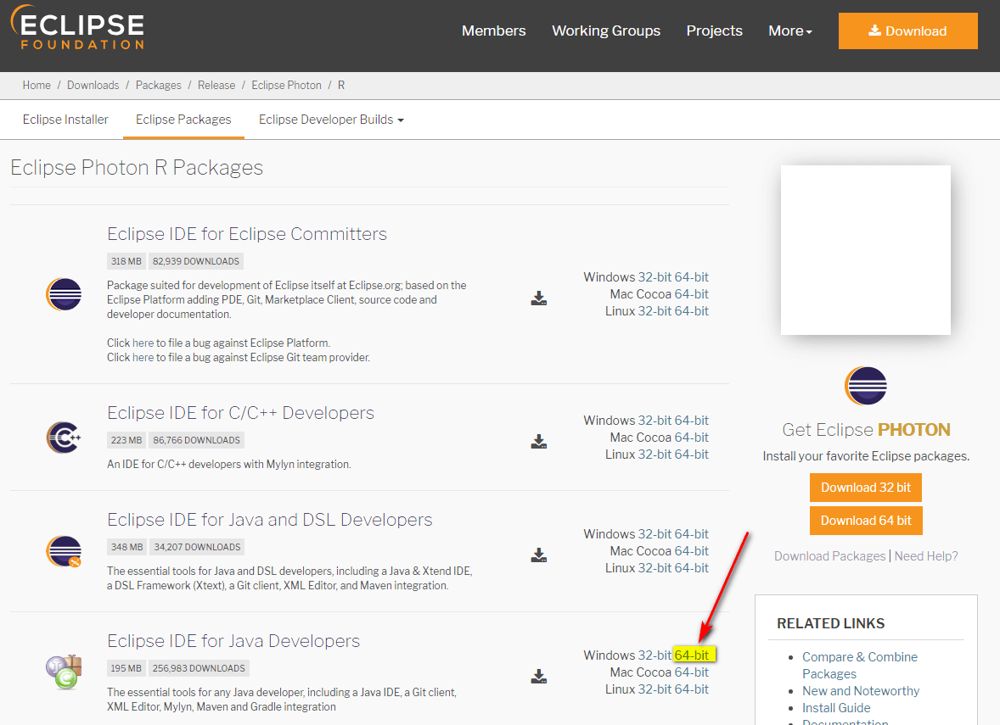

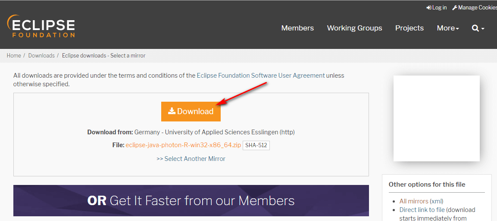

## Установка Eclipse

Установки так таковой нет. Нужно распаковать скаченный архив куда-нибудь. Например, я распаковал в папку `C:\Android\eclipse`:

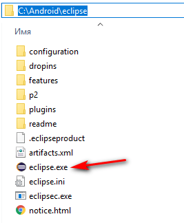

Запускаем файл `eclipse.exe`:


## Первоначальная настройка Eclipse

Попросит при старте создать или выбрать `workspace` (папка, где будут храниться ваши проекты):

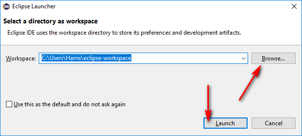

Рекомендую всегда сразу закрывать окно приветствия, так как в свое время долго не мог понять, почему при создании и открытии проектов проекты не открываются (проекты открывались, только окно приветствия всё загораживало):

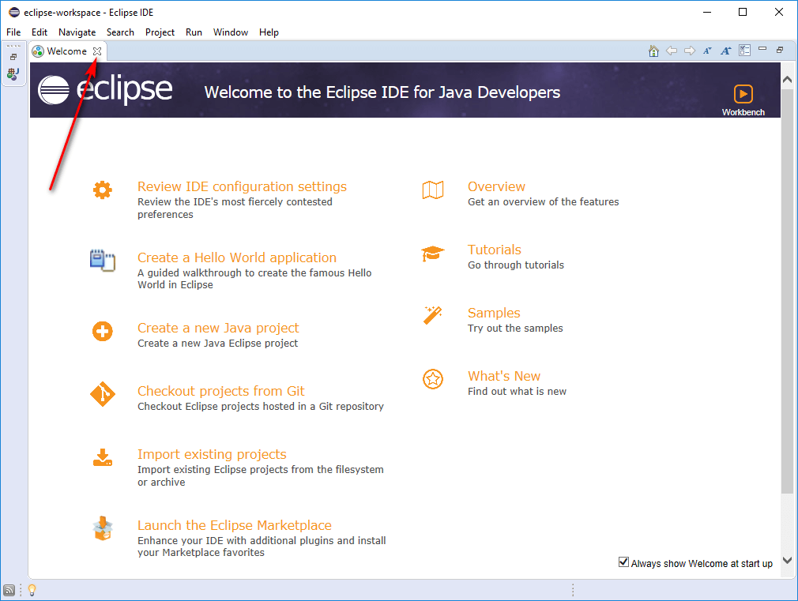

Откроется стандартный вид Eclipse:

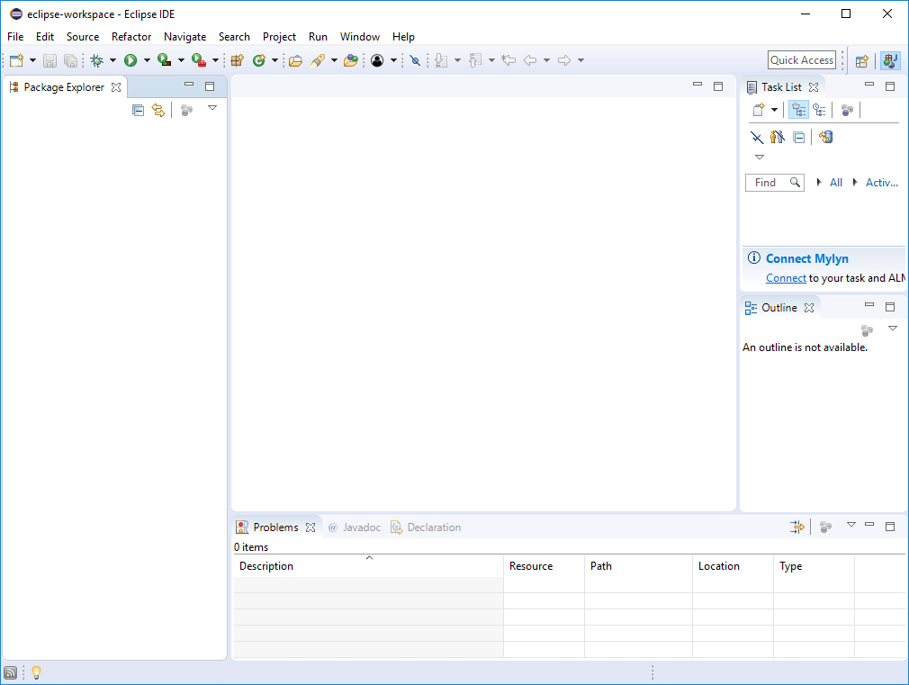

## Создание нового приложения

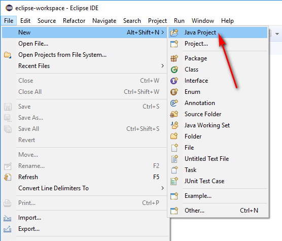

Выбираем название нашего проекта:

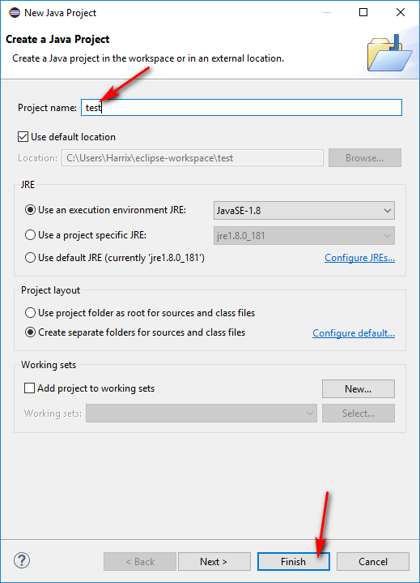

Создалась болванка Java проекта. Но в нем нет никаких файлов исходного кода программы. Создадим файл для главного класса приложения:

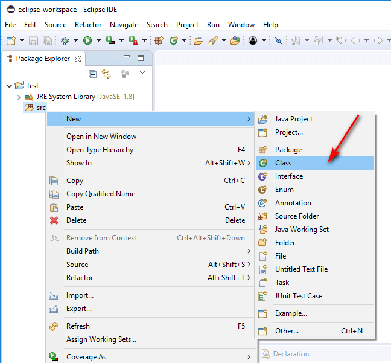

Выбираем название нашего класса (с большой буквы) и ставим галочку около `public static void main(String[] args)`. Эта галочка добавит метод main в наш класс, который нужен для запуска консольного приложения. Фактически это точка входа в приложение:

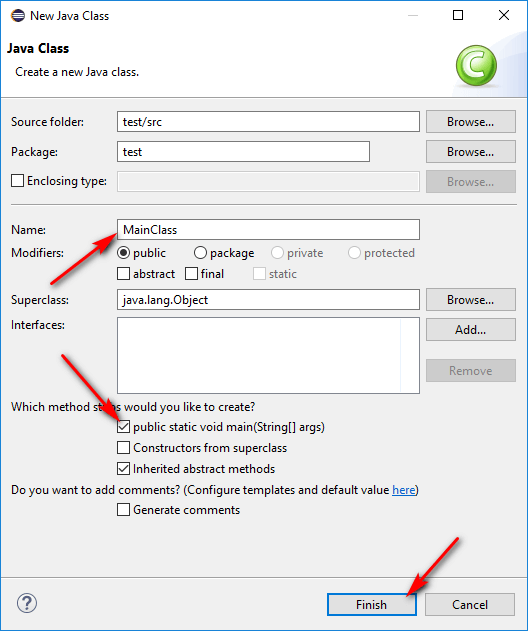

Наш класс создался:

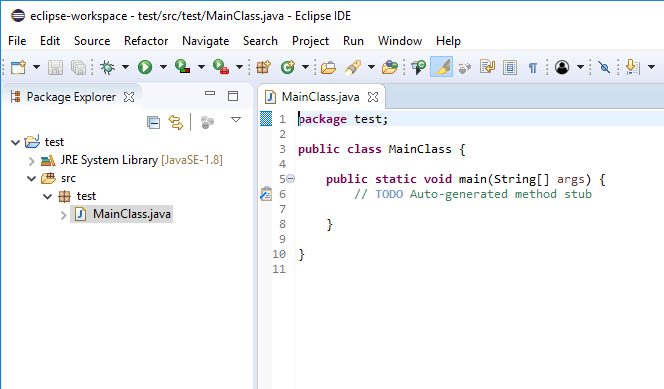

## Запуск приложения

В методе `main` пропишем простейшую команду:

```java
System.out.println("Hello, World!");
```

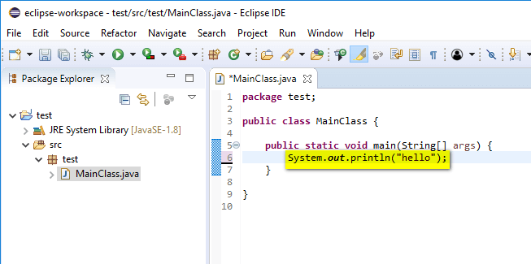

Запустим проект:

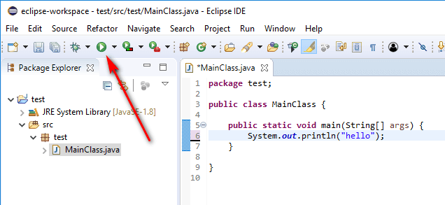

Подтвердим сохранения изменений в файле:

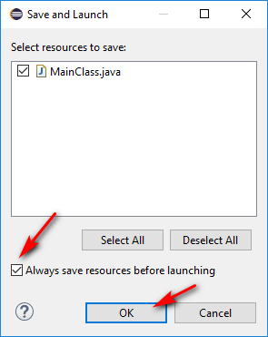

В консоли отобразился результат выполнения программы:

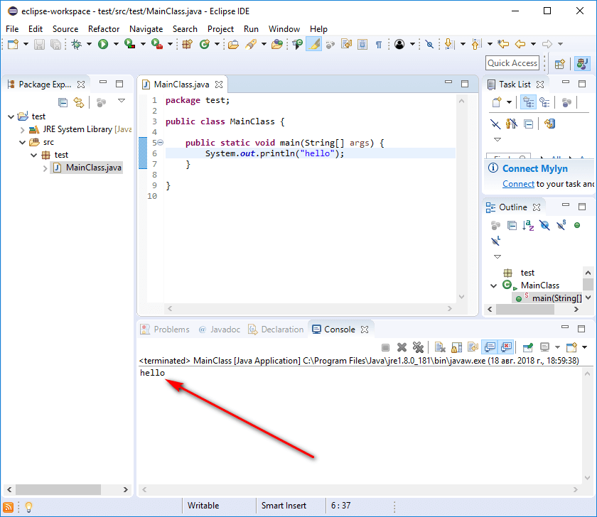
