# Установка JDK 8 в Windows

Для программирования под Java и, в частности, при создании приложений под Android на компе требуется установка JDK (Java Development Kit). В статье рассказывается как это сделать.

В статье рассматривается способ установки под Widows 10, но никакой разницы для других версий Windows не должно быть. Если вам нужна последняя версия JDK, то посмотрите эту [статью](https://github.com/Harrix/harrix.dev-blog-2019/blob/main/install-jdk-on-windows/install-jdk-on-windows.md) <!-- https://harrix.dev/ru/blog/2019/install-jdk-on-windows/ -->.

Скачиваем и устанавливаем с официального сайта:

<http://www.oracle.com/technetwork/java/javase/downloads/index.html>

Сейчас на сайте уже есть Java 14 (на 08.2020). Но для Qt и других программ, использующих Java, по-прежнему рекомендую скачивать **Java 8** (в Android Studio уже можно использовать [Java 14](https://github.com/Harrix/harrix.dev-blog-2019/blob/main/install-jdk-on-windows/install-jdk-on-windows.md) <!-- https://harrix.dev/ru/blog/2019/install-jdk-on-windows/ -->):

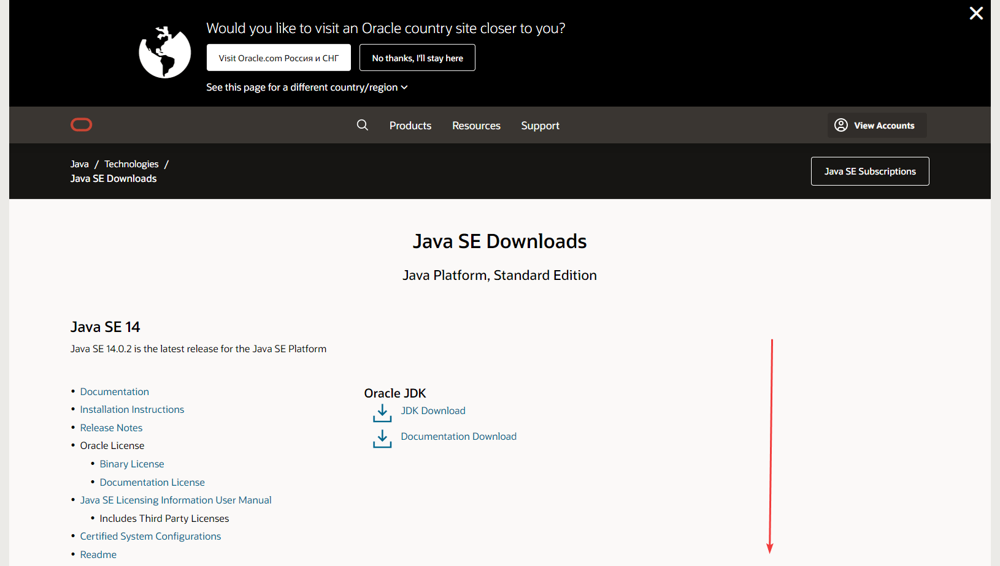

_Рисунок 1 — Прокрутка окна ниже_

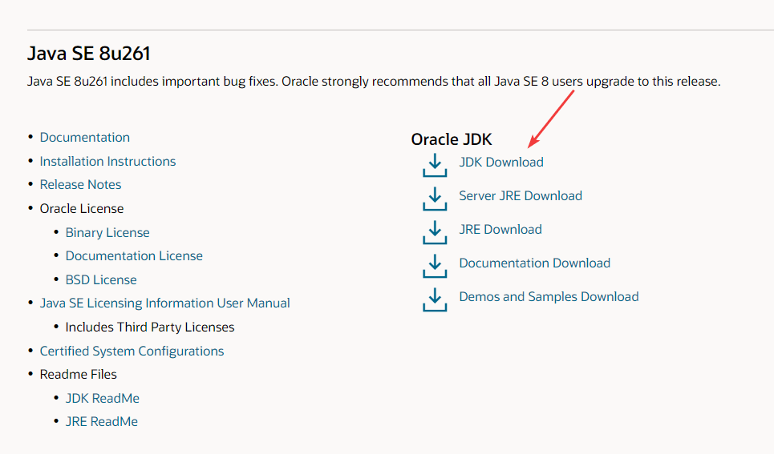

_Рисунок 2 — Выбор JDK_

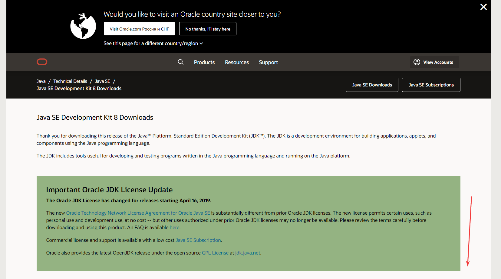

_Рисунок 3 — Прокрутка окна ниже_

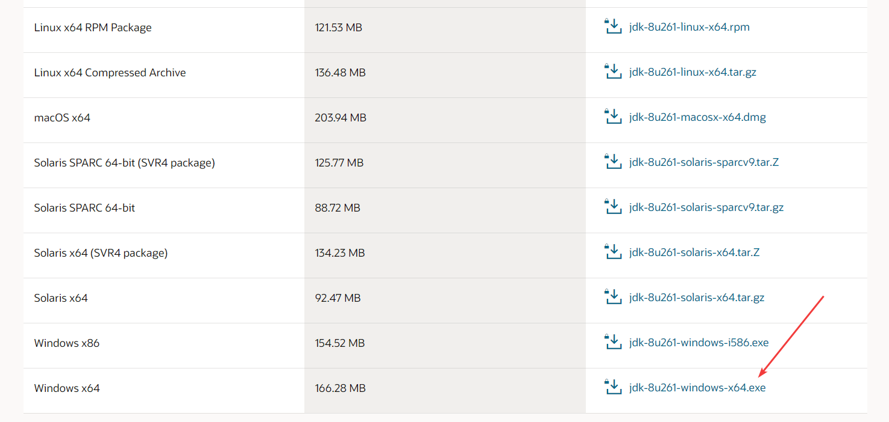

_Рисунок 4 — Выбор JDK_

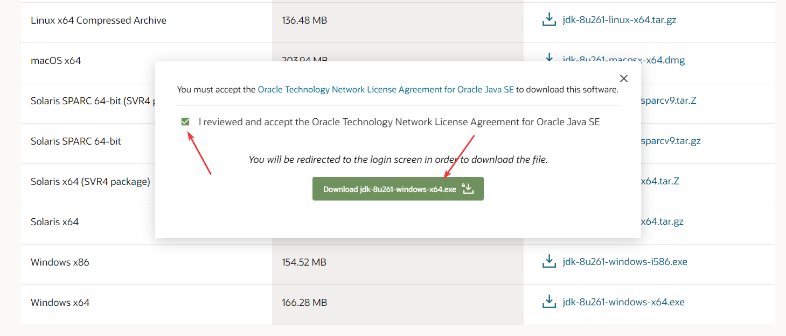

_Рисунок 5 — Соглашение с условиями и скачивание_

Если у вас 32-битная операционная система, то скачивайте пакет под Windows x86. Для тех, кто не знает: версии программ для 64-битных операционных систем обозначаются **x64**, а для 32-битных обозначаются **x86**. Версии программ x86 можно устанавливать на 64-битные операционные системы, но лучше (за рядом некоторых исключений) устанавливать x64 версии. А версии программ x64 не получится установить на 32-битные операционные системы.

Для скачивания старых версий JDK требуется учетная запись на Oracle:

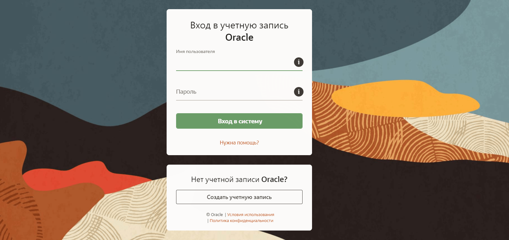

_Рисунок 6 — Вход в учетную запись Oracle_

Процесс установки обычный и не представляет никаких трудностей:

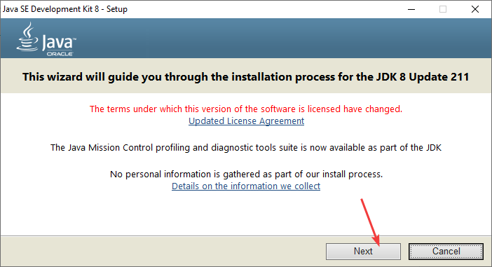

_Рисунок 7 — Установка_

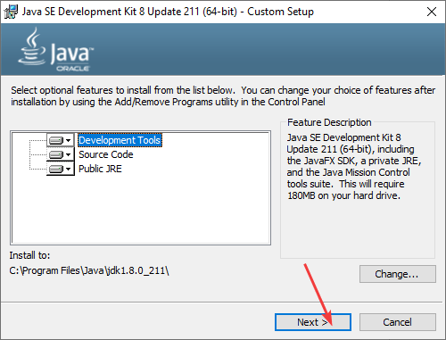

_Рисунок 8 — Установка_

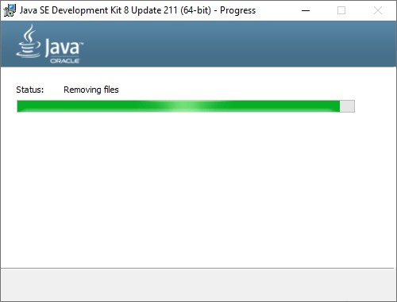

_Рисунок 9 — Процесс установки_

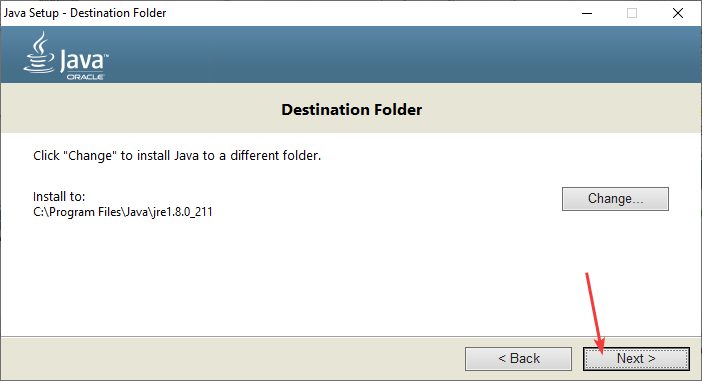

_Рисунок 10 — Установка JRE_

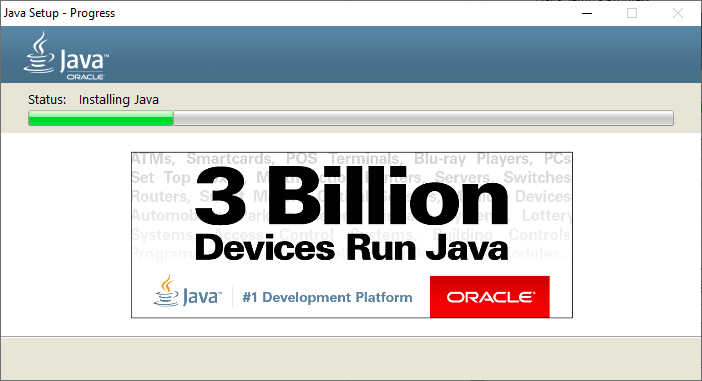

_Рисунок 11 — Процесс установки_

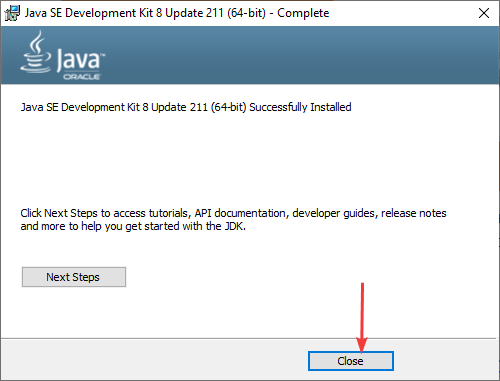

_Рисунок 12 — Окончание установки_
