# Установка Qt 4.8.4 на Windows XP

Пригласили меня преподавать Qt в одну школу. Всё бы хорошо, но у них стоит Windows XP и современные версии Qt или старые версии QtSDK не устанавливаются (или вообще не запускают процесс установки или вызывают ошибку). Выкрутился установкой связки Qt 4.8.4 + QtCreator 2.5.2 + MinGW.

## Файлы

Скачивал я Qt 4.8.4 и QtCreator 2.5.2 отсюда: <http://download.qt.io/archive/>.

Если более конкретно, то Qt 4.8.4 в виде файла `qt-win-opensource-4.8.4-mingw.exe` скачал из этой папки: <http://download.qt.io/archive/qt/4.8/4.8.4/>.

А QtCreator 2.5.2 в виде файла `qt-creator-win-opensource-2.5.2.exe` скачал из этой папки: <http://download.qt.io/archive/qtcreator/2.5/>.

Архив MinGW, который с ними заработал можно взять с этого сайта: [mingw.zip](files/mingw.zip).

## Установка

Распаковываем архив.

Папку `Mingw` копируем в корень диска `C:\`:

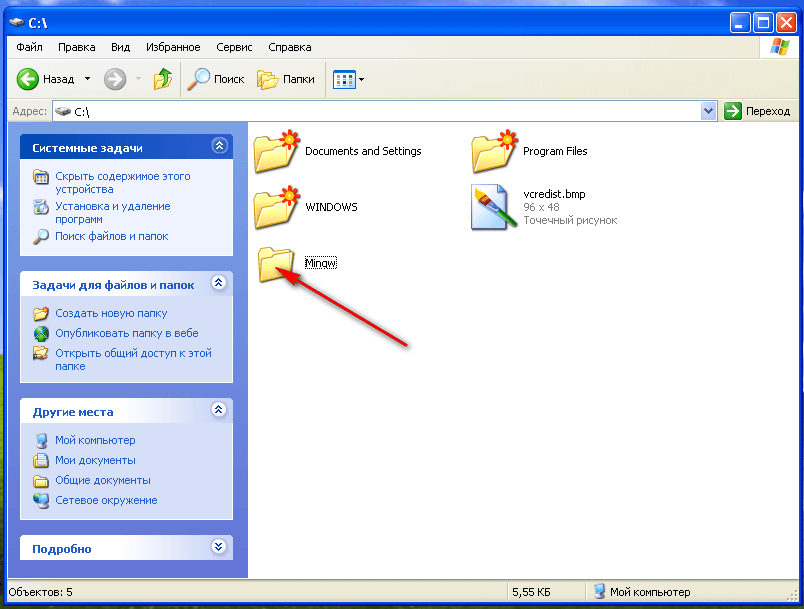

Запускаем файл `qt-win-opensource-4.8.4-mingw.exe` от имени администратора:

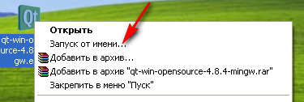

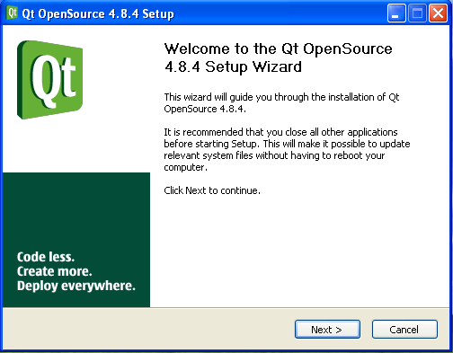

В месте, где просит показать, где MinGW, показываете, где он:

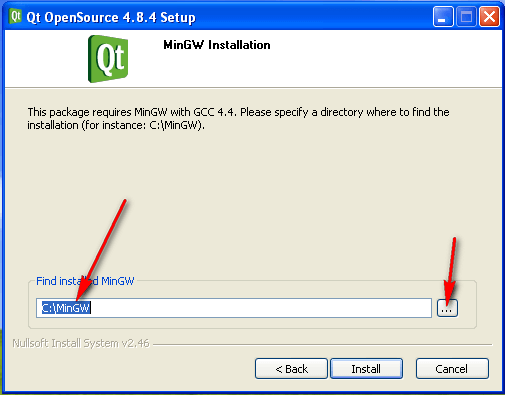

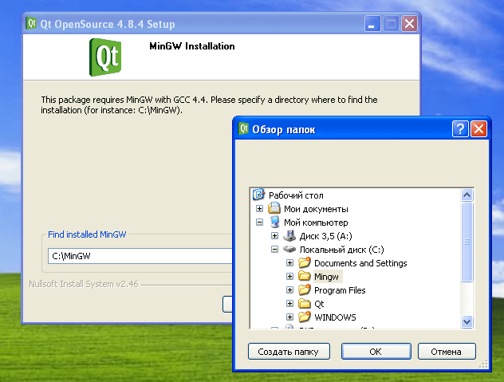

Дальше всё по умолчанию:

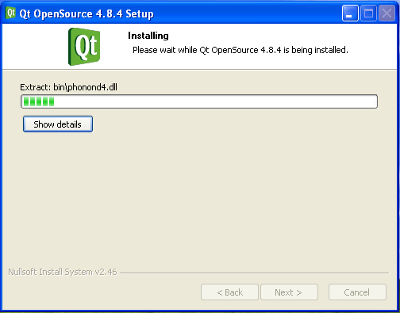

Запускаем файл `qt-creator-win-opensource-2.5.2.exe` от имени администратора:

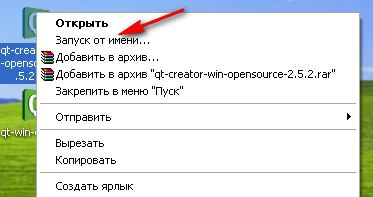

Установка не вызывает никаких проблем:

## Настройка

Поменяем язык на английский:

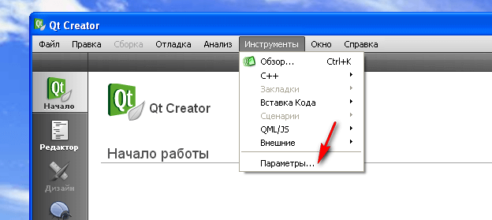

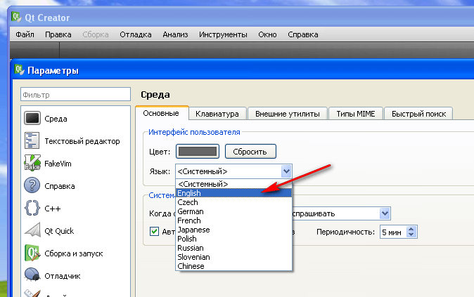

Перезапускаем QtCreator.

Опять идем в настройки, но уже по-английски:

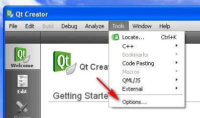

Соединим QtCreator и Qt:

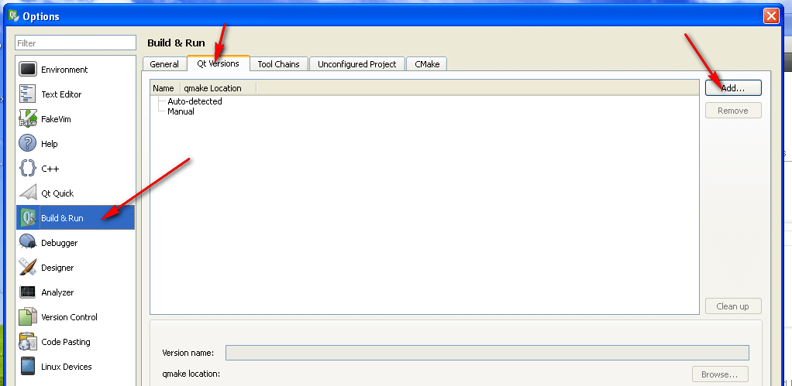

Находим папку Qt и выбираем там файл `qmake.exe`. У меня это папка `C:\Qt4.8.4\bin`:

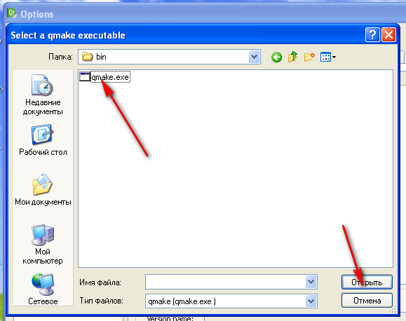

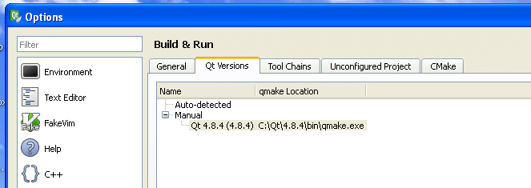

Соединим Qt и MinGW:

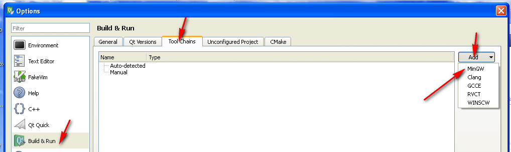

Находим папку MinGW и выбираем там файл `mingw32-make.exe`. У меня это папка `C:\Mingw\bin`:

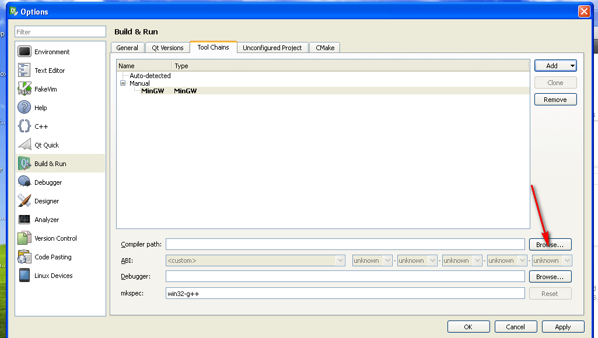

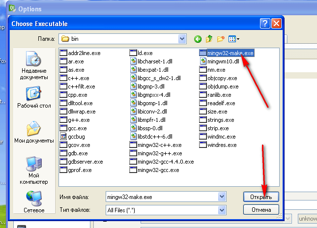

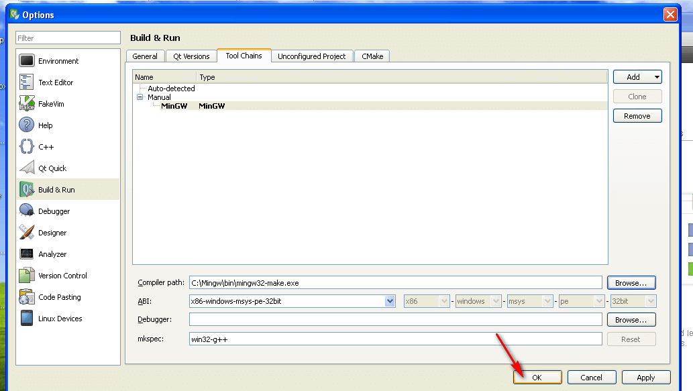

Всё! Приложения создаются и компилируются:

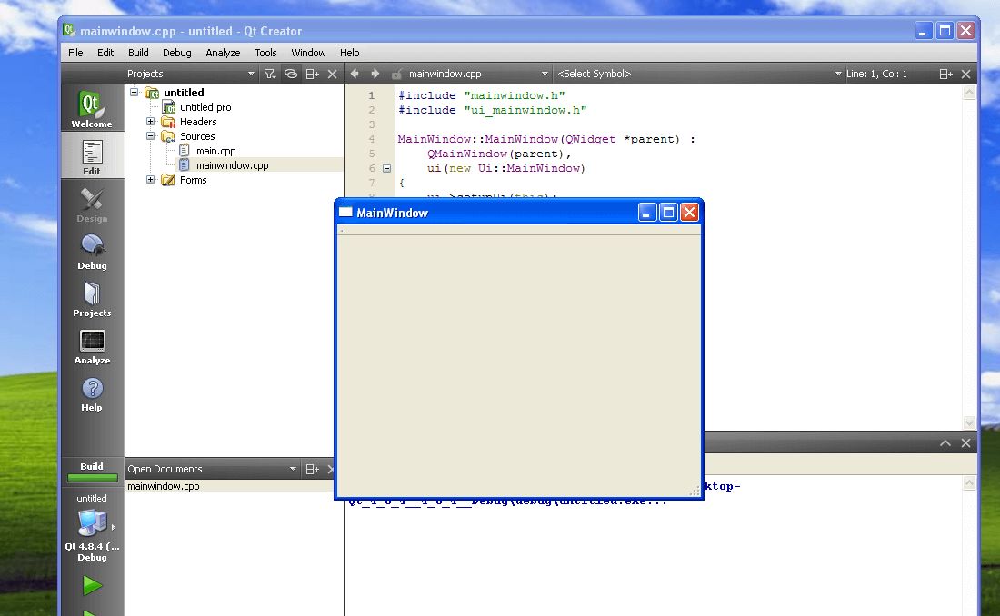
