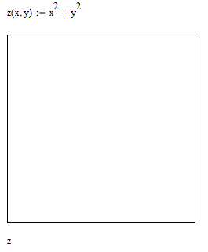
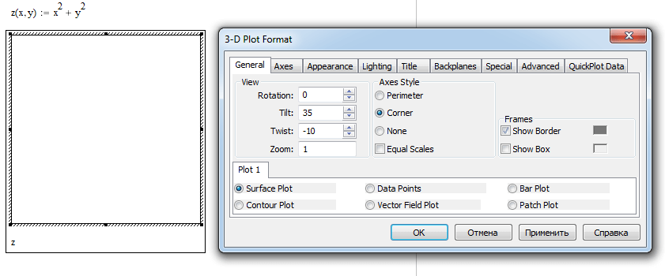
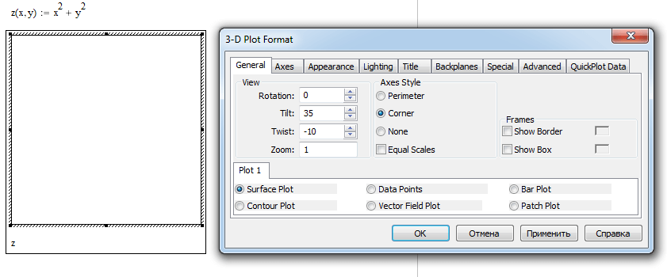
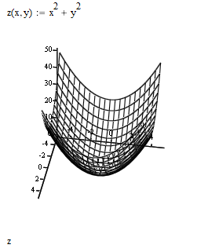
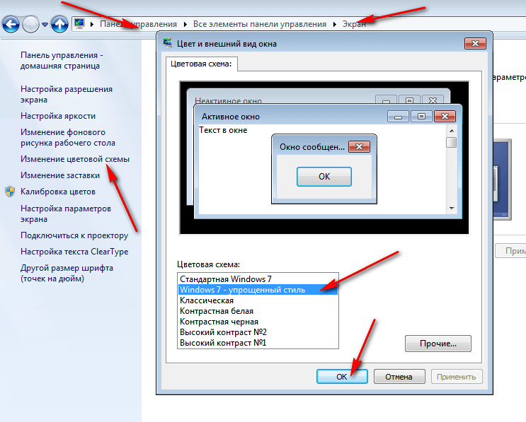
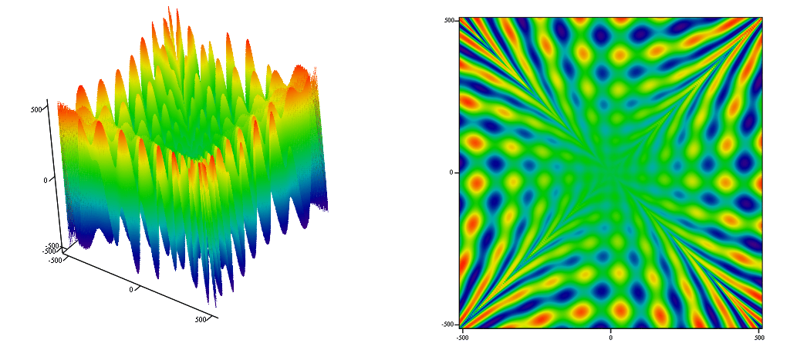

# Не отображаются 3D графики MathCAD

В статье показано решение для некоторых компьютеров отображения графиков 3D в Windows 7 и выше.

- [Первый способ](#первый-способ)
- [Второй способ](#второй-способ)
- [Дополнительно](#дополнительно)

## Первый способ

Многие столкнулись с переходом на Windows Vista и Windows 7 с проблемой, что 3D графики не отображаются во всех версиях MathCAD, и вместо них видно белый лист. Иногда при поворачивании графика что-то проглядывается, но быстро пропадает.

Проблему можно решить следующим образом.

Двойным кликом по графику открываем меню графика:

_Рисунок 1 — Белый лист вместо графика_

Снимаем галочку напротив `Show Border` во вкладке `General` и жмем `OK`:

_Рисунок 2 — Настройки графика_

_Рисунок 3 — Снятие галочки у параметра Show Border_

График должен появиться:

_Рисунок 4 — Трехмерный график появился_

Работает не на всех машинах. Вроде бы только на тех, где стоит Nvidia.

## Второй способ

Надо включить упрощенный стиль Windows 7. Для этого идем `Пуск` → `Панель управления` → `Экран` → `Изменение цветовой схемы` → `Windows 7 - упрощенный стиль`:

_Рисунок 5 — Установка упрощенного стиля в Windows_

Графики должны появиться. Этот способ подсказал пользователь Ferrum.

## Дополнительно

В новых версиях Mathcad 15 (например, **PTC Mathcad V15 M050**) этот баг исправлен:

_Рисунок 6 — Трехмерные графики_
