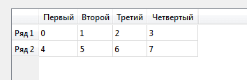

# Как вывести данные в QTableView в Qt


Небольшая шпаргалка как добавить данные в таблицу QTableView в Qt.

Подключите эти библиотеки:

```cpp
#include "QStandardItemModel"
#include "QStandardItem"
```

А в кнопке, например, добавьте этот код:

```cpp
QStandardItemModel *model = new QStandardItemModel;
QStandardItem *item;

//Заголовки столбцов
QStringList horizontalHeader;
horizontalHeader.append("Первый");
horizontalHeader.append("Второй");
horizontalHeader.append("Третий");
horizontalHeader.append("Четвертый");

//Заголовки строк
QStringList verticalHeader;
verticalHeader.append("Ряд 1");
verticalHeader.append("Ряд 2");
model->setHorizontalHeaderLabels(horizontalHeader);
model->setVerticalHeaderLabels(verticalHeader);

//Первый ряд
item = new QStandardItem(QString("0"));
model->setItem(0, 0, item);
item = new QStandardItem(QString("1"));
model->setItem(0, 1, item);
item = new QStandardItem(QString("2"));
model->setItem(0, 2, item);
item = new QStandardItem(QString("3"));
model->setItem(0, 3, item);

//Второй ряд
item = new QStandardItem(QString("4"));
model->setItem(1, 0, item);
item = new QStandardItem(QString("5"));
model->setItem(1, 1, item);
item = new QStandardItem(QString("6"));
model->setItem(1, 2, item);
item = new QStandardItem(QString("7"));
model->setItem(1, 3, item);

//Закидываем данные
ui->tableView->setModel(model);
ui->tableView->resizeRowsToContents();
ui->tableView->resizeColumnsToContents();
```

При нажатии на кнопку получим вот это:



_Рисунок 1 — Таблица с данными_
