# Графики в Qt через QCustomPlot


В статье показывается пример установки и демонстрации возможностей библиотеки QCustomPlot для рисования графиков на QtWidgets.

<details>
<summary>📖 Содержание</summary>

- [Где найти](#где-найти)
- [Подключение библиотеки](#подключение-библиотеки)
- [График в виде точек](#график-в-виде-точек)
- [График массива точек](#график-массива-точек)
- [Старый пример](#старый-пример)

**Update 2018.** В бесплатной версии Qt появились [Qt Charts](http://doc.qt.io/qt-5/qtcharts-index.html), но они распространяются по GPL лицензии. А это накладывает очень серьезные ограничения для распространения ваших программ. Поэтому для нормального использования Qt Charts нужно брать платную версию Qt.

Поэтому приветствуются альтернативы, которой и является QCustomPlot.

</details>

## Где найти

Идем на сайт <https://www.qcustomplot.com>:

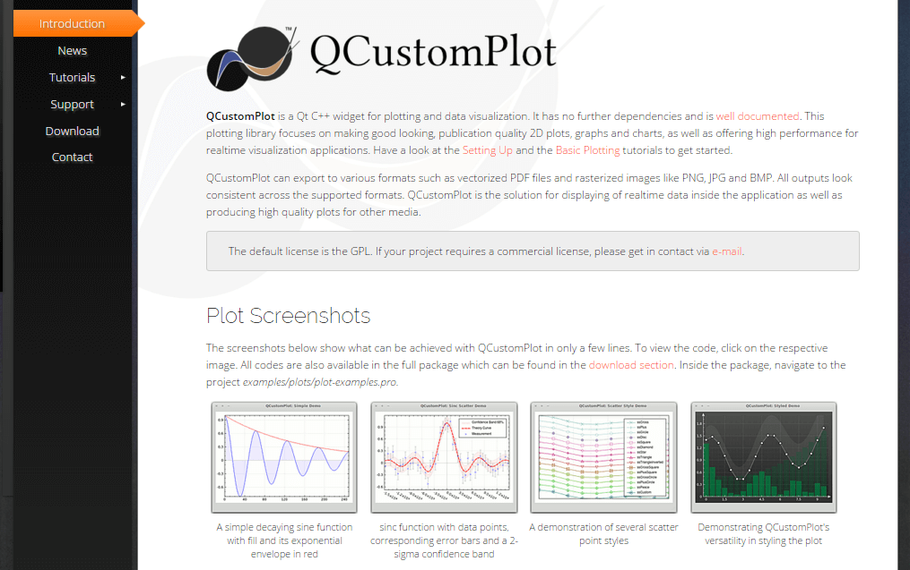

_Рисунок 1 — Сайт библиотеки_

И скачиваем библиотеку из соответствующего раздела:

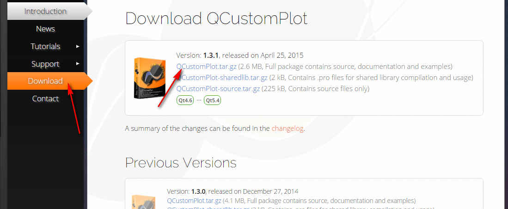

_Рисунок 2 — Скачивание библиотеки_

Из всей библиотеки нам потребуется только два файла: `qcustomplot.cpp` и `qcustomplot.h`:

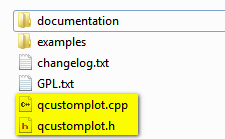

_Рисунок 3 — Файлы библиотеки_

## Подключение библиотеки

Создадим для примера приложение Qt Widgets:

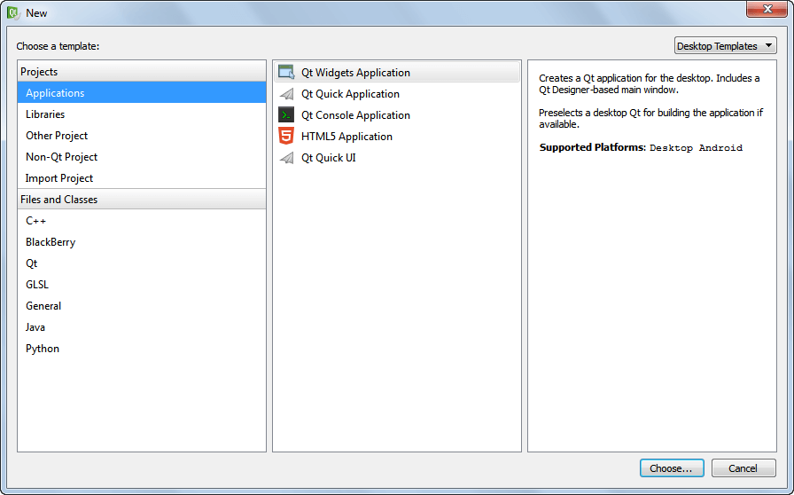

_Рисунок 4 — Выбор типа проектов_

В папку с исходными кодами проекта скинем наши два файла библиотеки. Обратите на этот шаг внимание! Многие данный шаг, как показывает практика, пропускают, и загружают потом в проект эти файлы из распакованного архива, а не из папки своего проекта:

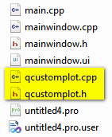

_Рисунок 5 — Папка проекта_

Щелкнем правой кнопкой по проекту в Qt Creator и выберем добавление существующих файлов `Add Existing Files…`:

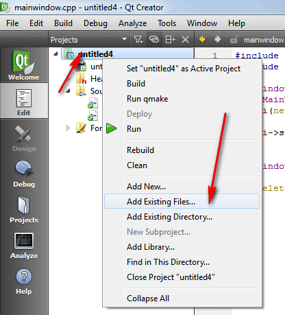

_Рисунок 6 — Add Existing Files…_

Выберем два наших файла библиотеки:

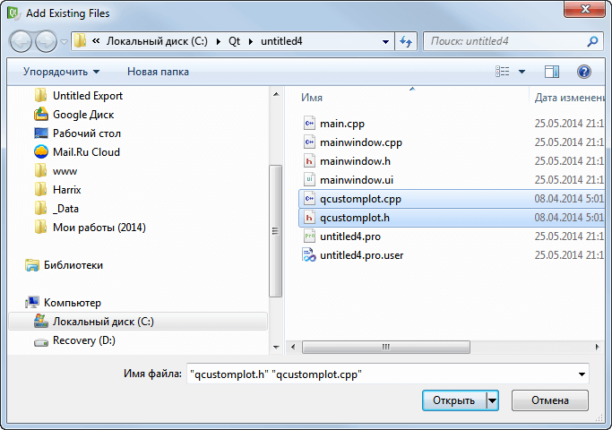

_Рисунок 7 — Выбор файлов библиотеки_

Они добавятся к нашему проекту:

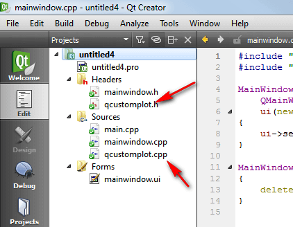

_Рисунок 8 — Файлы библиотеки в проекте_

Перейдем в файл проекта `.pro` и допишем там слово `printsupport`:

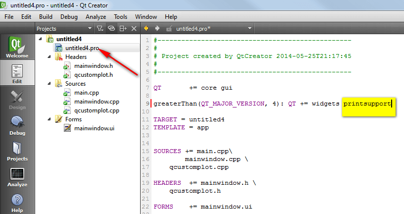

_Рисунок 9 — Файл проекта .pro_

Перейдем на форму:

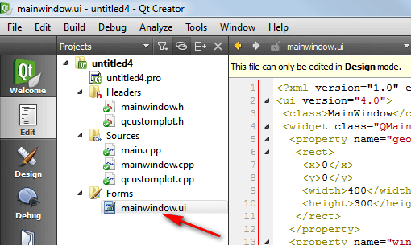

_Рисунок 10 — Форма проекта_

Разместим там кнопку и `Widget`:

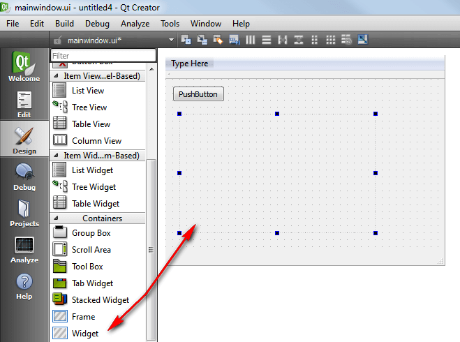

_Рисунок 11 — Компоненты на форме_

Щелкнем по `Widget` правой кнопкой и перейдем к `Promote to…`:

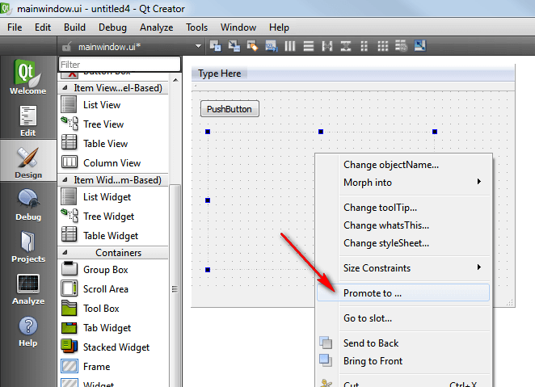

_Рисунок 12 — Promote to…_

Там пропишем класс графиков `QCustomPlot` и нажмем на `Add…`:

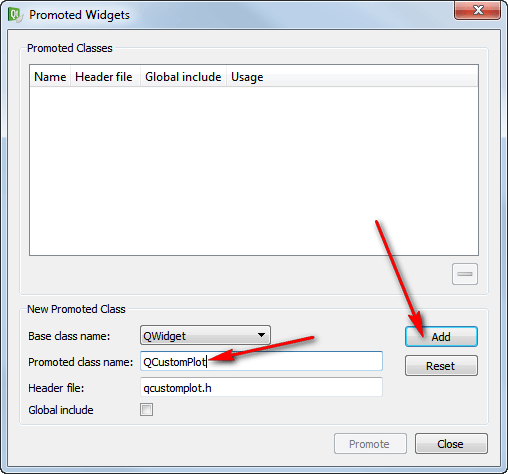

_Рисунок 13 — Добавление класса библиотеки_

А потом на `Promote`:

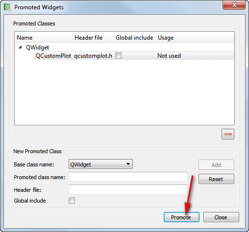

_Рисунок 14 — Подключение класса библиотеки к виджету_

Внешне ничего не изменилось, но, если мы запустим приложение, то увидим координатную сетку:

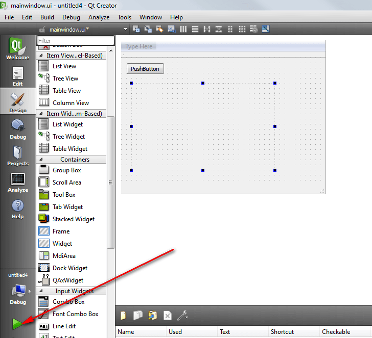

_Рисунок 15 — Запуск приложения_

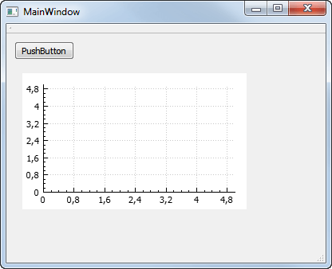

_Рисунок 16 — Координатная сетка в запущенном приложении_

Иногда после данных действий кнопка запуска неактивна и серая вместо того, чтобы быть зеленой. Данный глюк, можно, например, быстро решить, переключить режим компилирования с Debug на Release (или наоборот), а потом обратно переключить:

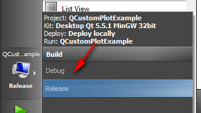

_Рисунок 17 — Переключение режимов сборки_

Теперь нарисуем какой-нибудь график. Нам потребуется имя компонента Widget, чтобы обращаться к нему:

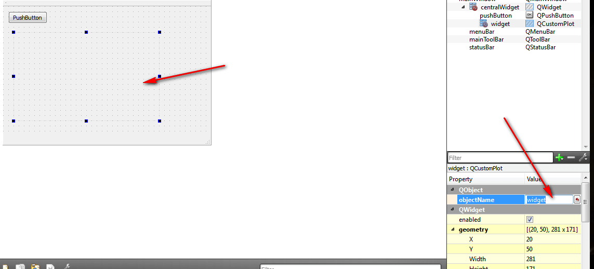

_Рисунок 18 — Нахождение имени компонента_

Перейдем к коду кнопки при клике:

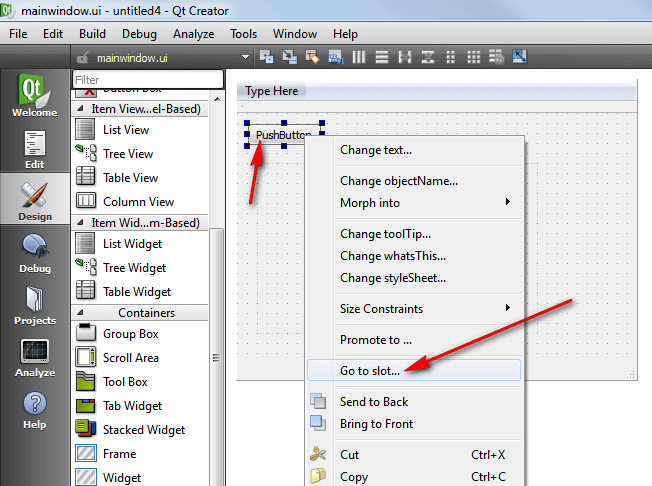

_Рисунок 19 — Переход к слоту кнопки_

И напишем, например, такой код:

```cpp
//Рисуем график y=x*x
//Сгенерируем данные
//Для этого создадим два массива точек:
//один для сохранения x координат точек,
//а второй для y соответственно
double a = -1; //Начало интервала, где рисуем график по оси Ox
double b =  1; //Конец интервала, где рисуем график по оси Ox
double h = 0.01; //Шаг, с которым будем пробегать по оси Ox
int N = (b - a) / h + 2; //Вычисляем количество точек, которые будем отрисовывать
QVector<double> x(N), y(N); //Массивы координат точек

//Вычисляем наши данные
int i=0;
//Пробегаем по всем точкам
for (double X = a; X <= b; X += h) {
  x[i] = X;
  y[i] = X * X;//Формула нашей функции
  i++;
}
ui->widget->clearGraphs();//Если нужно, но очищаем все графики

//Добавляем один график в widget
ui->widget->addGraph();

//Говорим, что отрисовать нужно график по нашим двум массивам x и y
ui->widget->graph(0)->setData(x, y);

//Подписываем оси Ox и Oy
ui->widget->xAxis->setLabel("x");
ui->widget->yAxis->setLabel("y");

//Установим область, которая будет показываться на графике
ui->widget->xAxis->setRange(a, b);//Для оси Ox

//Для показа границ по оси Oy сложнее, так как надо по правильному
//вычислить минимальное и максимальное значение в векторах
double minY = y[0], maxY = y[0];
for (int i = 1; i < N; i++) {
  if (y[i] < minY) minY = y[i];
  if (y[i] > maxY) maxY = y[i];
}
ui->widget->yAxis->setRange(minY, maxY);//Для оси Oy

//И перерисуем график на нашем widget
ui->widget->replot();
```

При запуске приложение и нажатии на кнопку получим вот это:

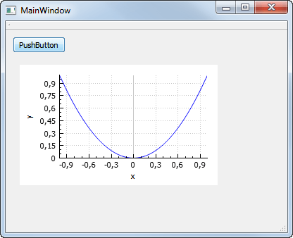

_Рисунок 20 — График в приложении_

Вот и всё. Много примеров ещё в архиве с данной библиотекой, что вы скачивали, и на сайте ее тоже много. Так что дерзайте!

## График в виде точек

Чтобы график рисовался не линией, а точками, достаточно прописать это в свойствах графика. Ниже представлен пример такого графика:

```cpp
ui->widget->graph(0)->setPen(QColor(50, 50, 50, 255));//задаем цвет точки
ui->widget->graph(0)->setLineStyle(QCPGraph::lsNone);//убираем линии
//формируем вид точек
ui->widget->graph(0)->setScatterStyle(QCPScatterStyle(QCPScatterStyle::ssCircle, 4));
```

Полный код:

```cpp
//Рисуем график точками y=x*x
//Сгенерируем данные
//Для этого создадим два массива точек:
//один для сохранения x координат точек,
//а второй для y соответственно
double a = -1; //Начало интервала, где рисуем график по оси Ox
double b =  1; //Конец интервала, где рисуем график по оси Ox
double h = 0.1; //Шаг, с которым будем пробегать по оси Ox
int N = (b - a) / h + 2; //Вычисляем количество точек, которые будем отрисовывать
QVector<double> x(N), y(N); //Массивы координат точек

//Вычисляем наши данные
int i=0;
//Пробегаем по всем точкам
for (double X = a; X <= b; X += h) {
  x[i] = X;
  y[i] = X * X;//Формула нашей функции
  i++;
}
ui->widget->clearGraphs();//Если нужно, но очищаем все графики

//Добавляем один график в widget
ui->widget->addGraph();

//Говорим, что отрисовать нужно график по нашим двум массивам x и y
ui->widget->graph(0)->setData(x, y);
ui->widget->graph(0)->setPen(QColor(50, 50, 50, 255));//задаем цвет точки
ui->widget->graph(0)->setLineStyle(QCPGraph::lsNone);//убираем линии

//формируем вид точек
ui->widget->graph(0)->setScatterStyle(QCPScatterStyle(QCPScatterStyle::ssCircle, 4));

//Подписываем оси Ox и Oy
ui->widget->xAxis->setLabel("x");
ui->widget->yAxis->setLabel("y");

//Установим область, которая будет показываться на графике
ui->widget->xAxis->setRange(a, b);//Для оси Ox

//Для показа границ по оси Oy сложнее, так как надо по правильному
//вычислить минимальное и максимальное значение в векторах
double minY = y[0], maxY = y[0];
for (int i = 1; i < N; i++) {
  if (y[i] < minY) minY = y[i];
  if (y[i] > maxY) maxY = y[i];
}
ui->widget->yAxis->setRange(minY, maxY);//Для оси Oy

//И перерисуем график на нашем widget
ui->widget->replot();
```

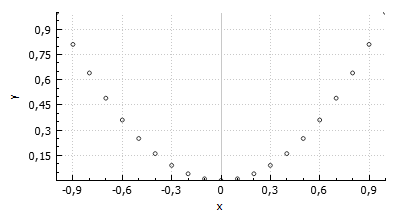

_Рисунок 21 — График в виде точек_

## График массива точек

Ниже рассмотрен более простой пример, где отображается график в виде точек из набора точек, заданных вручную:

```cpp
//Рисуем точки
int N = 5; //Допустим, что у нас пять точек
QVector<double> x(N), y(N); //Массивы координат точек

//Зададим наши точки
x[0] = 1.0; y[0] = 2.0;
x[1] = 4.0; y[1] = 1.0;
x[2] = 3.0; y[2] = 0.0;
x[3] = 0.5; y[3] = 2.2;
x[4] = 1.5; y[4] = 0.7;
ui->widget->clearGraphs();//Если нужно, но очищаем все графики

//Добавляем один график в widget
ui->widget->addGraph();

//Говорим, что отрисовать нужно график по нашим двум массивам x и y
ui->widget->graph(0)->setData(x, y);
ui->widget->graph(0)->setPen(QColor(50, 50, 50, 255));//задаем цвет точки
ui->widget->graph(0)->setLineStyle(QCPGraph::lsNone);//убираем линии

//формируем вид точек
ui->widget->graph(0)->setScatterStyle(QCPScatterStyle(QCPScatterStyle::ssCircle, 4));

//Подписываем оси Ox и Oy
ui->widget->xAxis->setLabel("x");
ui->widget->yAxis->setLabel("y");

//Установим область, которая будет показываться на графике
ui->widget->xAxis->setRange(-1, 5);//Для оси Ox
ui->widget->yAxis->setRange(-1, 3);//Для оси Oy

//И перерисуем график на нашем widget
ui->widget->replot();
```

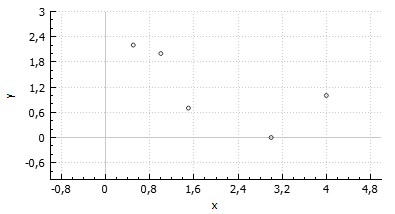

_Рисунок 22 — Точечный график из массивов_

## Старый пример

До обновления статьи 2015-12-01 тут был вот такой пример:

```cpp
 // generate some data:
QVector<double> x(101), y(101); // initialize with entries 0..100
for (int i = 0; i < 101; ++i) {
  x[i] = i/50.0 - 1; // x goes from -1 to 1
  y[i] = x[i] * x[i]; // let's plot a quadratic function
}

// create graph and assign data to it:
ui->widget->addGraph();
ui->widget->graph(0)->setData(x, y);

// give the axes some labels:
ui->widget->xAxis->setLabel("x");
ui->widget->yAxis->setLabel("y");

// set axes ranges, so we see all data:
ui->widget->xAxis->setRange(-1, 1);
ui->widget->yAxis->setRange(0, 1);
ui->widget->replot();
```
