# Фон с радиальным градиентом c шумом для сайта


В статье рассказывается как сделать на сайте радиальный градиент на фоне с шумом с использованием SVG картинки и шумом (растровым или векторным).

<details>
<summary>📖 Содержание</summary>

## Содержание

- [Обозначение проблемы](#обозначение-проблемы)
- [Что получим по итогу](#что-получим-по-итогу)
- [Первый способ: SVG + PNG](#первый-способ-svg--png)
  - [Создание SVG файла с градиентом](#создание-svg-файла-с-градиентом)
  - [Создание текстуры шума](#создание-текстуры-шума)
  - [Обработка](#обработка)
  - [Создание HTML заготовки](#создание-html-заготовки)
  - [Заполнение файла main.css](#заполнение-файла-maincss)
- [Второй способ: только SVG](#второй-способ-только-svg)
  - [Создание SVG файла с градиентом с шумом](#создание-svg-файла-с-градиентом-с-шумом)
  - [HTML болванка](#html-болванка)

</details>

## Обозначение проблемы

Нужно сделать страницу с радиальным градиентом и шумом. CSS градиенты не использовать. Можно использовать SVG и PNG файлы. Желательно встроенные в CSS.

## Что получим по итогу

SVG + PNG:

<https://codepen.io/Harrix/pen/ZqbpYb>

Только SVG:

<https://codepen.io/Harrix/pen/ReWoqr>

## Первый способ: SVG + PNG

### Создание SVG файла с градиентом

Создайте текстовой файл со следующим содержанием:

```xml
<svg version="1.1" xmlns="http://www.w3.org/2000/svg" preserveAspectRatio="xMinYMin">
  <defs>
    <radialGradient id="a" x1="0%" x2="100%" y1="0%" y2="100%" r="60%">
      <stop offset="0" stop-color="#217897" />
      <stop offset="1" stop-color="#0e2e42" />
    </radialGradient>
  </defs>
  <rect width="100%" height="100%" fill="url(#a)" />
</svg>
```

Надеюсь, что вы найдете, где тут прописаны два цвета для радиального градиента.

Сохраните файл как `bk.svg`.

С помощью <https://jakearchibald.github.io/svgomg/> я оптимизировал SVG файл, а с помощью <https://yoksel.github.io/url-encoder/> перевел в inline SVG, который можно вставлять в CSS код. Получилось следующее:

```css
background-image: url("data:image/svg+xml,%3Csvg version='1.1' xmlns='http://www.w3.org/2000/svg' preserveAspectRatio='xMinYMin'%3E%3Cdefs%3E%3CradialGradient id='a' x1='0%25' x2='100%25' y1='0%25' y2='100%25' r='60%25'%3E%3Cstop offset='0' stop-color='%23217897'/%3E%3Cstop offset='1' stop-color='%230e2e42'/%3E%3C/radialGradient%3E%3C/defs%3E%3Crect width='100%25' height='100%25' fill='url(%23a)'/%3E%3C/svg%3E");
```

### Создание текстуры шума

Создавать текстуру будем в Photoshop.

Создаем новый документ:

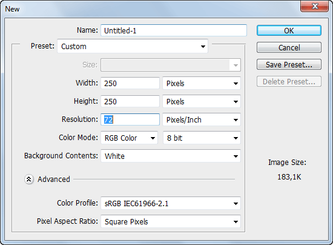

_Рисунок 1 — Создание нового файла_

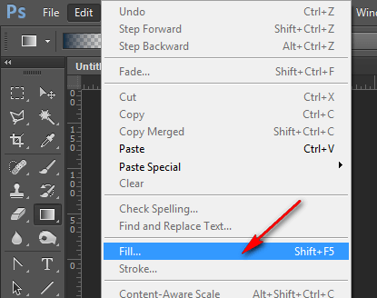

_Рисунок 2 — Команда заполнения слоя_

Заполним серым цветом:

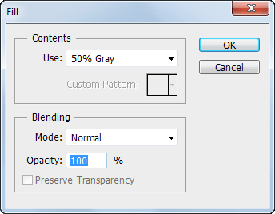

_Рисунок 3 — Заполнение серым цветом_

Добавим шума:

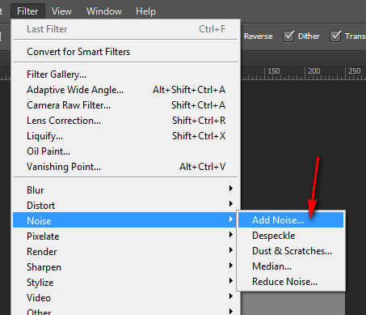

_Рисунок 4 — Команда добавление шума_

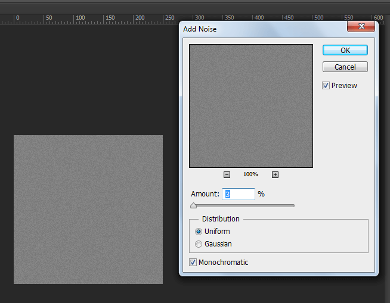

_Рисунок 5 — Параметры добавления шума_

Мы не будем использовать полученный шум для текстуры. Он нам нужен для создания маски для текстуры. Поэтому приводим к резкому контрасту картинку:

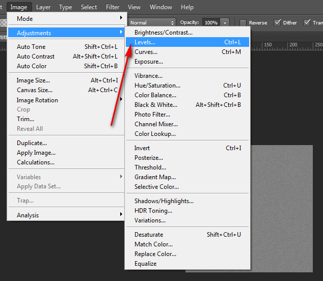

_Рисунок 6 — Команда уровней изображения_

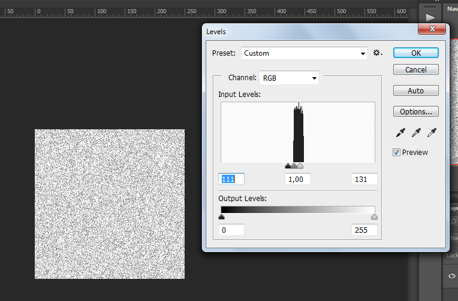

_Рисунок 7 — Настройка уровней изображения_

Переходим в каналы и щелкаем по любому с нажатым `Ctrl`:


_Рисунок 8 — Отображение окна каналов изображения_

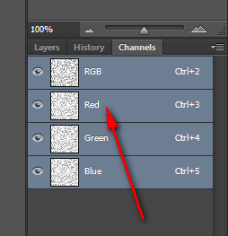

_Рисунок 9 — Выбор канала красного цвета_

Создадим новый слой, а старый сделаем невидимым или удалим:

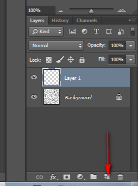

_Рисунок 10 — Создание нового слоя_

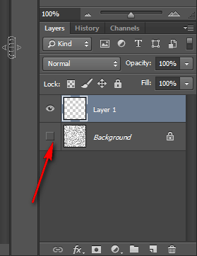

_Рисунок 11 — Нижний слой становится невидимым_

Итак, у нас есть новый слой и выделение по маске. Выберем цвет для заливки шума. Я предлагаю взять цвет немного более темный, чем тот, что использовался в градиенте в темном цвете:

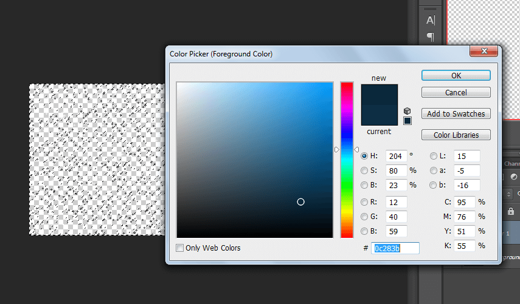

_Рисунок 12 — Выбор цвета для заливки шума_

И заливаем через `Alt` + `Backspace`:

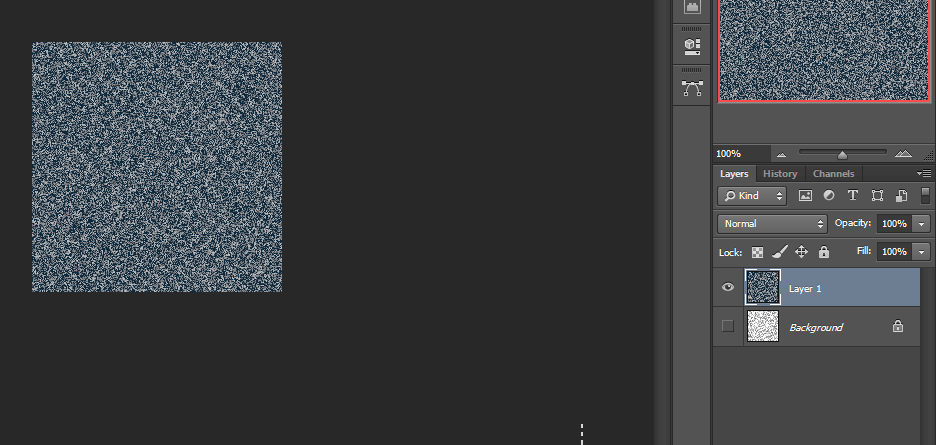

_Рисунок 13 — Заливка нового слоя_

Прозрачность слоя установим на `25%`:

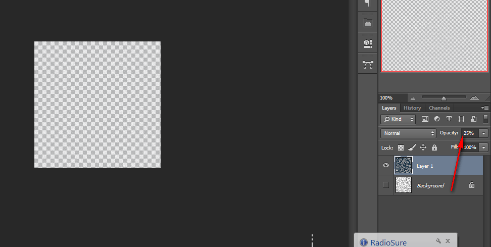

_Рисунок 14 — Прозрачность слоя_

Уменьшим яркость текстуры:

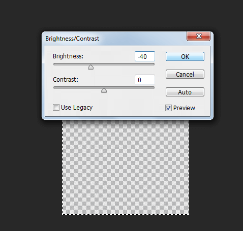

_Рисунок 15 — Уменьшение яркости слоя_

И сохраним текстуру как `noise.png`.

### Обработка

Вначале с помощью <https://tinypng.com/> произвел оптимизацию текстуры, существенно уменьшив размер файла.

Так как нам нужен inline PNG, то переведем изображение в base64 вид, например, с помощью <https://yoksel.github.io/url-encoder/>. У меня получилось следующее:

```css
background-image: url("data:image/png;base64,iVBORw0KGgoAAAANSUhEUgAAAPoAAAD6BAMAAAB6wkcOAAAAGFBMVEUJHy8JHy8JHy8JHy8JHy8JHy8JHy8JHy991eQmAAAACHRSTlNAOyg0HzAtIyUccT0AABBRSURBVHjaxFu3lsJGFL1vZiS1TxKhfZJYaEcBaEfA7rYCNrSCTa2ADb/vyuE4HduyvT8ARxPuu2kAPKDq2J9GvoyjN+ROT9Tj5L2iw9e+y61VLW9nGqrF7hw44uzg2a8tbxA5PKhMntdXmwhge4xO1LFX08z5jP0RI27qgNmDq9QlQ9ToXblTgk+BHg5LEoeAl6/ZUa3itsH0o3y5XVvEd8Zuz5HxLdP8AxQeXGCpgPBhFO53mtNUdZUfBYZif3A/gmFM1oBobweoWlYqu0Al3sDPdMujp9bCGMxM4z+pGAiolSJci4VOnrn4Whp4pVthB/MUNJxbVq79ynCvcRIgxGwJZE6nIBh9o2kWkNcuAnvtI9AlVDteAYho9KDEq7v0RGFnn8ydqx55taaa8T58h6yQepF1pgttnugS9+hg2/UOMUQ/QWmlWMV4wtAz16azbayaenmU7Om14opVFcK+XbwbN6w6KcQ+fUQ38sTgN/85tURk7fggJ57PRtPBJZiqi1l2BLv2ReC1+pZwPMiRTtNOD2DWemlZKD7WMJprvOMM/eGxffc2CwGLxsAC+vR0GII8iNvzvFPz60/xuvJ4o09RPLnPakQiZlDZCq0+eZbUHtHRR6od6xzaIAXHpXmVvOWOTFBcNQEUnyCfKL2D3XQT30JjhNQMEyohKxSVvU059F/KjcPWAbRRZHjy1sgxtFKA3zBTrigZahAAiG/pAFNb6yPLgQ/l08AMvIGHgDvQ0QTKri1eOEAHNOBGGS/Xj8juHo941ItJuwyT4npXMaUK9XqtnY8l78FXlqbSKqkIJcM6JUSlvTnqEQVgd0n/5j7iP/mm6deXAiuXew1eV36D2MO109kQzgTDOT6ljZDcCi5vzgBqAowaD5OTiWrVuNobXXOqu30blpFV9za6z7GcGwMSTLxaug2nd5l9gA3LysF2rMi6r4iLqiW3SZSJvE47F1Xocqw/wW2grPtAe8Ut6HJqoQPGidAY7WaFpSvMs7mkCI5Avt3byASkh63/0BwxLNxs1Y7qLmmcD25R+1iogAxQioki46zyWfF6Fivs210BXLgNE53kHYztWofHMZQI0qN/QeVpxYoQNwhZcGSDxrrn+LruVIBQLGQ0oSA52fhRTeQyHxZSSCbUPC7e4YDUgV7QqFuuJ3xlDG+ft0qW3oLiPMPVnq72rC+Nc4ig3F0UmFpdrUqv1RSXG+iAIABpP5nxmHDH0TsO8BZCB8/w/7EoCIyXp0AgUWmhZwIP9Jza6w3tgRlu1k8qUkZeQ+WFUAoqAXRcgk0HdQ2+vw9s0OwtPFwN09XfW0q4SNvDqkmdjtHJu65lM5k+S451SLyQQyDDyRhSAgKNmmSuSrEaQ601TbWb6OYyIsAoBVw0hOPCZ/aulok+gqClk/UfgQrc1fl27Ubjj6WONabkRZ3FFN5M3hGqBe+Dj9A4msBr08LfFHe1/HubhR6I1v/2AwS8iQVADjllWNvslNXCOnRDVQYC1w4fpouzCaEOsuHWAivHMEpT3WHLOduoJcyv2s6UAiud20cCnCkrgeIMNBitMnPnhhaqM88Lm4is/AMLvm28Fe7qDDuSO+N9uo4J3MB3DNU431Fcqs+tp3CdqAnp9Nz8B9MQPc5Nf+SDjIH92baYfccqbH1gvBwB9qQ/jwuZJAsP6m2/uHsvQXO39saJuCdC/NggHA1wQSyK/PAwnEuuUplpd5DOhfZwvW1RQ20sFOy9AJPISLq0SHnrjnZB9LrQgHOqu8arTSzwb/9eN1I6GRTaT2H5TFsbAq4KgXxRVvkKJtBRR3h1wvsP/EcH+q+BGAbUZPYM49P98elNasY0MrWvATMhwIkdjOGFOtQ0BevdQ4B1Aa3+lfmAi3Ozbn9HRTR80Z7FUY0+QwB1NqZpo3yU8ZfbB6Tt0WaB8qr1BPZfg6jUcTG7wsaWF1IIFxOGyw0HLhAsm60O3N36CFKwtAawHC3Cf48Koh85WTXMa63TUHehokRHMrtqGT5MayzB4d3Wvr9XbXKCqkcqzT8ASE50Fdnaw7tnOy79TNlO9pvCaYDhnzUADKA5sqZUy6iKCPm/fkbwE7HXvpkLWYWFhVhJkFjfUtNsmlvtk70y8WeqFounWtfIatb+l717pv2t0qn2l9vJ0c9Bfve6ysAca/qMglDvTsfDrT23M7v+Amtjj+qXshXB2XqNDSKAWF06qAqFgOGq1kZdxw+6vZimRVdaTOldAJLwpU1xN1YzDsfat9cbfX0yEzsIEdSPThlRss0MbinWEZelS/MB2IXjZzv15wPzNdQ0ISg4/Kni+a8XBv8jkfqtOoNeUd6iVaBAdzNX+IgmX7eezWGLNznqWWkyd4fr5TZIN+AZWiSNigeJBXuNYN5lKkPL3p3XKGofEmob12hFHbxl5kNd6Og59/gcEJg84JmAK4NnhKVFjxnSH/Nhi1GtZ5fOYV8Z8QQ39oN0TJj4//2BRA/k7s/sYd2NiTyrO/aTbJkxIAMND8WTQ+hjxV4V1mjvwZvPt06f4EPDqYNvW82LQDSdNJgn8T+xYMD3SOtFGTfevdYde4KcLOd3yksWU5W+xNoJ2ju6QMoramek2zhmiRS6qRawamHDcgYUMJJT4aYLmPiktLVx9954K0LRYsEEzxvMj4LTgwJbG3sRNApfa4OUpPiqJOEbehh6Ked7yYwLhcaA0S/V7AGqGtuJynaxEKCkGT6WtoYK9y7TXlDGJ7L72eprs6yM+vLmLk6Sh8bu4UvydmDARHkXvUBanS9/hHd8J6kU/BVjq1JZ6MhQ+LlW7dPW3Z4aGzmGGDrNIohgzDePwNFfrVfWNwaERt+uzzOdYQBNb4FiG2jdtvCaNfI9pW12VkCP4d3fx8FfVj1bhghSBvLSEm6BSUPefXPBh1cCjdruJskcFCr4CZynjV9Xd2NIR5GGoqPj8zimeZeugnK7T3WqChiOdJMVGpYaa23UVsrNg7xlwIkgsFYRlXIg7PZnXggYRaCMTQJWQavtQ2xulXsCLLVK6h3HVhnR2dqcE+LXfbWBNwAwcMK1uvlQfhIrLeR3qpugl/MRm+CU6OwGA7NiqeURlaHMBZrNsiUfXWaCxld/qBnwH/vAR9EUyDAmhtE1Q8dP5XogcF0+A/8Xt/lvkLX/H+AOrq0kHsGHIO0mT6hc26KY/O+Yj3/D8GS9eriDhSzF9xQ44rE5L/7CBEHBGqS0Mys2CioszP7L1+VugZspZWYbdPSKQJb+50pBR5ZMueuIjYdGhr0X7h8xotkLN2J23FcIocfu9g9V0ABKM0fbzHBDiqvqPWwTTv19fnVqEt9worfq6WR577/IYLqDfxG9fa2B/puGfRMcfRI1OBOqqxenofQZbSNECXW32cFr1CR+yue4b+ySsIPmmPTQyS4+tul0aysF33Njq3TRjFTHC8pzRSKBagsQptAUFx20YKU5nqinFvWSpdS0RA9y3t9oRA+a0F/YoocH1T+X6mOQ9KfZ6JEv9TdS8UeRzf+Sz+JXbENnOZC4DqCqGzE2sUarSkbQSBu62m1dg1MAjMR1mSnhb9EFUG9fnRAmmu/hP8sLyDbmDkXeGLjTH95qaHR24QP3xuqhjaZqKQL4JQBv8HzcXgBL2tO3jpGCQVUq4g3g7zLv6QEeaRk6mU+wuw4V4raE1tJa65REenZZqdC0w0OzS/SwUHZDEcIOcIv96qMF/nmY1n9ngB6Ktb+FAjR6WoG4NQn29YB9ryFz+/qFJaOFNZjyk49ct2fYMVsiVf97oht/ui9ZfVEunScFGEg9ur+UhpEMK2Vtc8mXHHvF++x9/U8Nz2/2LnogVf/UFGidA3uo3pdpV1hysKOuS/6fiwjAfp+Ywu8rWzxZANubm6uxhQbbpnonKCEgXqUKW4eX1D7MWzRc0J3SO+dNtiy00Bb2LzsS6GFS9ndv0UMW9few0YOz96fDcHff6F6ghwDvH9qhBz3pH4vhX5LC3C3Vu5aW0tv3bq9Z6+nZl+JiV5XnzP6DzxNHqvOhhkjyVQzCvQJoP1HvU3oeq6FBSz4Mt7qVjh10gTqRjYYckJjiZMVbeJkgyH2KuIjHwDrwDbxTh1RBTeXNatfYBDK4IjLWFgkviSXiPFXnBwJa3GANNgjWhtsXfAOj+Xly4neDKk70+rYeqVDJSxk9DhW3teI5T5cxefZ1R6sXwVuB+eiZoRNYsFTYJHCCJJbrZdeW86w1xzay1/yFUYuz7t6eRZBn4PV8hhCu8dBDO/cPEfFjUvctC4Bv7DnFpk/w1F/b/s55/R+ZHv5GcjiOTqIU6GReOvjyPKmynswIPeZmf/mLb9QSQ40fu0nf4tKjh//Qn4DhfyCvf6zN0aPG0B8c8Q0G8c8OPHpATH8x+c3p/18v+necP+DlxZd/jw6hx7/0J129D1ivDBs9erT9DwD+X0s8uMadsJ5CH8Bo4PvQ6dqYtpY9loRjVJ5zQJGz/72hhB6Gb39Shv7OfA+sRo9P7c8/+wRP/V/zoMfw6s/s8SMN+h5u+Xt9hKH3P70k+ea3Az30Sf+SP3rMl/4dqW/2676TXCj0kI/9uR36tPP7J6P9ZVsPvEKP4nj/ty3o0TToXw/Bf29I6kdlU+sT7t09ZOQdeeQZD1bGwDd2PgKN7yx5+b3C5N58GD3GS/83ZPiGp98/g3afyKF/TooeKVD/C/JDcXev2lQAhnH8n5PSrgkoXUuUugYHnUVxTwfn0isQF2/fRXAI0sKvOe8NhJzP93mfrxOgJLcI/Jc6XzYPH5bvx+23S65agcfDH8ueiZVc9pHoWXLxcpDbaH439dZ+MJ8XPMY+53pVde94v9zuer9/PLy7fYllMvAGO/4IXu1+SwTQ2Un9wLHl8EeMgq7ENxlUWmY7Xkjh8YCkKT/oyqSQknOc0KHgdEuwKzh33tUyyNwETI0LNLKX+F8MuAFfQAKi33nthBtyLnv3e3CdSWgXr+kA55hjy+Al6px1AJ6cOwr4N78REmLSXz6g6fmy2Wgoc3i+g9brIyDog3LPVfBTzrB02g0efZOS1M3wfAf+2XFe8JsObyn25XPwzJSwJsoSxtdfvsG8dgU3kHd8vQ0up9utepo0ndTHwc7I4WYhCJk5JgtwiluwAmrEzfQNJkb2BR1sLpZ1vnau2AIhrKyfsuQOci4dBGYHI8Gxum4QwFW3ViYzyq/IXz/16euPQzdvH+822+3meLrr05vry9f6ycLkO14rdpedJ7wbtPYdCiCbo5Ez3XBVpBUErL2GJTARuCIZVHB6aDawVLkXI9E53ZkEPnS3AAZGWi+Jl2S1dyQEoXan1IK57kgrYKRcTAoGh6+xgVnW2ZRAEXKGKVCCXIYObC6+UAXXzfXJ4Mlymbb95GeNAn+sU/ZNRoXuRW9zyieAKE6lBwSsD8FgtrtcNpzSmiyM/NyAo/Lfgh58p8iJhuBYnGwISkV8FgcjzF3sXY0WWsEZdrQTUHK+5pOJgmdEcMxObQScpJ+yltEQOLwv/SQMf9FJYQIlmdtvn653vzYPX34u22PLurWl7SY/6RQwBu5QGs6IQfbGOXSpCPVQV2Bh9JXqD/hePn0dfR3UAAAAAElFTkSuQmCC");
```

### Создание HTML заготовки

Конечно, у вас может быть своя заготовка HTML, но мне надо же на чем-то осязаемом показать, так что вначале я покажу ту заготовку, на которой буду работать.

Файл `index.html` имеет следующий вид:

```html
<!DOCTYPE html>
<html>
  <head>
    <meta charset="utf-8" />
    <meta
      name="viewport"
      content="width=device-width, initial-scale=1, shrink-to-fit=no"
    />
    <title>Radial gradient and noise</title>
    <link rel="stylesheet" type="text/css" href="css/normalize.css" />
    <link rel="stylesheet" type="text/css" href="css/main.css" />
  </head>
  <body>
    <div id="noise">
      <p>Text</p>
      <p>Text</p>
      <p>Text</p>
      <p>Text</p>
      <p>Text</p>
      <p>Text</p>
      <p>Text</p>
      <p>Text</p>
      <p>Text</p>
      <p>Text</p>
      <p>Text</p>
      <p>Text</p>
      <p>Text</p>
      <p>Text</p>
      <p>Text</p>
      <p>Text</p>
      <p>Text</p>
      <p>Text</p>
      <p>Text</p>
      <p>Text</p>
      <p>Text</p>
      <p>Text</p>
      <p>Text</p>
      <p>Text</p>
      <p>Text</p>
      <p>Text</p>
      <p>Text</p>
      <p>Text</p>
      <p>Text</p>
      <p>Text</p>
      <p>Text</p>
      <p>Text</p>
      <p>Text</p>
      <p>Text</p>
      <p>Text</p>
      <p>Text</p>
      <p>Text</p>
      <p>Text</p>
      <p>Text</p>
      <p>Text</p>
      <p>Text</p>
      <p>Text</p>
      <p>Text</p>
      <p>Text</p>
      <p>Text</p>
      <p>Text</p>
      <p>Text</p>
      <p>Text</p>
      <p>Text</p>
      <p>Text</p>
      <p>Text</p>
      <p>Text</p>
      <p>Text</p>
      <p>Text</p>
      <p>Text</p>
      <p>Text</p>
      <p>Text</p>
      <p>Text</p>
      <p>Text</p>
      <p>Text</p>
      <p>Text</p>
      <p>Text</p>
      <p>Text</p>
      <p>Text</p>
      <p>Text</p>
      <p>Text</p>
      <p>Text</p>
      <p>Text</p>
      <p>Text</p>
      <p>Text</p>
      <p>Text</p>
      <p>Text</p>
      <p>Text</p>
      <p>Text</p>
      <p>Text</p>
      <p>Text</p>
      <p>Text</p>
      <p>Text</p>
      <p>Text</p>
      <p>Text</p>
      <p>Text</p>
      <p>Text</p>
      <p>Text</p>
      <p>Text</p>
      <p>Text</p>
      <p>Text</p>
      <p>Text</p>
      <p>Text</p>
      <p>Text</p>
      <p>Text</p>
      <p>Text</p>
      <p>Text</p>
      <p>Text</p>
      <p>Text</p>
      <p>Text</p>
      <p>Text</p>
      <p>Text</p>
      <p>Text</p>
      <p>Text</p>
      <p>Text</p>
      <p>Text</p>
      <p>Text</p>
      <p>Text</p>
      <p>Text</p>
      <p>Text</p>
      <p>Text</p>
      <p>Text</p>
      <p>Text</p>
      <p>Text</p>
      <p>Text</p>
      <p>Text</p>
      <p>Text</p>
      <p>Text</p>
      <p>Text</p>
      <p>Text</p>
      <p>Text</p>
      <p>Text</p>
      <p>Text</p>
      <p>Text</p>
      <p>Text</p>
      <p>Text</p>
      <p>Text</p>
      <p>Text</p>
      <p>Text</p>
      <p>Text</p>
      <p>Text</p>
      <p>Text</p>
      <p>Text</p>
      <p>Text</p>
      <p>Text</p>
      <p>Text</p>
      <p>Text</p>
      <p>Text</p>
      <p>Text</p>
      <p>Text</p>
      <p>Text</p>
      <p>Text</p>
      <p>Text</p>
      <p>Text</p>
      <p>Text</p>
      <p>Text</p>
      <p>Text</p>
      <p>Text</p>
      <p>Text</p>
      <p>Text</p>
      <p>Text</p>
      <p>Text</p>
      <p>Text</p>
      <p>Text</p>
      <p>Text</p>
      <p>Text</p>
      <p>Text</p>
      <p>Text</p>
      <p>Text</p>
      <p>Text</p>
      <p>Text</p>
      <p>Text</p>
      <p>Text</p>
      <p>Text</p>
      <p>Text</p>
      <p>Text</p>
      <p>Text</p>
      <p>Text</p>
      <p>Text</p>
      <p>Text</p>
      <p>Text</p>
      <p>Text</p>
      <p>Text</p>
      <p>Text</p>
      <p>Text</p>
      <p>Text</p>
      <p>Text</p>
      <p>Text</p>
      <p>Text</p>
      <p>Text</p>
      <p>Text</p>
      <p>Text</p>
      <p>Text</p>
      <p>Text</p>
      <p>Text</p>
      <p>Text</p>
      <p>Text</p>
      <p>Text</p>
      <p>Text</p>
      <p>Text</p>
      <p>Text</p>
      <p>Text</p>
      <p>Text</p>
      <p>Text</p>
      <p>Text</p>
      <p>Text</p>
      <p>Text</p>
      <p>Text</p>
      <p>Text</p>
      <p>Text</p>
      <p>Text</p>
    </div>
  </body>
</html>
```

Файл `normalize.css` стандартный файл нормализации CSS свойств: <https://necolas.github.io/normalize.css/>.

### Заполнение файла main.css

Настроим градиент с использованием inline SVG:

```css
html,
body {
  min-height: 100%;
  height: 100%;
}

html {
  background-image: url("data:image/svg+xml,%3Csvg version='1.1' xmlns='http://www.w3.org/2000/svg' preserveAspectRatio='xMinYMin'%3E%3Cdefs%3E%3CradialGradient id='a' x1='0%25' x2='100%25' y1='0%25' y2='100%25' r='60%25'%3E%3Cstop offset='0' stop-color='%23217897'/%3E%3Cstop offset='1' stop-color='%230e2e42'/%3E%3C/radialGradient%3E%3C/defs%3E%3Crect width='100%25' height='100%25' fill='url(%23a)'/%3E%3C/svg%3E");
  background-attachment: fixed;
  background-repeat: no-repeat;
  background-position: 50% 50%;
  background-size: 100% 100%;

  color: white;
}
```

Теперь настроим шум:

```css
#noise {
  position: absolute;
  width: 100%;
  background-image: url("data:image/png;base64,iVBORw0KGgoAAAANSUhEUgAAAPoAAAD6BAMAAAB6wkcOAAAAGFBMVEUJHy8JHy8JHy8JHy8JHy8JHy8JHy8JHy991eQmAAAACHRSTlNAOyg0HzAtIyUccT0AABBRSURBVHjaxFu3lsJGFL1vZiS1TxKhfZJYaEcBaEfA7rYCNrSCTa2ADb/vyuE4HduyvT8ARxPuu2kAPKDq2J9GvoyjN+ROT9Tj5L2iw9e+y61VLW9nGqrF7hw44uzg2a8tbxA5PKhMntdXmwhge4xO1LFX08z5jP0RI27qgNmDq9QlQ9ToXblTgk+BHg5LEoeAl6/ZUa3itsH0o3y5XVvEd8Zuz5HxLdP8AxQeXGCpgPBhFO53mtNUdZUfBYZif3A/gmFM1oBobweoWlYqu0Al3sDPdMujp9bCGMxM4z+pGAiolSJci4VOnrn4Whp4pVthB/MUNJxbVq79ynCvcRIgxGwJZE6nIBh9o2kWkNcuAnvtI9AlVDteAYho9KDEq7v0RGFnn8ydqx55taaa8T58h6yQepF1pgttnugS9+hg2/UOMUQ/QWmlWMV4wtAz16azbayaenmU7Om14opVFcK+XbwbN6w6KcQ+fUQ38sTgN/85tURk7fggJ57PRtPBJZiqi1l2BLv2ReC1+pZwPMiRTtNOD2DWemlZKD7WMJprvOMM/eGxffc2CwGLxsAC+vR0GII8iNvzvFPz60/xuvJ4o09RPLnPakQiZlDZCq0+eZbUHtHRR6od6xzaIAXHpXmVvOWOTFBcNQEUnyCfKL2D3XQT30JjhNQMEyohKxSVvU059F/KjcPWAbRRZHjy1sgxtFKA3zBTrigZahAAiG/pAFNb6yPLgQ/l08AMvIGHgDvQ0QTKri1eOEAHNOBGGS/Xj8juHo941ItJuwyT4npXMaUK9XqtnY8l78FXlqbSKqkIJcM6JUSlvTnqEQVgd0n/5j7iP/mm6deXAiuXew1eV36D2MO109kQzgTDOT6ljZDcCi5vzgBqAowaD5OTiWrVuNobXXOqu30blpFV9za6z7GcGwMSTLxaug2nd5l9gA3LysF2rMi6r4iLqiW3SZSJvE47F1Xocqw/wW2grPtAe8Ut6HJqoQPGidAY7WaFpSvMs7mkCI5Avt3byASkh63/0BwxLNxs1Y7qLmmcD25R+1iogAxQioki46zyWfF6Fivs210BXLgNE53kHYztWofHMZQI0qN/QeVpxYoQNwhZcGSDxrrn+LruVIBQLGQ0oSA52fhRTeQyHxZSSCbUPC7e4YDUgV7QqFuuJ3xlDG+ft0qW3oLiPMPVnq72rC+Nc4ig3F0UmFpdrUqv1RSXG+iAIABpP5nxmHDH0TsO8BZCB8/w/7EoCIyXp0AgUWmhZwIP9Jza6w3tgRlu1k8qUkZeQ+WFUAoqAXRcgk0HdQ2+vw9s0OwtPFwN09XfW0q4SNvDqkmdjtHJu65lM5k+S451SLyQQyDDyRhSAgKNmmSuSrEaQ601TbWb6OYyIsAoBVw0hOPCZ/aulok+gqClk/UfgQrc1fl27Ubjj6WONabkRZ3FFN5M3hGqBe+Dj9A4msBr08LfFHe1/HubhR6I1v/2AwS8iQVADjllWNvslNXCOnRDVQYC1w4fpouzCaEOsuHWAivHMEpT3WHLOduoJcyv2s6UAiud20cCnCkrgeIMNBitMnPnhhaqM88Lm4is/AMLvm28Fe7qDDuSO+N9uo4J3MB3DNU431Fcqs+tp3CdqAnp9Nz8B9MQPc5Nf+SDjIH92baYfccqbH1gvBwB9qQ/jwuZJAsP6m2/uHsvQXO39saJuCdC/NggHA1wQSyK/PAwnEuuUplpd5DOhfZwvW1RQ20sFOy9AJPISLq0SHnrjnZB9LrQgHOqu8arTSzwb/9eN1I6GRTaT2H5TFsbAq4KgXxRVvkKJtBRR3h1wvsP/EcH+q+BGAbUZPYM49P98elNasY0MrWvATMhwIkdjOGFOtQ0BevdQ4B1Aa3+lfmAi3Ozbn9HRTR80Z7FUY0+QwB1NqZpo3yU8ZfbB6Tt0WaB8qr1BPZfg6jUcTG7wsaWF1IIFxOGyw0HLhAsm60O3N36CFKwtAawHC3Cf48Koh85WTXMa63TUHehokRHMrtqGT5MayzB4d3Wvr9XbXKCqkcqzT8ASE50Fdnaw7tnOy79TNlO9pvCaYDhnzUADKA5sqZUy6iKCPm/fkbwE7HXvpkLWYWFhVhJkFjfUtNsmlvtk70y8WeqFounWtfIatb+l717pv2t0qn2l9vJ0c9Bfve6ysAca/qMglDvTsfDrT23M7v+Amtjj+qXshXB2XqNDSKAWF06qAqFgOGq1kZdxw+6vZimRVdaTOldAJLwpU1xN1YzDsfat9cbfX0yEzsIEdSPThlRss0MbinWEZelS/MB2IXjZzv15wPzNdQ0ISg4/Kni+a8XBv8jkfqtOoNeUd6iVaBAdzNX+IgmX7eezWGLNznqWWkyd4fr5TZIN+AZWiSNigeJBXuNYN5lKkPL3p3XKGofEmob12hFHbxl5kNd6Og59/gcEJg84JmAK4NnhKVFjxnSH/Nhi1GtZ5fOYV8Z8QQ39oN0TJj4//2BRA/k7s/sYd2NiTyrO/aTbJkxIAMND8WTQ+hjxV4V1mjvwZvPt06f4EPDqYNvW82LQDSdNJgn8T+xYMD3SOtFGTfevdYde4KcLOd3yksWU5W+xNoJ2ju6QMoramek2zhmiRS6qRawamHDcgYUMJJT4aYLmPiktLVx9954K0LRYsEEzxvMj4LTgwJbG3sRNApfa4OUpPiqJOEbehh6Ked7yYwLhcaA0S/V7AGqGtuJynaxEKCkGT6WtoYK9y7TXlDGJ7L72eprs6yM+vLmLk6Sh8bu4UvydmDARHkXvUBanS9/hHd8J6kU/BVjq1JZ6MhQ+LlW7dPW3Z4aGzmGGDrNIohgzDePwNFfrVfWNwaERt+uzzOdYQBNb4FiG2jdtvCaNfI9pW12VkCP4d3fx8FfVj1bhghSBvLSEm6BSUPefXPBh1cCjdruJskcFCr4CZynjV9Xd2NIR5GGoqPj8zimeZeugnK7T3WqChiOdJMVGpYaa23UVsrNg7xlwIkgsFYRlXIg7PZnXggYRaCMTQJWQavtQ2xulXsCLLVK6h3HVhnR2dqcE+LXfbWBNwAwcMK1uvlQfhIrLeR3qpugl/MRm+CU6OwGA7NiqeURlaHMBZrNsiUfXWaCxld/qBnwH/vAR9EUyDAmhtE1Q8dP5XogcF0+A/8Xt/lvkLX/H+AOrq0kHsGHIO0mT6hc26KY/O+Yj3/D8GS9eriDhSzF9xQ44rE5L/7CBEHBGqS0Mys2CioszP7L1+VugZspZWYbdPSKQJb+50pBR5ZMueuIjYdGhr0X7h8xotkLN2J23FcIocfu9g9V0ABKM0fbzHBDiqvqPWwTTv19fnVqEt9worfq6WR577/IYLqDfxG9fa2B/puGfRMcfRI1OBOqqxenofQZbSNECXW32cFr1CR+yue4b+ySsIPmmPTQyS4+tul0aysF33Njq3TRjFTHC8pzRSKBagsQptAUFx20YKU5nqinFvWSpdS0RA9y3t9oRA+a0F/YoocH1T+X6mOQ9KfZ6JEv9TdS8UeRzf+Sz+JXbENnOZC4DqCqGzE2sUarSkbQSBu62m1dg1MAjMR1mSnhb9EFUG9fnRAmmu/hP8sLyDbmDkXeGLjTH95qaHR24QP3xuqhjaZqKQL4JQBv8HzcXgBL2tO3jpGCQVUq4g3g7zLv6QEeaRk6mU+wuw4V4raE1tJa65REenZZqdC0w0OzS/SwUHZDEcIOcIv96qMF/nmY1n9ngB6Ktb+FAjR6WoG4NQn29YB9ryFz+/qFJaOFNZjyk49ct2fYMVsiVf97oht/ui9ZfVEunScFGEg9ur+UhpEMK2Vtc8mXHHvF++x9/U8Nz2/2LnogVf/UFGidA3uo3pdpV1hysKOuS/6fiwjAfp+Ywu8rWzxZANubm6uxhQbbpnonKCEgXqUKW4eX1D7MWzRc0J3SO+dNtiy00Bb2LzsS6GFS9ndv0UMW9few0YOz96fDcHff6F6ghwDvH9qhBz3pH4vhX5LC3C3Vu5aW0tv3bq9Z6+nZl+JiV5XnzP6DzxNHqvOhhkjyVQzCvQJoP1HvU3oeq6FBSz4Mt7qVjh10gTqRjYYckJjiZMVbeJkgyH2KuIjHwDrwDbxTh1RBTeXNatfYBDK4IjLWFgkviSXiPFXnBwJa3GANNgjWhtsXfAOj+Xly4neDKk70+rYeqVDJSxk9DhW3teI5T5cxefZ1R6sXwVuB+eiZoRNYsFTYJHCCJJbrZdeW86w1xzay1/yFUYuz7t6eRZBn4PV8hhCu8dBDO/cPEfFjUvctC4Bv7DnFpk/w1F/b/s55/R+ZHv5GcjiOTqIU6GReOvjyPKmynswIPeZmf/mLb9QSQ40fu0nf4tKjh//Qn4DhfyCvf6zN0aPG0B8c8Q0G8c8OPHpATH8x+c3p/18v+necP+DlxZd/jw6hx7/0J129D1ivDBs9erT9DwD+X0s8uMadsJ5CH8Bo4PvQ6dqYtpY9loRjVJ5zQJGz/72hhB6Gb39Shv7OfA+sRo9P7c8/+wRP/V/zoMfw6s/s8SMN+h5u+Xt9hKH3P70k+ea3Az30Sf+SP3rMl/4dqW/2676TXCj0kI/9uR36tPP7J6P9ZVsPvEKP4nj/ty3o0TToXw/Bf29I6kdlU+sT7t09ZOQdeeQZD1bGwDd2PgKN7yx5+b3C5N58GD3GS/83ZPiGp98/g3afyKF/TooeKVD/C/JDcXev2lQAhnH8n5PSrgkoXUuUugYHnUVxTwfn0isQF2/fRXAI0sKvOe8NhJzP93mfrxOgJLcI/Jc6XzYPH5bvx+23S65agcfDH8ueiZVc9pHoWXLxcpDbaH439dZ+MJ8XPMY+53pVde94v9zuer9/PLy7fYllMvAGO/4IXu1+SwTQ2Un9wLHl8EeMgq7ENxlUWmY7Xkjh8YCkKT/oyqSQknOc0KHgdEuwKzh33tUyyNwETI0LNLKX+F8MuAFfQAKi33nthBtyLnv3e3CdSWgXr+kA55hjy+Al6px1AJ6cOwr4N78REmLSXz6g6fmy2Wgoc3i+g9brIyDog3LPVfBTzrB02g0efZOS1M3wfAf+2XFe8JsObyn25XPwzJSwJsoSxtdfvsG8dgU3kHd8vQ0up9utepo0ndTHwc7I4WYhCJk5JgtwiluwAmrEzfQNJkb2BR1sLpZ1vnau2AIhrKyfsuQOci4dBGYHI8Gxum4QwFW3ViYzyq/IXz/16euPQzdvH+822+3meLrr05vry9f6ycLkO14rdpedJ7wbtPYdCiCbo5Ez3XBVpBUErL2GJTARuCIZVHB6aDawVLkXI9E53ZkEPnS3AAZGWi+Jl2S1dyQEoXan1IK57kgrYKRcTAoGh6+xgVnW2ZRAEXKGKVCCXIYObC6+UAXXzfXJ4Mlymbb95GeNAn+sU/ZNRoXuRW9zyieAKE6lBwSsD8FgtrtcNpzSmiyM/NyAo/Lfgh58p8iJhuBYnGwISkV8FgcjzF3sXY0WWsEZdrQTUHK+5pOJgmdEcMxObQScpJ+yltEQOLwv/SQMf9FJYQIlmdtvn653vzYPX34u22PLurWl7SY/6RQwBu5QGs6IQfbGOXSpCPVQV2Bh9JXqD/hePn0dfR3UAAAAAElFTkSuQmCC");
  background-attachment: fixed;
}
```

Теперь у нас есть градиентный фон с шумом, который [работает](https://codepen.io/Harrix/pen/ZqbpYb) на множестве браузеров.

## Второй способ: только SVG

### Создание SVG файла с градиентом с шумом

Создайте текстовой файл со следующим содержанием:

```xml
<svg version="1.1" xmlns="http://www.w3.org/2000/svg" preserveAspectRatio="xMinYMin">
  <defs>
    <radialGradient id="a" x1="0%" x2="100%" y1="0%" y2="100%" r="60%">
      <stop offset="0" stop-color="#217897" />
      <stop offset="1" stop-color="#0e2e42" />
    </radialGradient>
    <filter id="noise">
      <feTurbulence type="fractalNoise" baseFrequency=".7" />
      <feComponentTransfer>
        <feFuncR type="linear" slope="2" intercept="-.5" />
        <feFuncG type="linear" slope="2" intercept="-.5" />
        <feFuncB type="linear" slope="2" intercept="-.5" />
      </feComponentTransfer>
      <feColorMatrix type="saturate" values="0" />
      <feComponentTransfer>
        <feFuncA type="table" tableValues="0 .3" />
      </feComponentTransfer>
    </filter>
  </defs>
  <rect width="100%" height="100%" fill="url(#a)" />
  <rect width="100%" height="100%" filter="url(#noise)" />
</svg>
```

Надеюсь, что вы найдете, где тут прописаны два цвета для радиального градиента.

Сохраните файл как `bk-with-noise.svg`.

С помощью <https://jakearchibald.github.io/svgomg/> я оптимизировал SVG файл, а с помощью <https://yoksel.github.io/url-encoder/> перевел в inline SVG, который можно вставлять в CSS код. Получилось следующее:

```css
background-image: url("data:image/svg+xml,%3Csvg version='1.1' xmlns='http://www.w3.org/2000/svg' preserveAspectRatio='xMinYMin'%3E%3Cdefs%3E%3CradialGradient id='a' x1='0%25' x2='100%25' y1='0%25' y2='100%25' r='60%25'%3E%3Cstop offset='0' stop-color='%23217897'/%3E%3Cstop offset='1' stop-color='%230e2e42'/%3E%3C/radialGradient%3E%3Cfilter id='b'%3E%3CfeTurbulence type='fractalNoise' baseFrequency='.7'/%3E%3CfeComponentTransfer%3E%3CfeFuncR type='linear' slope='2' intercept='-.5'/%3E%3CfeFuncG type='linear' slope='2' intercept='-.5'/%3E%3CfeFuncB type='linear' slope='2' intercept='-.5'/%3E%3C/feComponentTransfer%3E%3CfeComponentTransfer%3E%3CfeFuncA type='linear' slope='1'/%3E%3C/feComponentTransfer%3E%3CfeComponentTransfer%3E%3CfeFuncA type='table' tableValues='0 .15'/%3E%3C/feComponentTransfer%3E%3C/filter%3E%3C/defs%3E%3Crect width='100%25' height='100%25' fill='url(%23a)'/%3E%3Crect width='100%25' height='100%25' filter='url(%23b)'/%3E%3C/svg%3E");
```

### HTML болванка

Файл `index.html`:

```html
<!DOCTYPE html>
<html>
  <head>
    <meta charset="utf-8" />
    <meta
      name="viewport"
      content="width=device-width, initial-scale=1, shrink-to-fit=no"
    />
    <title>Radial gradient and noise</title>
    <link rel="stylesheet" type="text/css" href="css/normalize.css" />
    <link rel="stylesheet" type="text/css" href="css/main.css" />
  </head>
  <body>
    <p>Text</p>
    <p>Text</p>
    <p>Text</p>
    <p>Text</p>
    <p>Text</p>
    <p>Text</p>
    <p>Text</p>
    <p>Text</p>
    <p>Text</p>
    <p>Text</p>
    <p>Text</p>
    <p>Text</p>
    <p>Text</p>
    <p>Text</p>
    <p>Text</p>
    <p>Text</p>
    <p>Text</p>
    <p>Text</p>
    <p>Text</p>
    <p>Text</p>
    <p>Text</p>
    <p>Text</p>
    <p>Text</p>
    <p>Text</p>
    <p>Text</p>
    <p>Text</p>
    <p>Text</p>
    <p>Text</p>
    <p>Text</p>
    <p>Text</p>
    <p>Text</p>
    <p>Text</p>
    <p>Text</p>
    <p>Text</p>
    <p>Text</p>
    <p>Text</p>
    <p>Text</p>
    <p>Text</p>
    <p>Text</p>
    <p>Text</p>
    <p>Text</p>
    <p>Text</p>
    <p>Text</p>
    <p>Text</p>
    <p>Text</p>
    <p>Text</p>
    <p>Text</p>
    <p>Text</p>
    <p>Text</p>
    <p>Text</p>
    <p>Text</p>
    <p>Text</p>
    <p>Text</p>
    <p>Text</p>
    <p>Text</p>
    <p>Text</p>
    <p>Text</p>
    <p>Text</p>
    <p>Text</p>
    <p>Text</p>
    <p>Text</p>
    <p>Text</p>
    <p>Text</p>
    <p>Text</p>
    <p>Text</p>
    <p>Text</p>
    <p>Text</p>
    <p>Text</p>
    <p>Text</p>
    <p>Text</p>
    <p>Text</p>
    <p>Text</p>
    <p>Text</p>
    <p>Text</p>
    <p>Text</p>
    <p>Text</p>
    <p>Text</p>
    <p>Text</p>
    <p>Text</p>
    <p>Text</p>
    <p>Text</p>
    <p>Text</p>
    <p>Text</p>
    <p>Text</p>
    <p>Text</p>
    <p>Text</p>
    <p>Text</p>
    <p>Text</p>
    <p>Text</p>
    <p>Text</p>
    <p>Text</p>
    <p>Text</p>
    <p>Text</p>
    <p>Text</p>
    <p>Text</p>
    <p>Text</p>
    <p>Text</p>
    <p>Text</p>
    <p>Text</p>
    <p>Text</p>
    <p>Text</p>
    <p>Text</p>
    <p>Text</p>
    <p>Text</p>
    <p>Text</p>
    <p>Text</p>
    <p>Text</p>
    <p>Text</p>
    <p>Text</p>
    <p>Text</p>
    <p>Text</p>
    <p>Text</p>
    <p>Text</p>
    <p>Text</p>
    <p>Text</p>
    <p>Text</p>
    <p>Text</p>
    <p>Text</p>
    <p>Text</p>
    <p>Text</p>
    <p>Text</p>
    <p>Text</p>
    <p>Text</p>
    <p>Text</p>
    <p>Text</p>
    <p>Text</p>
    <p>Text</p>
    <p>Text</p>
    <p>Text</p>
    <p>Text</p>
    <p>Text</p>
    <p>Text</p>
    <p>Text</p>
    <p>Text</p>
    <p>Text</p>
    <p>Text</p>
    <p>Text</p>
    <p>Text</p>
    <p>Text</p>
    <p>Text</p>
    <p>Text</p>
    <p>Text</p>
    <p>Text</p>
    <p>Text</p>
    <p>Text</p>
    <p>Text</p>
    <p>Text</p>
    <p>Text</p>
    <p>Text</p>
    <p>Text</p>
    <p>Text</p>
    <p>Text</p>
    <p>Text</p>
    <p>Text</p>
    <p>Text</p>
    <p>Text</p>
    <p>Text</p>
    <p>Text</p>
    <p>Text</p>
    <p>Text</p>
    <p>Text</p>
    <p>Text</p>
    <p>Text</p>
    <p>Text</p>
    <p>Text</p>
    <p>Text</p>
    <p>Text</p>
    <p>Text</p>
    <p>Text</p>
    <p>Text</p>
    <p>Text</p>
    <p>Text</p>
    <p>Text</p>
    <p>Text</p>
    <p>Text</p>
    <p>Text</p>
    <p>Text</p>
    <p>Text</p>
    <p>Text</p>
    <p>Text</p>
    <p>Text</p>
    <p>Text</p>
    <p>Text</p>
    <p>Text</p>
    <p>Text</p>
    <p>Text</p>
    <p>Text</p>
    <p>Text</p>
    <p>Text</p>
    <p>Text</p>
    <p>Text</p>
    <p>Text</p>
    <p>Text</p>
    <p>Text</p>
    <p>Text</p>
    <p>Text</p>
  </body>
</html>
```

Файл `main.css`:

```css
html {
  background-image: url("data:image/svg+xml,%3Csvg version='1.1' xmlns='http://www.w3.org/2000/svg' preserveAspectRatio='xMinYMin'%3E%3Cdefs%3E%3CradialGradient id='a' x1='0%25' x2='100%25' y1='0%25' y2='100%25' r='60%25'%3E%3Cstop offset='0' stop-color='%23217897'/%3E%3Cstop offset='1' stop-color='%230e2e42'/%3E%3C/radialGradient%3E%3Cfilter id='b'%3E%3CfeTurbulence type='fractalNoise' baseFrequency='.7'/%3E%3CfeComponentTransfer%3E%3CfeFuncR type='linear' slope='2' intercept='-.5'/%3E%3CfeFuncG type='linear' slope='2' intercept='-.5'/%3E%3CfeFuncB type='linear' slope='2' intercept='-.5'/%3E%3C/feComponentTransfer%3E%3CfeComponentTransfer%3E%3CfeFuncA type='linear' slope='1'/%3E%3C/feComponentTransfer%3E%3CfeComponentTransfer%3E%3CfeFuncA type='table' tableValues='0 .15'/%3E%3C/feComponentTransfer%3E%3C/filter%3E%3C/defs%3E%3Crect width='100%25' height='100%25' fill='url(%23a)'/%3E%3Crect width='100%25' height='100%25' filter='url(%23b)'/%3E%3C/svg%3E");
  background-attachment: fixed;
  background-repeat: no-repeat;
  background-position: 50% 50%;
  background-size: 100% 100%;

  color: white;
}
```

Получим [работающий](https://codepen.io/Harrix/pen/ReWoqr) вариант радиального градиента с шумом.
