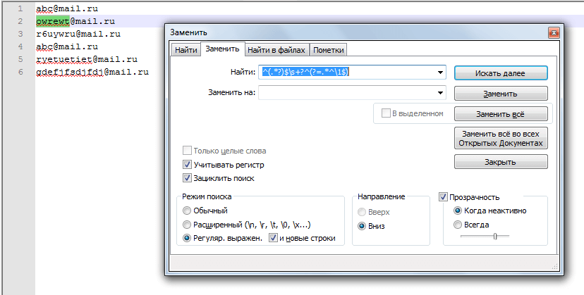
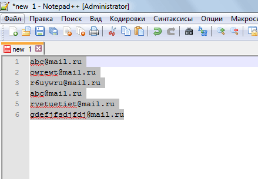
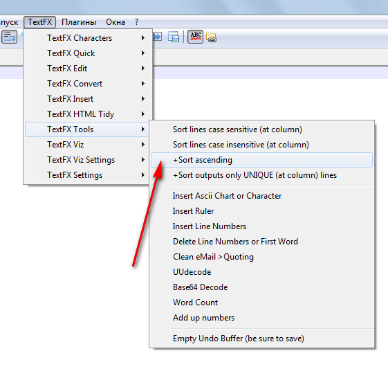
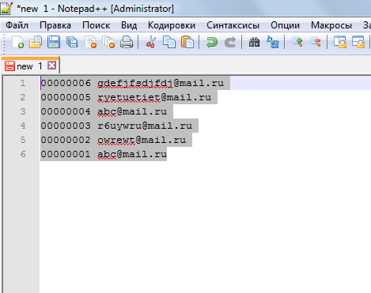
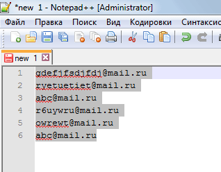

# Удаление дублирующих строк в Notepad++

Надо удалить повторяющиеся строки в текстовом файле. Для этого воспользуемся Notepad++.

Прямой функции в Notepad++ нет, но можно воспользоваться некоторыми функциями, чтобы всё реализовать.

Допустим, что у нас есть файл такого содержания:

```text
abc@mail.ru
owrewt@mail.ru
r6uywru@mail.ru
abc@mail.ru
ryetuetiet@mail.ru
gdefjfsdjfdj@mail.ru
```

## Первый способ

Запустите окно замены в файле и введите команду:

```text
^(.*?)$\s+?^(?=.*^\1$)
```

При этом настройки замены должны быть как на рисунке:



И нажмите `Заменить всё`. Повторяющиеся строки удаляться. Но при этом останутся не первые варианты строк, а последние повторы.

## Второй способ

Если надо удалить повторы так, чтобы оставалось первые варианты строк, а не последние, то тут надо по-другому поступить. Идея простая. Мы меняем порядок строк, а потом просто применяем первый способ, а потом меняем обратно.

Для этого нам потребуется плагин [TextFX](https://github.com/Harrix/harrix.dev-blog-2013/blob/main/textfx/textfx.md). По ссылке рассказывается и про его установку.

Итак, нужно сделать следующие действия для изменения порядка строк.

Выделите весь текст `Ctrl` + `A`:



Вставьте номера строкам: `TextFX` → `TextFX Tools` → `Insert Line Numbers`:


Если стоит флажок `TextFX` → `TextFX Tools` → `+Sort ascending`, то его убрать:



Отсортируем строки `TextFX` → `TextFX Tools` → `Sort lines case sensitive (at column)`:



Удаляем номера строк `TextFX` → `TextFX Tools` → `Delete Line Numbers or First Word`:



Потом используем первый способ для удаление повторяющихся строк. А потом обратно меняем порядок строк.

## Третий способ

Но я бы всё-таки для таких целей использовал бы специализированные средства (ибо, иногда способы в статье немного шалят). Вот два рабочий сервиса, которыми я пользуюсь при случае:

<http://textmechanic.com/Remove-Duplicate-Lines.html>

<http://www.textfixer.com/tools/remove-duplicate-lines.php>
