# Запуск Qt приложений .exe вне Qt Creator

В статье рассказывается как запускать приложения, созданные в Qt без самого Qt Creator. Или же приложения должны запускаться на компах, где нет Qt.

Для версии Qt под компилятор Visual Studio статья [Запуск Qt приложений под Visual Studio .exe вне Qt Creator](https://github.com/Harrix/harrix.dev-blog-2016/blob/main/run-qt-vs-app-exe-outside-qt/run-qt-vs-app-exe-outside-qt.md).

Тут расскажу о самом механизме нахождения DLL, так как Qt активно развивается и регулярно новые версии выпускает, и под каждую версию писать статью о новом наборе DLL накладно.

В качестве среды для разработки используется Qt 5.2.0 for Windows 32-bit (MinGW 4.8). Для версий не с компилятором MinGW алгоритм решение проблемы может быть иным.

## Проблема

Допустим, мы создали [базовое приложение Qt Widgets](https://github.com/Harrix/harrix.dev-blog-2014/blob/main/basic-app-qt-widgets/basic-app-qt-widgets.md).

При запуске приложения в самом Qt Creator (при нажатии на зеленую стрелку, или же через меню, или же иным способом) мы видим наше приложение:

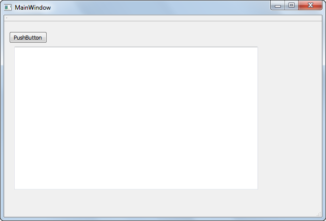

Когда мы создавали приложение, то мы видели следующее окно:

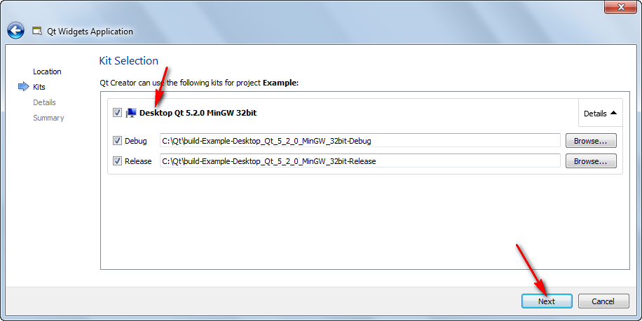

Указанные тут папки и есть папки, куда сохраняется наше приложение.

Если мы перейдем в папку `C:\Qt\build-Example-Desktop_Qt_5_2_0_MinGW_32bit-Debug` (у вас папка может по-другому называться), то увидим следующее:

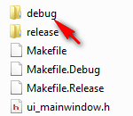

Зайдем в папку `debug` и найдем там наше приложение:

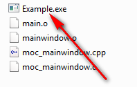

Если мы его запустим, то получим ошибку:

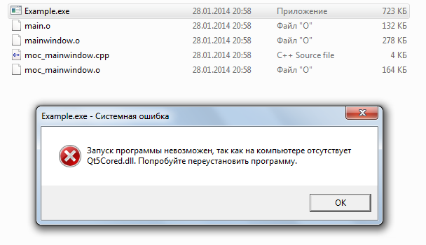

Как быть?

## Первый способ — Официальная утилита windeployqt

У Qt есть утилита `windeployqt`, которая поставляется с Qt и про которую можно прочитать тут <http://doc.qt.io/qt-5/windows-deployment.html>. Она решает ту же задачу, что и второй способ ниже.

**Update 2018.** Сейчас библиотека стала работать гораздо лучше. Поэтому ниже будет более подробная инструкция по использованию `windeployqt`.

Итак, в командной строке перейдите в папку `bin` того компилятора, под которым вы компилируете приложение в режиме `Release`. В этой папке должен быть файл `windeployqt.exe`. Например, у меня в данный момент для MinGW это папка `D:\Qt\5.12.0\mingw73_64\bin`, а для Visual Studio `D:\Qt\5.12.0\msvc2017_64\bin`.

Перейти можно с помощью команды `cd`:

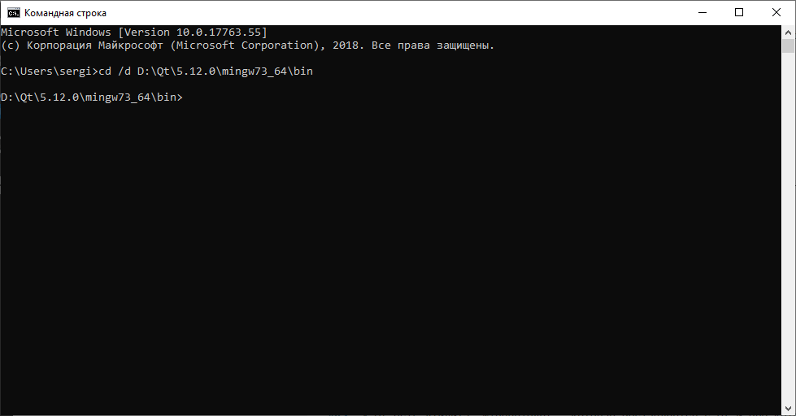

Скомпилируйте в режиме `Release` ваше приложение. Для примера я создал простое `Qt Widgets Application` и скомпилировал под MinGW компилятором:

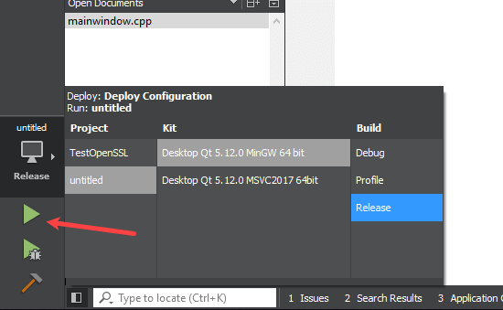

Найдите папку, в которой находится скомпилированный EXE файл. Например, в моем случае это папка `D:\Harrix\Projects\Qt\untitled\_build\release`:

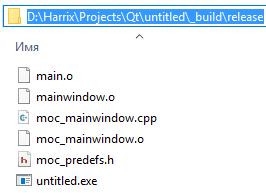

Теперь можно в командной строке вызвать `windeployqt` с указанием папки с EXE файлом:

```console
windeployqt D:\Harrix\Projects\Qt\untitled\_build\release
```

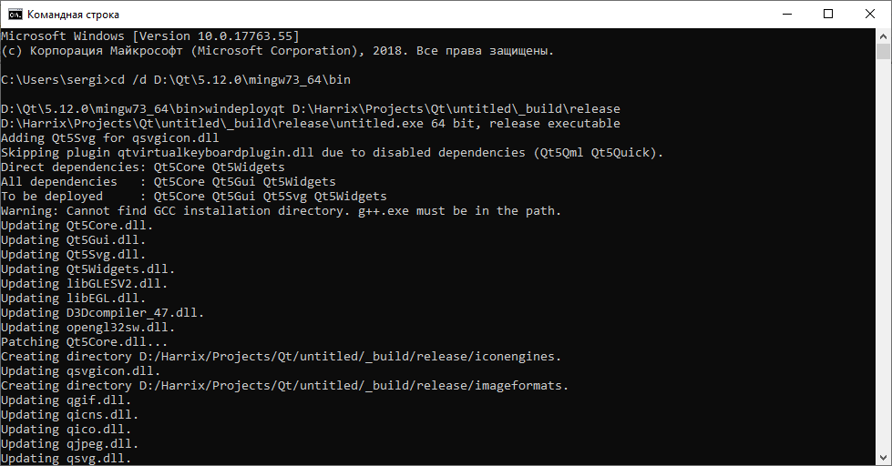

Теперь в папке добавились нужные файлы:

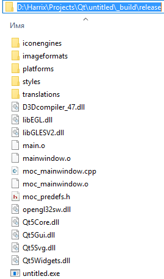

Но если попробовать запустить EXE файл, то вылетит ошибка, так как три DLL не скопировались: `libwinpthread-1.dll`, `libstdc++-6.dll`, `libgcc_s_seh-1.dll`. Их нужно вручную скопировать из той же папки, где находится `windeployqt.exe`:

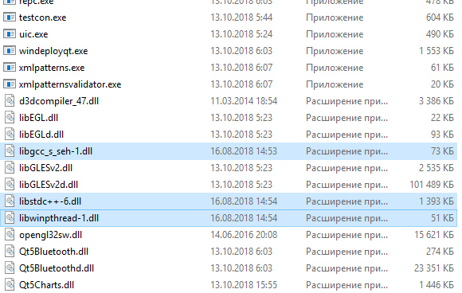

После этого приложение должно запуститься. Настоятельно рекомендую проверить работоспособность приложения на чистом компьютере без установленной Qt.

Для компилятора Visual Studio алгоритм тот же, но лучше еще добавить параметр `--compiler-runtime`, например:

```console
windeployqt --compiler-runtime D:\Harrix\Projects\Qt\untitled\_build\release
```

Если у вас приложение с использованием QML, то нужен параметр `--qmldir` с указанием папки, где хранятся `.qml` файлы:

```console
windeployqt --compiler-runtime --qmldir D:\Harrix\Projects\Qt\untitled D:\Harrix\Projects\Qt\untitled\_build\release
```

Стоит обратить внимание на то, что `windeployqt` может копировать лишние файлы. От них можно избавиться, потихоньку удаляя файлы из папки на чистом компьютере.

## Второй способ — Ручной

### Начало решения проблемы

Мы же хотим, чтобы приложение запускалось на других компах? Поэтому надо в окончательном виде выдавать приложение, а не в режиме отладки.

Внизу, над зеленым треугольником выбираем режим `Release`:

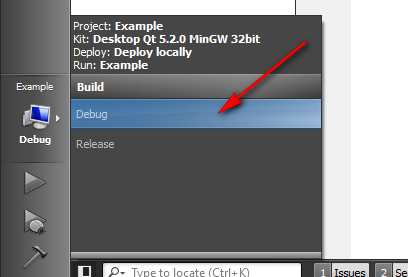

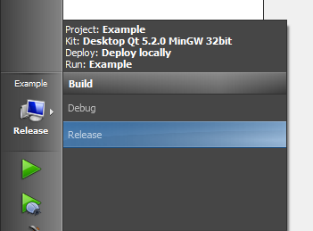

Запускаем приложение, нажатием на зеленый треугольник:


Как видим, через некоторое время запустилось привычное нам приложение. Но теперь `*.exe` файл появился в папке, которое мы указывали для `Release`:


Заходим в эту папку (у меня это `C:\Qt\build-Example-Desktop_Qt_5_2_0_MinGW_32bit-Release`):

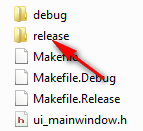

Если в прошлый раз мы заходили в папку `debug`, то сейчас заходим в папку `release`, и запускаем приложение:

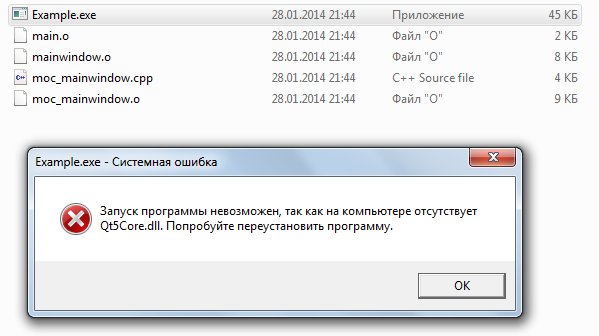

Кстати, для последующего распространения программы нам из папки нужен (из текущих файлов) только `*.exe` файл, поэтому файлы `main.o`, `mainwindow.o`, `moc_mainwindow.cpp`, `moc_mainwindow.o` можно удалить без ущерба (это служебные файлы, которые будут появляться при каждой компиляции).

### Нахождение DLL и других файлов

Итак, приложение ругается на отсутствие `Qt5Core.dll` (у вас может быть цифра другая, если в момент чтения статьи вышла иная версия Qt). Где этот файл искать?

Найдите папку, в которую устанавливался Qt. У меня это папка `C:\QtQt5.2.0`

В ней найдите папку с номером версии вашего Qt. У меня это первая папка с названием `5.2.0-rc1`. У вас скорее всего будет немного по-другому называться (у меня сейчас beta версия стоит):

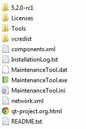

В ней будет папка компилятора MinGW:


Переходим в неё:

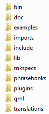

В ней находим главную папку `bin`:

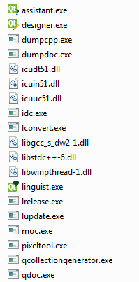

И в этой папке находим нужные нам `dll`. Находим тут `Qt5Core.dll` (не `Qt5Cored.dll`!!!) и копируем в папку `C:\Qt\build-Example-Desktop_Qt_5_2_0_MinGW_32bit-Release\release` (где наш `*.exe` файл находится). И запустим приложение:

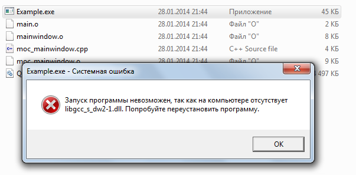

И вот так копируем все нужные DLL, которые просит приложение. У меня потребовались следующие DLL: `icudt51.dll`, `icuin51.dll`, `icuuc51.dll`, `libgcc_s_dw2-1.dll`, `libstdc++-6.dll`, `libwinpthread-1.dll`, `Qt5Core.dll`, `Qt5Gui.dll`, `Qt5Widgets.dll`. И вот приложение запустилось:

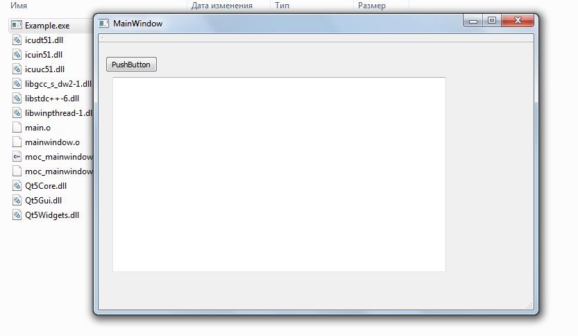

Ура! Но рано радоваться. Если мы запустим на компе, где нет Qt, то приложение выдаст ошибку, так как не может найти библиотеки. Надо скопировать еще несколько файлов. Помните основную папку Qt? Переходим в неё:

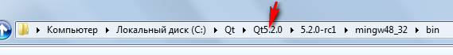

Там есть папка `Tools`:

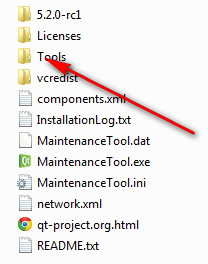

В ней есть папка `QtCreator`:

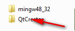

В ней папка `bin`:

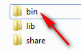

Скопируйте файл `qt.conf` в папку с `*.exe` файлом:

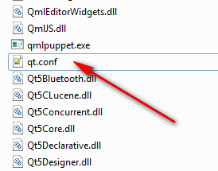

Теперь перейдите в папку с компилятором:

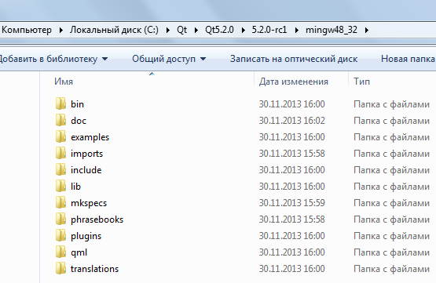

А там перейдем в папку `plugins`, а оттуда в `platforms`:

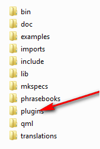

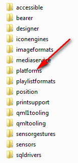

Скопируйте файлы `qminimal.dll` и `qwindows.dll`. Но вставим не просто в папку с `*.exe` файлом, там создадим папку `plugins`, а там папку `platforms`, и уже в нее вставим файлы. То есть для всех DLL, которые нам могут пригодиться, некоторые находятся не прямо в папке `bin`, то для этих DLL в папке с EXE файлом мы должны создать такие же папки, в которых они находились, относительно папки компилятора. В нашем случае в папке с компилятором файлы находись под именами: `[путь к папке с компилятором] \plugins \platforms \qminimal.dll`, `[путь к папке с компилятором] \plugins \platforms \qwindows.dll`. Поэтому копируйте так: `[путь к папке с *.exe файлом] \plugins \platforms \qminimal.dll`, `[путь к папке с *.exe файлом] \plugins \platforms \qwindows.dll`.

Вот теперь приложение запустится везде! То есть вы должны вместе с EXE файлом копировать все эти DLL и `qt.conf`. На скриншоте временные файлы я не удалил:

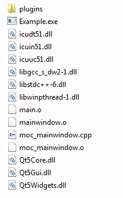

Здесь показан принцип, как находить нужные DLL. Если вы используете какие то другие компоненты, например, `QWebVie`w, то вам будут нужны еще другие DLL, которые вы находите аналогичным способом.

Помните, что если вы используется `QtQuick` то вам еще потребуется папка `qml`.

**Внимание!** Иногда описанный выше способ не помогает. Вроде скопировали все DLL, что вам могли пригодиться, приложение даже запускается, но вы видите лишь белый экран, например, или приложение вообще не появляется, но в диспетчере задач появляется.

В таком случае копируйте все DLL из папки `bin` (а из остальных мест в виде папок, где они хранятся) и начинайте скрупулезно удалять поштучно DLL до тех пор, пока не сузите число файлов до минимально работающего числа. Помните, что все DLL есть в двух вариантах: для `release` и ли `debug` режима. Для `debug` режима в имени DLL появляется буква `d`. Эти файлы вам не нужны!
