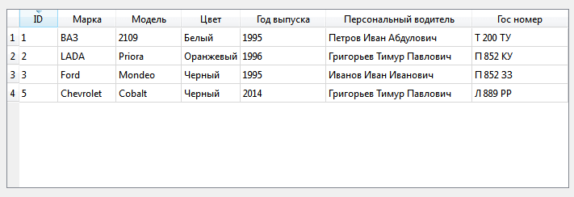
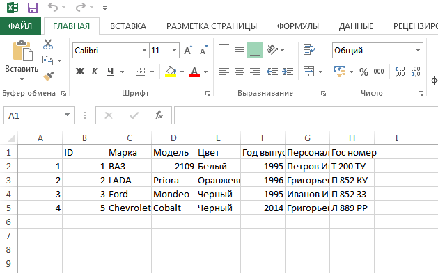

# Как сохранять из QTableView данные в CSV формат

В статье описана функция, которая вам поможет сохранять из таблицы данные в CSV формат, который читается Excel.

Написал вот такую функцию. Она сохраняет всё содержимое таблицы, включая вертикальный столбец и горизонтальную строку заголовков. Единственно, чего нет, так как это экранирования двойных кавычек:

```cpp
void MainWindow::saveAsCSV(QString filename)
{
  QFile f(filename);

  if( f.open( QIODevice::WriteOnly ) )
  {
    QTextStream ts( &f );
    QStringList strList;

    strList << "\" \"";
    for( int c = 0; c < ui->tableView->horizontalHeader()->count(); ++c )
      strList << "\""+ui->tableView->model()->headerData(c, Qt::Horizontal).toString()+"\"";
    ts << strList.join( ";" )+"\n";

    for( int r = 0; r < ui->tableView->verticalHeader()->count(); ++r )
    {
      strList.clear();
      strList << "\""+ui->tableView->model()->headerData(r, Qt::Vertical).toString()+"\"";
      for( int c = 0; c < ui->tableView->horizontalHeader()->count(); ++c )
      {
        strList << "\""+ui->tableView->model()->data(ui->tableView->model()->index(r, c), Qt::DisplayRole).toString()+"\"";
      }
      ts << strList.join( ";" )+"\n";
    }
    f.close();
  }
}
```

Заголовочные файлы подключите те, что попросит Qt при компиляции.

Вот была такая таблица:



Получили вот это:



В статье [Как вывести данные в QTableView в Qt](https://github.com/Harrix/harrix.dev-blog-2014/blob/main/2014-04-22-output-data-to-qtableview/2014-04-22-output-data-to-qtableview.md) узнаете, как добавлять данные в QTableView.
