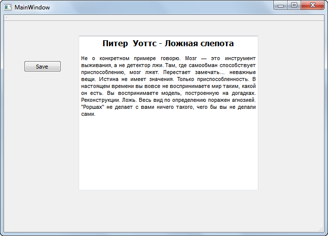
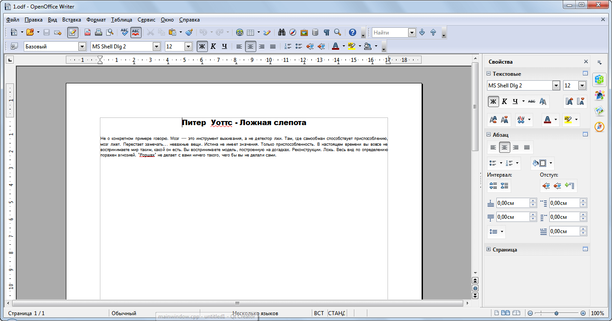

# Как сохранить данные из QTextEdit в ODF

Надо сохранить оформленный текст из textEdit в Qt в ODF (это аналог формата DOC). Отчеты, например, сохранять и так далее.

Подключите это:

```cpp
#include <QTextDocumentWriter>
#include <QMessageBox>
#include <QFileDialog>
```

В кнопке, например, пропишите это:

```cpp
QString fileName = QFileDialog::getSaveFileName(this, tr("Файл ODF"),"",tr("Файлы ODF (*.odf)"));
if (fileName.isEmpty()) return;
QTextDocumentWriter writer(fileName);
bool success;
success = writer.write(ui->textEdit->document());
if (success)
  QMessageBox::information(this, "Отлично!", "Экспорт прошел успешно");
}
else {
  QMessageBox::critical(this, "Ошибка", "При сохранении файла произошла ошибка");
}
```

Например, был такой текст:



При сохранении получили это:



Про формат ODF читать [тут](https://ru.wikipedia.org/wiki/OpenDocument). А тут можно скачать <https://www.openoffice.org/ru/download/index.html>.
