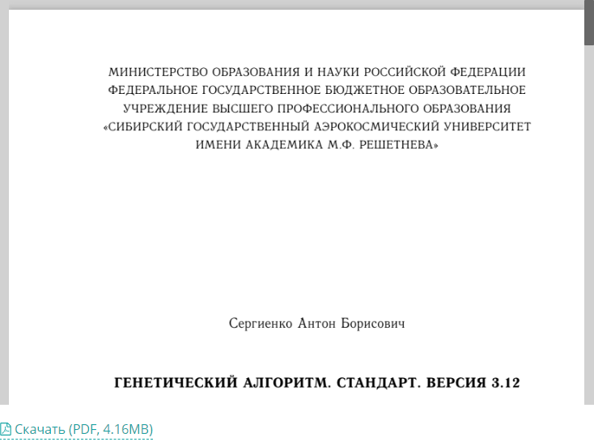

# Как показать в Wordpress документы PDF напрямую из GitHub


В статье рассказывается как показать в Wordpress документы PDF напрямую из GitHub. Но если файлы большие, то GitHub не отдаст файл (у меня 13Мб файл не отдал).

<details>
<summary>📖 Содержание</summary>

- [Инструкция](#инструкция)
  - [Вариант I](#вариант-i)
  - [Вариант II](#вариант-ii)

У меня возникла необходимость отобразить в статье документ PDF, который имеет свойство изменяться в течении времени, в процессе редактирования в GitHub. Постоянно загружать в Wordpress документ накладно, да и забуду я скоро, где я там в статье что использовал. Желательно напрямую считывать, но просто так GitHub не отдает файлы.

</details>

## Инструкция

Установите в Wordpress плагин `Google Doc Embedder`.

Страница на репозитории плагинов: <https://wordpress.org/plugins/google-document-embedder/>.

Теперь займемся ссылкой на PDF документ. Разберем на моем примере. У меня аккаунт [Harrix](https://github.com/Harrix), там есть проект [Standard-Genetic-Algorithm](https://github.com/Harrix/Standard-Genetic-Algorithm). И там есть PDF документ [\_Standard-Genetic-Algorithm.pdf](https://github.com/Harrix/Standard-Genetic-Algorithm/blob/master/_Standard-Genetic-Algorithm.pdf) в корневой папке. Как получить прямую ссылку?

### Вариант I

Прямая ссылка на документ в GitHub формулируется так:

```text
https://raw.githubusercontent.com/user/repository/branch/filename
```

Поэтому в моем случае получаем:

```text
https://raw.githubusercontent.com/Harrix/Standard-Genetic-Algorithm/master/_Standard-Genetic-Algorithm.pdf
```

### Вариант II

Прямую ссылку на файл можно получить через сервис <https://rawgit.com/>.

Теперь в статье вставляем наш документ:

```html
[gview
file="https://raw.githubusercontent.com/Harrix/Standard-Genetic-Algorithm/master/_Standard-Genetic-Algorithm.pdf"]
```

В итоге получим вот такое:



_Рисунок 1 — Внешний вид PDF в Wordpress_

Вот и всё!
