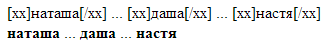

# Функция изменения текста между тэгами в PHP


Возникла необходимость написания функции, которая бы обрабатывала текст особым образом между всеми тэгами в тексте вида `[xx] [/xx]` в PHP. Ниже об этом небольшая поэма с показом примера для Wordpress.

В примере рассмотрен пример, где текст в тэге становится жирным. Итак, сгенерированная функция выглядит так:

```php
<?
function WorkWithTags($content){
$Tag ="xx";// считаем, что есть тэг [xx] и [/xx]. Вот тут и меняйте текст

//Поиск всех тегов нужного вида [xx] [/xx] и сохранение текста между ними. Вместо [xx] и [/xx] вставьте свои тэги.
if (preg_match_all('~['.$Tag.'](.*?)[/'.$Tag.']~is', $content, $arr))
{
  //Пробегаем по всем найденным тэгам
  foreach ($arr[1] as $value)
  {
    //Тут производим анализ текста из переменной $value и его изменение в переменную $newValue
    //НАЧАЛО ИЗМЕНЕНИЙ
    $newValue = "<b>".$value."</b>"; // Пример изменений
    //КОНЕЦ ИЗМЕНЕНИЙ

    $content=str_replace($value, $newValue, $content);//заменим старые варианты подстрок между тэгами на новые
  }

  //Удалим тэги [xx] и [/xx]
  $tr=array('['.$Tag.']'=>'','[/'.$Tag.']'=>'',);
  $content=strtr($content,$tr);
}
return $content;
}
?>
```

В ней в качестве параметра `$Tag ="xx"` и задается название тэга.

Если у вас есть такой код:

```php
<html>
<head> <meta charset="UTF-8"> </head>
<body>
<?
function WorkWithTags($content){
$Tag ="xx";// считаем, что есть тэг [xx] и [/xx]. Вот тут и меняйте текст

//Поиск всех тегов нужного вида [xx] [/xx] и сохранение текста между ними. Вместо [xx] и [/xx] вставьте свои тэги.
if (preg_match_all('~['.$Tag.'](.*?)[/'.$Tag.']~is', $content, $arr))
{
  //Пробегаем по всем найденным тэгам
  foreach ($arr[1] as $value)
  {
    //Тут производим анализ текста из переменной $value и его изменение в переменную $newValue
    //НАЧАЛО ИЗМЕНЕНИЙ
    $newValue = "<b>".$value."</b>"; // Пример изменений
    //КОНЕЦ ИЗМЕНЕНИЙ

    $content=str_replace($value, $newValue, $content);//заменим старые варианты подстрок между тэгами на новые
  }

  //Удалим тэги [xx] и [/xx]
  $tr=array('['.$Tag.']'=>'','[/'.$Tag.']'=>'',);
  $content=strtr($content,$tr);
}
return $content;
}
?>
<?
$S="[xx]наташа[/xx] ... [xx]даша[/xx] ... [xx]настя[/xx]";
echo "$S<br>";

$S=WorkWithTags($S);

echo "$S<br>";
?>
</body>
</html>
```

То вы получите вот это:



_Рисунок 1 — Результат работы обработки тэгов_

Если вы хотите добавить в Wordpress функцию обработки шорткода, то найдите файл `functions.php` в вашей теме и добавьте такое, в конце файла:

```php
add_filter('the_content', 'WorkWithTags');
function WorkWithTags($content){
$Tag ="xx";// считаем, что есть тэг [xx] и [/xx]. Вот тут и меняйте текст

//Поиск всех тегов нужного вида [xx] [/xx] и сохранение текста между ними. Вместо [xx] и [/xx] вставьте свои тэги.
if (preg_match_all('~['.$Tag.'](.*?)[/'.$Tag.']~is', $content, $arr))
{
  //Пробегаем по всем найденным тэгам
  foreach ($arr[1] as $value)
  {
    //Тут производим анализ текста из переменной $value и его изменение в переменную $newValue
    //НАЧАЛО ИЗМЕНЕНИЙ
    $newValue = "<b>".$value."</b>"; // Пример изменений
    //КОНЕЦ ИЗМЕНЕНИЙ

    $content=str_replace($value, $newValue, $content);//заменим старые варианты подстрок между тэгами на новые
  }

  //Удалим тэги [xx] и [/xx]
  $tr=array('['.$Tag.']'=>'','[/'.$Tag.']'=>'',);
  $content=strtr($content,$tr);
}
return $content;
}
```

В общем всё!

Кстати, если вам нужно просто обрамить текст некоторыми тегами вместо `[xx]` и `[/xx]`, то можно сделать проще. Ниже показан пример подобной функции в Wordpress. А описанный выше в статье способ предназначен, когда вам нужно иметь возможность как-то обрабатывать текст между тегами, а не только обрамить тегами.

Более простой способ:

```php
add_filter('the_content', 'make_important');
function make_important($content) {
  if( strpos($content, '[important]')===false ) return $content;
$tr=array(
"[important]"=>"<span class=\"important\">",
"[/important]"=>"</span>",
);
$content=strtr($content,$tr);
   return $content;
}
```
